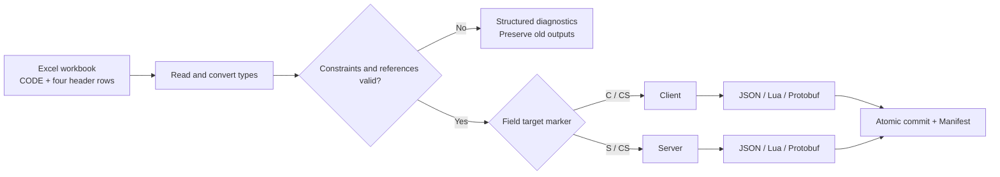

<p align="center">
  <strong>English</strong> |
  <a href="./README.md">简体中文</a> |
  <a href="./README.ja.md">日本語</a> |
  <a href="./README.ko.md">한국어</a> |
  <a href="./README.es.md">Español</a> |
  <a href="./README.zh-TW.md">繁體中文</a>
</p>

<h1 align="center">SheetToConfig</h1>

<p align="center"><a href="https://github.com/liushafeiniao/SheetToConfig">github.com/liushafeiniao/SheetToConfig</a></p>

<p align="center">
  <strong>Excel configuration management, validation, and multi-format export for game teams</strong>
</p>

<p align="center">
  Manage multiple projects in the SheetToConfig desktop app, export configuration data reliably to JSON, Lua, and Protobuf, and split client and server fields at column level.
</p>

<p align="center">
  
  
  
  
  <a href="LICENSE"></a>
</p>

<p align="center">
  <a href="#quick-start">Quick Start</a> ·
  <a href="#core-capabilities">Capabilities</a> ·
  <a href="#excel-workbook-format">Excel Format</a> ·
  <a href="#protobuf">Protobuf</a> ·
  <a href="#development-and-verification">Development</a>
</p>

<p align="center">
  
</p>

<p align="center"><sub>All project names and paths shown in the screenshot are fictitious demonstration data.</sub></p>

## Quick Start

Windows is the primary supported platform. SheetToConfig is also continuously tested on Apple Silicon and Intel macOS. Download stable packages from [GitHub Releases](https://github.com/liushafeiniao/SheetToConfig/releases); a macOS DMG is published only after Apple signing and notarization succeed.

Run from source on Windows:

```powershell
py -3.12 -m venv .venv
.\.venv\Scripts\python.exe -m pip install -r requirements.txt
.\.venv\Scripts\python.exe SheetToConfig.py
```

After installing the dependencies, you can also double-click `run.bat`. `launch.bat` starts `dist/SheetToConfig.exe` when it exists and otherwise falls back to the source version.

Run from source on macOS:

```bash
python3.12 -m venv .venv
source .venv/bin/activate
python -m pip install -r requirements.txt
./run.sh
```

To try a macOS preview, download an experimental DMG from the rolling [macos-preview](https://github.com/liushafeiniao/SheetToConfig/releases/tag/macos-preview) GitHub prerelease: choose `arm64` for an Apple M-series Mac and `x64` for an Intel Mac. These DMGs are unsigned, unnotarized, and not Apple-verified; use them only when you trust the repository and the source commit. Managed company or school Macs may block them. After the first failed launch, use Apple-supported **System Settings → Privacy & Security → Open Anyway**. If the link has not been created yet, no public preview is available; run from source with the steps above instead.

### Your first export

1. Click New Project (`新建项目`) and configure the workbook, client output, and server output directories.
2. Put at least one `.xlsx` file containing a `CODE` worksheet in the workbook directory.
3. Select the project, click Export Tables (`导表`), and enable Validation Only (`仅校验`) to inspect all issues before writing files.
4. After validation succeeds, run the actual export, confirm the result in the operation log, and inspect the output directories.

The first export creates `TypeDefinition.xlsx` in the workbook directory with built-in types and constraint examples. The C# output and team share directories are optional.

## Core Capabilities

| Capability | What it provides |
| --- | --- |
| Multi-project management | Manage workbook, client, server, C#, and shared directories with search, drag-and-drop paths, and project ordering |
| Multiple output formats | Generate JSON, Lua, `.proto`, and `.pb` files from the same Excel source, with optional C# type generation |
| Client / server field routing | Use `C`, `S`, `CS`, and `X` markers to control where each field is exported and keep server-only data out of clients |
| Data validation | Validate types, primary keys, uniqueness, field constraints, and cross-table references with file, sheet, row, column, and field diagnostics |
| Safe writes | Convert and validate the entire batch in staging, then commit atomically; failed exports preserve previous outputs |
| Hot-update manifests | Generate deterministic `excel2json-manifest.json` files for client and server outputs with SHA-256, size, and source metadata |
| Team workflow | Copy workbooks to a shared directory while keeping project settings, themes, and window skins local and out of the repository |

## How It Works



The exporter reads the `CODE` configuration in every workbook and then parses the four header rows in each data worksheet. Outputs and manifests are committed only after the complete workbook batch passes conversion, constraint, and reference validation.

## Excel Workbook Format

### The `CODE` worksheet

Every exported workbook must contain a `CODE` worksheet:

| Sheet | File | Platform |
| --- | --- | --- |
| Item | ItemConfig.json | cs |
| Skill | SkillData.lua | c |
| Quest | QuestConfig.pb | cs |

- `Sheet`: the data worksheet name in the same workbook.
- `File`: the output filename. The extension is mandatory and must be `.json`, `.lua`, or `.pb`; formats are never guessed.
- `Platform`: `c` exports only to the client, `s` only to the server, and `cs` to both.

### Data worksheets

Each data worksheet uses four header rows. Data begins on row five:

```text
ID           Name        Rewards                    Rate
int          string      intList+len(1,5)           float+range(0,1)
CS           CS          C                          S
Identifier   Name        Reward list                Server-side rate
1            Potion      1001#1002                  0.25
```

The four rows define field names, field types, output targets, and field descriptions. Output markers behave as follows:

| Marker | Behavior |
| --- | --- |
| `C` | Client only |
| `S` | Server only |
| `CS` | Client and server |
| `X` | Excluded from export |

The first column is the primary key. It must contain a non-empty scalar and must be unique. Errors are returned as structured diagnostics instead of being silently skipped.

### Types and constraints

Built-in types cover `int`, `float`, `string`, `bool`, `bytes`, one- to three-dimensional lists, dictionaries, paths, and cross-table ID references. Complex types can be extended with composed expressions in `TypeDefinition.xlsx`.

Enums stay inside the existing three-column TypeDefinition format and require no additional schema. `enum(string,white,green,blue)` and `enum(int,1,2,3)` first perform strict base-type conversion and then validate the allowed values. Exported values remain strings or integers; names are not mapped to numeric values.

Append constraints directly to a type expression:

```text
intList+len(1,5)
float+range(0,1)
string+required()+unique()
string+regex(^item_[0-9]+$)
intList+equalLen(Weights)
```

Supported constraints include `len`, `len2`, `len3`, `equalLen`, `equalLen2`, `coexist`, `leastOne`, `required` / `notEmpty`, `range`, `regex`, and `unique`.

## Cross-Workbook References: `find_id` / `find`

The public syntax is limited to these equivalent functions:

```text
find_id(file_prefix, display_label, field)
find(file_prefix, display_label, field)
```

- `file_prefix` locates the target `.xlsx` workbook by filename prefix.
- `display_label` is display metadata only and never selects a worksheet.
- `field` must match a target field; values are read from row 5 onward.
- Empty values follow the target field's real type; missing tables, fields, or IDs fail validation.
- List references are flattened using their separators before validation; failures cancel the batch and preserve old outputs.
- `find` is the identical short alias of `find_id`; other names are not public features.

## Output Consistency

Each enabled output target receives an `excel2json-manifest.json` file:

```json
{
  "manifestVersion": 1,
  "platform": "client",
  "contentVersion": "sha256:...",
  "files": [
    {
      "path": "ItemConfig.json",
      "format": "json",
      "sha256": "...",
      "size": 2048,
      "source": {
        "workbook": "Item.xlsx",
        "sheet": "Item"
      }
    }
  ]
}
```

Manifest entries are sorted deterministically by path. `contentVersion` is derived only from runtime artifact identity and content, making it suitable for comparing client and server versions or producing hot-update diffs. Selected-file exports are incremental and require a valid existing manifest; a missing or corrupt manifest stops the write.

Exports use full-batch staging and atomic commits. If any workbook fails, output paths collide, or the commit fails, SheetToConfig does not leave a partial new configuration behind. Failed commits attempt to restore previous files and report any recovery error.

## Protobuf

Set `File` to a `.pb` filename in the `CODE` worksheet to generate matching `.proto` and `.pb` files:

```text
QuestConfig.proto
QuestConfig.pb
```

- Scalars, `bytes`, and list types such as `intList` and `intList2` can be inferred directly from Excel.
- An optional `PROTO` worksheet can set the package and C# namespace or describe advanced messages, enums, maps, oneofs, and reserved declarations.
- The generator reuses the existing schema manifest to keep field numbers stable where possible; deleted fields are emitted as `reserved`.
- Client and server outputs share one superset `.proto` schema, while each `.pb` contains only the data allowed for that target.
- When a C# output directory is configured, `protoc` can generate the matching C# types.

The desktop UI rejects breaking protocol changes by default. An incompatible rebuild is allowed only after explicitly enabling Allow Protobuf Schema Rebuild (`允许重建 Protobuf 协议`) and confirming the warning. Published protocols should still be reviewed through the `.proto` diff.

## Project Settings and Local Data

| Setting | Required | Purpose |
| --- | --- | --- |
| Workbook directory | Yes | Stores `.xlsx` workbooks and `TypeDefinition.xlsx` |
| Client output | Yes | Client configuration and manifest output |
| Server output | Yes | Server configuration and manifest output |
| C# output | No | Destination for C# types generated by `protoc` |
| Asset root | No | Verifies that `path()` results remain inside the root and exist; when omitted, paths are converted with a warning but not checked |
| Share directory | No | Destination used by Sync to Share (`传共享`) |

When the source lives in a `GitHub` subdirectory of the parent project, local state defaults to the sibling `LocalData` directory. Standalone source runs store state in the source directory, and packaged executables use the executable directory. Override the location with an environment variable:

```powershell
$env:SHEETTOCONFIG_DATA_DIR = "D:\SheetToConfigData"
python SheetToConfig.py
```

Local state such as `projects.json` and `theme_config.json` is excluded by `.gitignore`. Do not commit real project paths, credentials, or team share locations.

## Development and Verification

### Run the tests

```powershell
$env:PYTHONUTF8 = "1"
python -m unittest discover -s tests -v
```

`PYTHONUTF8=1` prevents the GBK console used by some Chinese Windows installations from rejecting Unicode status characters. GitHub Actions runs the same suite with Python 3.12 on Windows, Apple Silicon macOS, and Intel macOS. The suite covers application data paths, type and constraint validation, JSON / Lua / Protobuf exports, schema evolution, runtime manifests, and atomic rollback.

### Build the Windows executable

```powershell
python -m pip install -r requirements-dev.txt
python build.py
```

A successful build produces the single-file application at `dist/SheetToConfig.exe`. `build.py` uses an isolated staging directory and replaces the previous executable only after PyInstaller succeeds.

### Build the macOS application

```bash
python3.12 -m pip install -r requirements-dev.txt
./build.sh
python scripts/package_macos.py --unsigned
```

Build on the target macOS architecture. The outputs are `dist/SheetToConfig.app` and a DMG. Maintainers can also build on public GitHub Actions macOS runners without owning a Mac, but cloud builds do not replace real-device acceptance testing. Unsigned DMGs may be public experimental `macos-preview` prereleases, but must not be described as stable, official, signed, or notarized releases. Stable releases require Developer ID signing and Apple notarization. See [`RELEASING.md`](RELEASING.md) for release and secret setup.

Generating C# configuration types additionally requires `protoc` on `PATH`, or a `PROTOC` environment variable pointing to it.

<details>
<summary><strong>Project structure</strong></summary>

```text
SheetToConfig.py             Main window and interactions
app_paths.py                Local data directory resolution
dialogs.py                  Project, theme, export, and about dialogs
styles.py                   Theme-driven QSS styles
theme_config.py             Theme presets and persistence
icons.py                    Theme-aware icon factory
widgets.py                  Custom widgets
utils/
  project_manager.py        Project data and ordering persistence
  export_handler.py         Export orchestration
  import_handler.py         Team share synchronization
  exporter/
    converter.py            Batch conversion and validation orchestration
    constraints.py          Field constraints
    reference_validator.py  Cross-table reference validation
    protobuf_schema.py      Protobuf schema parsing and evolution
    artifact_manifest.py    Runtime artifact manifests
    atomic_writer.py        Atomic commits and rollback
    exporters/              JSON / Lua / Protobuf writers
tests/                      Automated tests
```

</details>

## Compatibility and Limits

- Windows is the primary platform; Apple Silicon and Intel macOS are also covered by CI and the official packaging pipeline.
- Linux remains source-compatible on a best-effort basis and has no official AppImage, Flatpak, or other package.
- Both the README and desktop UI support Simplified Chinese, English, Japanese, Korean, Spanish, and Traditional Chinese.
- `.xlsx` is the supported input format. Temporary files and non-workbook content are ignored.
- C# generation requires an external `protoc`; JSON, Lua, `.proto`, and `.pb` generation do not require a system compiler.
- Incremental exports require an existing valid manifest. Run a full export first.
- Automated Protobuf evolution does not replace protocol review; teams remain responsible for controlling breaking changes after release.

## Contributing

When reporting an issue, include the smallest reproducible workbook structure, expected result, actual log, and runtime environment. Do not upload business data, real paths, or credentials.

Run the complete test suite before submitting code. Changes to output formats, manifests, or Protobuf schemas should include success-path, error-path, and rollback coverage.

## Version and License

- Current version: `1.0.0` in [`version.py`](version.py)
- Release notes: [`CHANGELOG.md`](CHANGELOG.md)
- License: [`MIT`](LICENSE)
