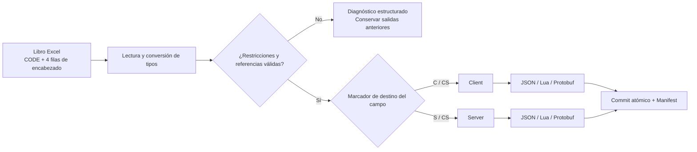

<p align="center">
  <a href="./README.en.md">English</a> |
  <a href="./README.md">简体中文</a> |
  <a href="./README.ja.md">日本語</a> |
  <a href="./README.ko.md">한국어</a> |
  <strong>Español</strong> |
  <a href="./README.zh-TW.md">繁體中文</a>
</p>

<h1 align="center">SheetToConfig</h1>

<p align="center"><a href="https://github.com/liushafeiniao/SheetToConfig">github.com/liushafeiniao/SheetToConfig</a></p>

<p align="center"><strong>Gestión, validación y exportación multiformato de configuraciones Excel para equipos de videojuegos</strong></p>

<p align="center">Administra varios proyectos desde la aplicación de escritorio SheetToConfig, exporta configuraciones de forma fiable a JSON, Lua y Protobuf, y separa los datos de cliente y servidor por columna.</p>

<p align="center">
  
  
  
  
  <a href="LICENSE"></a>
</p>

<p align="center">
  <a href="#inicio-rápido">Inicio rápido</a> ·
  <a href="#capacidades-principales">Capacidades</a> ·
  <a href="#formato-del-libro-de-excel">Formato Excel</a> ·
  <a href="#protobuf">Protobuf</a> ·
  <a href="#desarrollo-y-verificación">Desarrollo</a>
</p>

<p align="center"></p>
<p align="center"><sub>Los nombres de proyectos y las rutas de la captura son datos de demostración ficticios.</sub></p>

## Inicio rápido

Windows es la plataforma principal. SheetToConfig también se prueba continuamente en macOS Apple Silicon e Intel. En macOS, instala las dependencias y ejecuta la versión fuente con `./run.sh`. Un DMG estable se publica solo tras completar la firma Developer ID y la notarización de Apple.

Puedes probar un DMG experimental desde la prerelease continua de GitHub [macos-preview](https://github.com/liushafeiniao/SheetToConfig/releases/tag/macos-preview): elige `arm64` para un Mac con serie M de Apple y `x64` para un Mac Intel. Estos DMG no están firmados ni notarizados, y Apple no los ha verificado; úsalos solo si confías en el repositorio y en el commit de origen. Los Mac administrados por una empresa o escuela pueden bloquearlos. Tras el primer fallo de inicio, usa la opción compatible con Apple «Configuración del Sistema → Privacidad y seguridad → Abrir de todos modos». Si el enlace aún no existe, no hay una vista previa pública; usa los pasos anteriores para ejecutarlo desde el código fuente.

```powershell
py -3.12 -m venv .venv
.\.venv\Scripts\python.exe -m pip install -r requirements.txt
.\.venv\Scripts\python.exe SheetToConfig.py
```

Después de instalar las dependencias también puedes ejecutar `run.bat`. `launch.bat` inicia `dist/SheetToConfig.exe` si existe y, en caso contrario, usa la versión desde el código fuente.

### Primera exportación

1. Crea un proyecto nuevo (`新建项目`) y configura las carpetas de tablas, salida de cliente y salida de servidor.
2. Coloca en la carpeta de tablas al menos un archivo `.xlsx` con una hoja `CODE`.
3. Selecciona el proyecto, pulsa Exportar (`导表`) y usa primero Solo validar (`仅校验`) para revisar todos los problemas.
4. Cuando la validación termine correctamente, ejecuta la exportación y revisa el registro y las carpetas de salida.

La primera exportación crea `TypeDefinition.xlsx` en la carpeta de tablas con tipos y ejemplos de restricciones. Las carpetas de salida C# y de equipo son opcionales.

## Capacidades principales

| Capacidad | Qué ofrece |
| --- | --- |
| Gestión de varios proyectos | Administra carpetas de tablas, cliente, servidor, C# y compartidas con búsqueda, arrastrar y soltar y ordenación |
| Varios formatos | Genera JSON, Lua, `.proto`, `.pb` y, opcionalmente, tipos C# desde el mismo Excel |
| Separación cliente / servidor | Usa `C`, `S`, `CS` y `X` para decidir el destino de cada campo |
| Validación de datos | Comprueba tipos, claves primarias, unicidad, restricciones y referencias entre tablas con diagnósticos detallados |
| Escrituras seguras | Convierte y valida todo el lote en un área temporal y después hace un commit atómico; los errores conservan la salida anterior |
| Manifiestos de actualización | Genera `excel2json-manifest.json` deterministas con SHA-256, tamaño y origen para cliente y servidor |
| Flujo de equipo | Copia tablas a una carpeta compartida y mantiene la configuración y los temas locales, fuera del repositorio |

## Cómo funciona



El exportador lee la configuración `CODE` de cada libro y las cuatro filas de encabezado de cada hoja. Solo después de que todo el lote supera la conversión, las restricciones y las referencias se escriben las salidas y los manifiestos.

## Formato del libro de Excel

### Hoja `CODE`

Cada libro exportado debe contener una hoja `CODE`:

| Sheet | File | Platform |
| --- | --- | --- |
| Item | ItemConfig.json | cs |
| Skill | SkillData.lua | c |
| Quest | QuestConfig.pb | cs |

- `Sheet`: nombre de la hoja de datos dentro del mismo libro.
- `File`: nombre del archivo de salida. La extensión es obligatoria y debe ser `.json`, `.lua` o `.pb`.
- `Platform`: `c` solo cliente, `s` solo servidor y `cs` ambos destinos.

### Hojas de datos

Usa cuatro filas de encabezado; los datos empiezan en la quinta:

```text
ID           Name        Rewards                    Rate
int          string      intList+len(1,5)           float+range(0,1)
CS           CS          C                          S
Identificador Nombre     Lista de recompensas       Tasa del servidor
1            Potion      1001#1002                  0.25
```

Las filas definen nombres, tipos, destinos y descripciones. `C` es cliente, `S` servidor, `CS` ambos y `X` excluido. La primera columna es la clave primaria: debe ser un escalar no vacío y único.

### Tipos y restricciones

Los tipos integrados incluyen `int`, `float`, `string`, `bool`, `bytes`, listas de una a tres dimensiones, diccionarios, rutas y referencias de ID entre tablas. Puedes ampliarlos con expresiones compuestas en `TypeDefinition.xlsx`.

Los enums se definen en el formato TypeDefinition de tres columnas. `enum(string,white,green,blue)` y `enum(int,1,2,3)` convierten primero al tipo base y después validan los valores permitidos.

```text
intList+len(1,5)
float+range(0,1)
string+required()+unique()
string+regex(^item_[0-9]+$)
intList+equalLen(Weights)
```

Las restricciones disponibles son `len`, `len2`, `len3`, `equalLen`, `equalLen2`, `coexist`, `leastOne`, `required` / `notEmpty`, `range`, `regex` y `unique`.

## Referencias entre libros: `find_id` / `find`

La sintaxis pública se limita a estas funciones equivalentes:

```text
find_id(file_prefix, display_label, field)
find(file_prefix, display_label, field)
```

- `file_prefix` localiza el libro `.xlsx` por prefijo de nombre.
- `display_label` solo se muestra y nunca selecciona una hoja.
- `field` debe coincidir con el campo destino; los datos se leen desde la fila 5.
- Los valores vacíos siguen el tipo real del campo; libro, campo o ID ausente es un error.
- Las listas se aplanan con sus separadores. Un fallo cancela el lote y conserva las salidas anteriores.
- `find` es el alias idéntico de `find_id`; otros nombres no son funciones públicas.

## Consistencia de las salidas

Cada destino activo recibe `excel2json-manifest.json`, ordenado de forma determinista por ruta y con SHA-256, tamaño, libro de origen y hoja. Las exportaciones de archivos seleccionados son incrementales y requieren un manifiesto existente y válido.

La conversión de todo el lote se realiza en un área temporal y después se hace un commit atómico. Si falla un libro, hay una colisión o falla el commit, no se deja una configuración nueva incompleta y se intenta restaurar los archivos anteriores.

## Protobuf

Si `File` termina en `.pb` dentro de `CODE`, se generan el `.proto` y el `.pb` correspondientes.

- Los escalares, `bytes` y listas como `intList` / `intList2` se pueden inferir desde Excel.
- La hoja opcional `PROTO` permite definir package, namespace C#, message, enum, map, oneof y reserved.
- El generador reutiliza el manifest del schema para conservar los números de campo cuando sea posible y marca los campos eliminados como `reserved`.
- Cliente y servidor comparten el `.proto` superset; cada `.pb` contiene solo los datos de su destino.
- La generación de C# requiere `protoc`.

La interfaz rechaza por defecto los cambios de protocolo incompatibles. Solo se permiten tras activar explícitamente Permitir reconstrucción de Protobuf (`允许重建 Protobuf 协议`) y confirmar la advertencia. Revisa siempre el diff de `.proto` de los protocolos publicados.

## Configuración del proyecto y datos locales

| Configuración | Obligatoria | Uso |
| --- | --- | --- |
| Carpeta de tablas | Sí | Guarda `.xlsx` y `TypeDefinition.xlsx` |
| Salida cliente | Sí | Configuración y manifest del cliente |
| Salida servidor | Sí | Configuración y manifest del servidor |
| Salida C# | No | Tipos C# generados por `protoc` |
| Raíz de recursos | No | Comprueba que `path()` no salga de la raíz y que los archivos existan |
| Carpeta compartida | No | Destino de Sincronizar con compartido (`传共享`) |

Cuando el código fuente está dentro de una subcarpeta `GitHub`, el estado se guarda por defecto en `LocalData`. Puedes cambiarlo así:

```powershell
$env:SHEETTOCONFIG_DATA_DIR = "D:\SheetToConfigData"
python SheetToConfig.py
```

`projects.json`, `theme_config.json` y el resto del estado local están excluidos por `.gitignore`. No publiques rutas reales, credenciales ni ubicaciones compartidas.

## Desarrollo y verificación

```powershell
$env:PYTHONUTF8 = "1"
python -m unittest discover -s tests -v
```

En algunas instalaciones chinas de Windows, `PYTHONUTF8=1` evita que la consola GBK rechace símbolos Unicode. GitHub Actions ejecuta la misma suite en Windows, macOS Apple Silicon y macOS Intel.

Para construir el EXE de Windows:

```powershell
python -m pip install -r requirements-dev.txt
python build.py
```

El resultado es `dist/SheetToConfig.exe`. Para generar C# necesitas `protoc` en `PATH` o la variable `PROTOC`.

En macOS, `./build.sh` genera la aplicación y `python scripts/package_macos.py --unsigned` crea un DMG. Las personas mantenedoras también pueden compilar en runners públicos macOS de GitHub Actions sin tener un Mac, pero la compilación en la nube no sustituye las pruebas de aceptación en dispositivos reales. Los DMG sin firma pueden publicarse como vistas previas experimentales `macos-preview`, pero no deben presentarse como versiones estables, oficiales, firmadas ni notarizadas. Los DMG estables requieren firma Developer ID y notarización de Apple.

## Compatibilidad y límites

- Windows es la plataforma principal; macOS Apple Silicon e Intel también están cubiertos por CI y empaquetado oficial. No se publica un paquete oficial para Linux.
- Tanto el README como la interfaz de escritorio están disponibles en chino simplificado, inglés, japonés, coreano, español y chino tradicional.
- La entrada compatible es `.xlsx`; las exportaciones incrementales requieren un manifest válido existente.
- La evolución automática de Protobuf no sustituye la revisión del protocolo.

## Contribuir

Al abrir un Issue, incluye la estructura mínima reproducible del libro, el resultado esperado, el registro real y el entorno. No subas datos de negocio, rutas reales ni credenciales.

Los cambios en formatos, manifests o schemas Protobuf deben incluir pruebas de éxito, error y rollback.

## Versión y licencia

- Versión actual: `1.0.0` en [`version.py`](version.py)
- Historial: [`CHANGELOG.md`](CHANGELOG.md)
- Licencia: [`MIT`](LICENSE)
