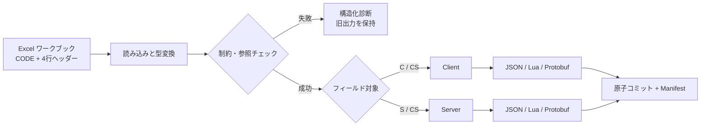

<p align="center">
  <a href="./README.en.md">English</a> |
  <a href="./README.md">简体中文</a> |
  <strong>日本語</strong> |
  <a href="./README.ko.md">한국어</a> |
  <a href="./README.es.md">Español</a> |
  <a href="./README.zh-TW.md">繁體中文</a>
</p>

<h1 align="center">SheetToConfig</h1>

<p align="center"><a href="https://github.com/liushafeiniao/SheetToConfig">github.com/liushafeiniao/SheetToConfig</a></p>

<p align="center"><strong>ゲームチーム向け Excel 設定表の管理・検証・マルチフォーマット出力ツール</strong></p>

<p align="center">SheetToConfig デスクトップアプリで複数プロジェクトを管理し、設定データを JSON、Lua、Protobuf へ安全に出力します。列単位でクライアントとサーバーのデータを分離できます。</p>

<p align="center">
  
  
  
  
  <a href="LICENSE"></a>
</p>

<p align="center">
  <a href="#クイックスタート">クイックスタート</a> ·
  <a href="#主な機能">主な機能</a> ·
  <a href="#excelワークブック形式">Excel 形式</a> ·
  <a href="#protobuf">Protobuf</a> ·
  <a href="#開発と検証">開発</a>
</p>

<p align="center"></p>
<p align="center"><sub>画面内のプロジェクト名とパスはすべて架空のデモデータです。</sub></p>

## クイックスタート

SheetToConfig は Windows を主要環境とし、Apple Silicon と Intel macOS でも継続的にテストします。macOS では依存関係のインストール後に `./run.sh` でソース版を起動できます。安定版 DMG は Developer ID 署名と Apple 公証が成功した場合にのみ公開されます。

実験的な DMG は、ローリング [macos-preview](https://github.com/liushafeiniao/SheetToConfig/releases/tag/macos-preview) GitHub Prerelease から入手できます。Apple M シリーズは `arm64`、Intel Mac は `x64` を選択してください。これらは未署名・未公証であり、Apple による検証も受けていません。リポジトリと該当するソースコミットを信頼できる場合にだけ使用してください。企業・学校で管理される Mac では起動がブロックされることがあります。最初の起動に失敗した後は、Apple がサポートする「システム設定 → プライバシーとセキュリティ → このまま開く」を使用してください。リンクがまだ作成されていない場合、公開プレビューはありません。上記の手順でソース版を起動してください。

```powershell
py -3.12 -m venv .venv
.\.venv\Scripts\python.exe -m pip install -r requirements.txt
.\.venv\Scripts\python.exe SheetToConfig.py
```

依存関係をインストールした後は `run.bat` も使用できます。`launch.bat` は `dist/SheetToConfig.exe` が存在すればそれを起動し、なければソース版を起動します。

### 最初の出力

1. 「新建项目（新規プロジェクト）」をクリックし、表格目录、客户端路径、服务端路径を設定します。
2. `CODE` ワークシートを含む `.xlsx` ファイルを表格目录に置きます。
3. プロジェクトを選択して「导表（出力）」をクリックし、先に「仅校验（検証のみ）」で問題を確認します。
4. 検証に成功したら正式な出力を実行し、操作ログと出力先を確認します。

初回出力時、表格目录に組み込み型と制約の例を含む `TypeDefinition.xlsx` が自動作成されます。C# 出力先と共有先は任意です。

## 主な機能

| 機能 | 内容 |
| --- | --- |
| 複数プロジェクト管理 | 表、クライアント、サーバー、C#、共有ディレクトリを一元管理。検索、ドラッグ＆ドロップ、並べ替えに対応 |
| 複数形式出力 | 同じ Excel から JSON、Lua、`.proto`、`.pb` を生成し、必要に応じて C# 型も生成 |
| Client / Server 振り分け | `C`、`S`、`CS`、`X` でフィールドの出力先を制御 |
| データ検証 | 型、主キー、一意性、制約、別表参照を検証し、ファイル・シート・行・列・フィールドを示す診断を返す |
| 安全な書き込み | バッチ全体を一時領域で変換・検証してから原子コミット。失敗時は既存出力を保持 |
| 更新用マニフェスト | Client / Server ごとに SHA-256、サイズ、ソースを含む決定的な `excel2json-manifest.json` を生成 |
| チーム運用 | 「传共享（共有へ同期）」で表を共有先へコピー。設定やテーマはローカルに保存 |

## 仕組み



各ワークブックの `CODE` 設定とデータシートの4行ヘッダーを読み込み、全ワークブックの変換・制約・参照検証が完了してから出力とマニフェストを正式なディレクトリへコミットします。

## Excelワークブック形式

### `CODE` ワークシート

出力するすべてのワークブックに `CODE` ワークシートが必要です。

| Sheet | File | Platform |
| --- | --- | --- |
| Item | ItemConfig.json | cs |
| Skill | SkillData.lua | c |
| Quest | QuestConfig.pb | cs |

- `Sheet`：同じワークブック内のデータシート名。
- `File`：出力ファイル名。拡張子は必須で、`.json`、`.lua`、`.pb` のみ対応します。
- `Platform`：`c` は Client のみ、`s` は Server のみ、`cs` は両方へ出力します。

### データワークシート

4行のヘッダーを使用し、5行目からデータを記述します。

```text
ID           Name        Rewards                    Rate
int          string      intList+len(1,5)           float+range(0,1)
CS           CS          C                          S
識別子       名前        報酬リスト                  サーバー確率
1            Potion      1001#1002                  0.25
```

4行はフィールド名、型、出力対象、説明を表します。`C` は Client、`S` は Server、`CS` は両方、`X` は除外です。1列目は主キーとなり、空でないスカラーかつ一意でなければなりません。

### 型と制約

組み込み型は `int`、`float`、`string`、`bool`、`bytes`、1〜3次元リスト、辞書、パス、別表 ID 参照に対応します。`TypeDefinition.xlsx` では複合式で拡張できます。

Enum は既存の3列 TypeDefinition 形式で定義します。`enum(string,white,green,blue)` と `enum(int,1,2,3)` は基底型へ厳密に変換してから許可値を検証します。

```text
intList+len(1,5)
float+range(0,1)
string+required()+unique()
string+regex(^item_[0-9]+$)
intList+equalLen(Weights)
```

使用できる制約は `len`、`len2`、`len3`、`equalLen`、`equalLen2`、`coexist`、`leastOne`、`required` / `notEmpty`、`range`、`regex`、`unique` です。

## ワークブック間参照：`find_id` / `find`

公開構文は次の同義関数だけです。

```text
find_id(file_prefix, display_label, field)
find(file_prefix, display_label, field)
```

- `file_prefix` はファイル名の接頭辞で対象 `.xlsx` を探します。
- `display_label` は表示用で、ワークシート選択には使いません。
- `field` は対象フィールドと一致させ、5行目からデータを読みます。
- 空値は対象フィールドの実際の型に従い、表・フィールド・ID がない場合は検証エラーです。
- リスト参照は区切りで展開してから検証します。失敗時は一括出力を中止し旧成果物を保持します。
- `find` は `find_id` の同義短縮形で、その他の名前は公開機能ではありません。

## 出力の一貫性

有効な出力先ごとに `excel2json-manifest.json` を生成します。パス順に安定ソートされ、SHA-256、サイズ、元ワークブック、シートを記録します。指定ファイル出力は増分出力のため、有効な既存マニフェストが必要です。

変換はバッチ全体を一時領域で行い、成功後に原子コミットします。失敗、出力衝突、コミットエラーが発生しても不完全な新設定を残さず、旧ファイルの復元を試みます。

## Protobuf

`CODE` の `File` を `.pb` にすると、同名の `.proto` と `.pb` を生成します。

- スカラー、`bytes`、`intList` / `intList2` などは Excel から自動推論できます。
- `PROTO` ワークシートで package、C# namespace、message、enum、map、oneof、reserved を設定できます。
- 既存の schema manifest を再利用してフィールド番号をできる限り維持し、削除フィールドは `reserved` にします。
- Client と Server は共通の超集合 `.proto` を使い、各 `.pb` には対象側のデータだけを含めます。
- C# 出力には `protoc` が必要です。

デスクトップ UI は破壊的なプロトコル変更を既定で拒否します。「允许重建 Protobuf 协议（Protobuf 再構築を許可）」を明示的に有効化して確認した場合のみ再構築できます。リリース済みのプロトコルは `.proto` の差分を必ずレビューしてください。

## プロジェクト設定とローカルデータ

| 設定 | 必須 | 用途 |
| --- | --- | --- |
| 表格目录 | はい | `.xlsx` と `TypeDefinition.xlsx` |
| 客户端路径 | はい | Client 設定とマニフェスト |
| 服务端路径 | はい | Server 設定とマニフェスト |
| C# 输出路径 | いいえ | `protoc` が生成する C# 型 |
| 资源根目录 | いいえ | `path()` の結果がルート内にあり、実在するかを検証 |
| 同步目录 | いいえ | 「传共享（共有へ同期）」のコピー先 |

ソースが親プロジェクトの `GitHub` サブディレクトリにある場合、状態ファイルは同階層の `LocalData` に保存されます。環境変数で変更できます。

```powershell
$env:SHEETTOCONFIG_DATA_DIR = "D:\SheetToConfigData"
python SheetToConfig.py
```

`projects.json`、`theme_config.json` などのローカル状態は `.gitignore` 対象です。実際のパス、認証情報、共有先をコミットしないでください。

## 開発と検証

```powershell
$env:PYTHONUTF8 = "1"
python -m unittest discover -s tests -v
```

Windows の GBK コンソールで Unicode の状態記号が出力できない場合は `PYTHONUTF8=1` を設定してください。GitHub Actions は Windows、Apple Silicon macOS、Intel macOS で同じテストを実行します。

Windows EXE をビルドするには次を実行します。

```powershell
python -m pip install -r requirements-dev.txt
python build.py
```

成功すると `dist/SheetToConfig.exe` が生成されます。C# 生成には `protoc` を `PATH` に追加するか、`PROTOC` を設定してください。

macOS では `./build.sh` で `.app` を生成し、`python scripts/package_macos.py --unsigned` で DMG を作成できます。メンテナーは Mac を所有していなくても公開 GitHub Actions の macOS runner でビルドできますが、クラウドビルドは実機での受け入れテストの代わりにはなりません。未署名 DMG は公開実験版 `macos-preview` として公開できますが、安定版、公式版、署名済み、または公証済みとして扱ってはいけません。安定版 DMG には Developer ID 署名と Apple 公証が必須です。

## 互換性と制限

- Windows を主要環境とし、Apple Silicon と Intel macOS も CI と正式なパッケージングの対象です。Linux の正式パッケージは提供しません。
- README とデスクトップ UI は、簡体字中国語、英語、日本語、韓国語、スペイン語、繁体字中国語に対応しています。
- 入力形式は `.xlsx` です。増分出力には有効な既存 manifest が必要です。
- Protobuf の自動進化はプロトコルレビューの代わりにはなりません。

## コントリビューション

Issue には最小再現ワークブック、期待結果、実際のログ、実行環境を添付してください。業務データ、実パス、認証情報は含めないでください。

出力形式、manifest、Protobuf schema を変更する場合は、成功・失敗・ロールバックのテストを追加してください。

## バージョンとライセンス

- バージョン：[`version.py`](version.py) の `1.0.0`
- 変更履歴：[`CHANGELOG.md`](CHANGELOG.md)
- ライセンス：[`MIT`](LICENSE)
