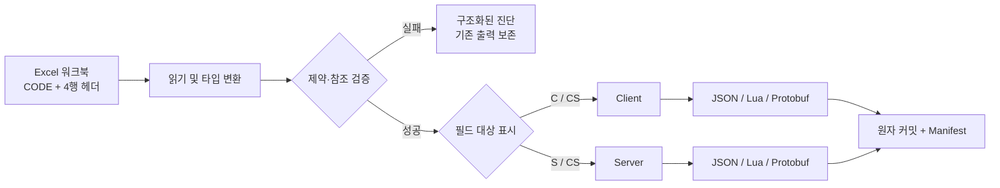

<p align="center">
  <a href="./README.en.md">English</a> |
  <a href="./README.md">简体中文</a> |
  <a href="./README.ja.md">日本語</a> |
  <strong>한국어</strong> |
  <a href="./README.es.md">Español</a> |
  <a href="./README.zh-TW.md">繁體中文</a>
</p>

<h1 align="center">SheetToConfig</h1>

<p align="center"><a href="https://github.com/liushafeiniao/SheetToConfig">github.com/liushafeiniao/SheetToConfig</a></p>

<p align="center"><strong>게임 팀을 위한 Excel 설정표 관리, 검증 및 다중 형식 내보내기 도구</strong></p>

<p align="center">SheetToConfig 데스크톱 앱에서 여러 프로젝트를 관리하고, 설정 데이터를 JSON, Lua, Protobuf로 안정적으로 내보내며, 열 단위로 클라이언트와 서버 데이터를 분리합니다.</p>

<p align="center">
  
  
  
  
  <a href="LICENSE"></a>
</p>

<p align="center">
  <a href="#빠른-시작">빠른 시작</a> ·
  <a href="#핵심-기능">핵심 기능</a> ·
  <a href="#excel-워크북-형식">Excel 형식</a> ·
  <a href="#protobuf">Protobuf</a> ·
  <a href="#개발과-검증">개발</a>
</p>

<p align="center"></p>
<p align="center"><sub>스크린샷의 프로젝트 이름과 경로는 모두 가상의 데모 데이터입니다.</sub></p>

## 빠른 시작

SheetToConfig는 Windows를 주요 지원 환경으로 하며 Apple Silicon 및 Intel macOS에서도 지속적으로 테스트합니다. macOS에서는 의존성을 설치한 뒤 `./run.sh`로 소스 버전을 실행할 수 있습니다.

```powershell
py -3.12 -m venv .venv
.\.venv\Scripts\python.exe -m pip install -r requirements.txt
.\.venv\Scripts\python.exe SheetToConfig.py
```

의존성을 설치한 뒤 `run.bat`을 실행해도 됩니다. `launch.bat`은 `dist/SheetToConfig.exe`가 있으면 이를 먼저 실행하고, 없으면 소스 버전을 실행합니다.

### 첫 내보내기

1. 새 프로젝트(`新建项目`)를 만들고 표, 클라이언트 출력, 서버 출력 디렉터리를 설정합니다.
2. `CODE` 워크시트가 포함된 `.xlsx` 파일을 표 디렉터리에 넣습니다.
3. 프로젝트를 선택하고 내보내기(`导表`)를 클릭한 뒤, 먼저 검증만(`仅校验`)으로 모든 문제를 확인합니다.
4. 검증이 성공하면 실제 내보내기를 실행하고 작업 로그와 출력 디렉터리를 확인합니다.

첫 내보내기 시 표 디렉터리에 기본 형식과 제약 예제가 포함된 `TypeDefinition.xlsx`가 자동으로 생성됩니다. C# 출력 및 공유 디렉터리는 선택 사항입니다.

## 핵심 기능

| 기능 | 설명 |
| --- | --- |
| 다중 프로젝트 관리 | 표, 클라이언트, 서버, C#, 공유 디렉터리를 검색·드래그 앤 드롭·정렬과 함께 관리 |
| 다중 출력 형식 | 같은 Excel에서 JSON, Lua, `.proto`, `.pb`와 선택적 C# 타입을 생성 |
| 클라이언트 / 서버 분기 | `C`, `S`, `CS`, `X`로 각 필드의 출력 대상을 제어 |
| 데이터 검증 | 타입, 기본 키, 고유성, 제약, 테이블 간 참조를 검사하고 파일·시트·행·열·필드를 진단 |
| 안전한 쓰기 | 전체 배치를 임시 영역에서 변환·검증한 뒤 원자적으로 커밋하며 실패 시 기존 결과를 보존 |
| 업데이트 manifest | Client / Server별 결정적인 `excel2json-manifest.json`에 SHA-256, 크기, 출처를 기록 |
| 팀 작업 흐름 | 표를 공유 디렉터리로 복사하고 프로젝트 설정과 테마는 저장소 밖에 로컬로 유지 |

## 작동 방식



모든 워크북의 `CODE` 설정과 데이터 시트의 네 줄 헤더를 읽고, 전체 변환·제약·참조 검증이 끝난 뒤에만 결과와 manifest를 공식 디렉터리에 커밋합니다.

## Excel 워크북 형식

### `CODE` 워크시트

내보낼 모든 워크북에는 `CODE` 워크시트가 있어야 합니다.

| Sheet | File | Platform |
| --- | --- | --- |
| Item | ItemConfig.json | cs |
| Skill | SkillData.lua | c |
| Quest | QuestConfig.pb | cs |

- `Sheet`: 같은 워크북 안의 데이터 시트 이름입니다.
- `File`: 출력 파일명입니다. `.json`, `.lua`, `.pb` 확장자를 반드시 지정해야 하며 형식을 추측하지 않습니다.
- `Platform`: `c`는 클라이언트, `s`는 서버, `cs`는 양쪽으로 내보냅니다.

### 데이터 워크시트

네 줄의 헤더를 사용하며 다섯 번째 줄부터 데이터입니다.

```text
ID           Name        Rewards                    Rate
int          string      intList+len(1,5)           float+range(0,1)
CS           CS          C                          S
식별자       이름        보상 목록                   서버 확률
1            Potion      1001#1002                  0.25
```

네 줄은 필드 이름, 타입, 출력 대상, 설명을 정의합니다. `C`는 클라이언트, `S`는 서버, `CS`는 양쪽, `X`는 제외입니다. 첫 번째 열은 기본 키이며 비어 있지 않은 스칼라이고 중복되지 않아야 합니다.

### 타입과 제약

기본 타입은 `int`, `float`, `string`, `bool`, `bytes`, 1~3차원 목록, 딕셔너리, 경로, 테이블 간 ID 참조를 지원합니다. `TypeDefinition.xlsx`에서 조합식으로 확장할 수 있습니다.

Enum은 기존 3열 TypeDefinition 형식에서 정의합니다. `enum(string,white,green,blue)`와 `enum(int,1,2,3)`는 기본 타입으로 엄격히 변환한 뒤 허용 값을 검증합니다.

```text
intList+len(1,5)
float+range(0,1)
string+required()+unique()
string+regex(^item_[0-9]+$)
intList+equalLen(Weights)
```

지원 제약은 `len`, `len2`, `len3`, `equalLen`, `equalLen2`, `coexist`, `leastOne`, `required` / `notEmpty`, `range`, `regex`, `unique`입니다.

## 워크북 간 참조: `find_id` / `find`

공개 문법은 다음 두 동의 함수입니다.

```text
find_id(file_prefix, display_label, field)
find(file_prefix, display_label, field)
```

- `file_prefix`는 파일명 접두사로 대상 `.xlsx`를 찾습니다.
- `display_label`은 표시용이며 워크시트를 선택하지 않습니다.
- `field`는 대상 필드와 일치해야 하며 5행부터 읽습니다.
- 빈 값은 대상 필드의 실제 타입을 따르고, 표·필드·ID가 없으면 검증 오류입니다.
- 목록은 구분자로 펼쳐 검증합니다. 실패하면 배치를 취소하고 기존 출력을 보존합니다.
- `find`는 `find_id`의 동의어이며 다른 이름은 공개 기능이 아닙니다.

## 출력 일관성

활성화된 출력 대상마다 `excel2json-manifest.json`이 생성됩니다. 경로 기준으로 결정적으로 정렬되며 SHA-256, 크기, 원본 워크북과 시트를 기록합니다. 지정 파일 내보내기는 유효한 기존 manifest가 필요한 증분 내보내기입니다.

전체 배치를 임시 영역에서 변환한 뒤 원자적으로 커밋합니다. 실패나 출력 충돌, 커밋 오류가 발생해도 불완전한 새 설정을 남기지 않고 이전 파일 복원을 시도합니다.

## Protobuf

`CODE`의 `File`을 `.pb` 파일명으로 설정하면 같은 이름의 `.proto`와 `.pb`가 생성됩니다.

- 스칼라, `bytes`, `intList` / `intList2` 등의 목록 타입을 Excel에서 자동 추론합니다.
- 선택적인 `PROTO` 워크시트에서 package, C# namespace, message, enum, map, oneof, reserved를 설정할 수 있습니다.
- 기존 schema manifest를 재사용해 필드 번호를 가능한 한 유지하며 삭제된 필드는 `reserved`로 기록합니다.
- Client와 Server는 공통 상위 `.proto`를 사용하고 각 `.pb`에는 해당 대상의 데이터만 포함합니다.
- C# 생성에는 `protoc`가 필요합니다.

데스크톱 UI는 파괴적인 프로토콜 변경을 기본적으로 거부합니다. Protobuf 스키마 재구성 허용(`允许重建 Protobuf 协议`)을 명시적으로 켜고 확인한 경우에만 허용됩니다. 릴리스된 프로토콜은 `.proto` diff를 검토해야 합니다.

## 프로젝트 설정과 로컬 데이터

| 설정 | 필수 | 용도 |
| --- | --- | --- |
| 표 디렉터리 | 예 | `.xlsx`와 `TypeDefinition.xlsx` 저장 |
| 클라이언트 출력 | 예 | Client 설정과 manifest |
| 서버 출력 | 예 | Server 설정과 manifest |
| C# 출력 | 아니요 | `protoc`가 생성한 C# 타입 |
| 리소스 루트 | 아니요 | `path()` 결과의 경로 이탈과 실제 파일 존재 여부 검증 |
| 공유 디렉터리 | 아니요 | 공유로 동기화(`传共享`) 대상 |

소스가 상위 프로젝트의 `GitHub` 하위 디렉터리에 있으면 상태는 형제 `LocalData`에 저장됩니다. 환경 변수로 변경할 수 있습니다.

```powershell
$env:SHEETTOCONFIG_DATA_DIR = "D:\SheetToConfigData"
python SheetToConfig.py
```

`projects.json`, `theme_config.json` 등의 로컬 상태는 `.gitignore`로 제외됩니다. 실제 경로, 인증 정보, 공유 위치를 커밋하지 마세요.

## 개발과 검증

```powershell
$env:PYTHONUTF8 = "1"
python -m unittest discover -s tests -v
```

일부 중국어 Windows의 GBK 콘솔에서 Unicode 상태 문자를 출력하지 못하는 경우 `PYTHONUTF8=1`을 설정하세요. GitHub Actions는 Windows, Apple Silicon macOS, Intel macOS에서 같은 테스트를 실행합니다.

Windows EXE 빌드:

```powershell
python -m pip install -r requirements-dev.txt
python build.py
```

성공하면 `dist/SheetToConfig.exe`가 생성됩니다. C# 생성에는 `PATH`의 `protoc` 또는 `PROTOC` 환경 변수가 필요합니다.

macOS에서는 `./build.sh`로 `.app`을 만들고 `python scripts/package_macos.py --unsigned`로 내부 검증용 DMG를 생성할 수 있습니다. 안정 릴리스 DMG는 서명과 Apple 공증이 성공한 경우에만 게시됩니다.

## 호환성과 제한

- Windows가 주요 플랫폼이며 Apple Silicon과 Intel macOS도 CI 및 공식 패키징 대상입니다. Linux 공식 패키지는 제공하지 않습니다.
- README와 데스크톱 UI는 중국어 간체, 영어, 일본어, 한국어, 스페인어, 중국어 번체를 지원합니다.
- 입력 형식은 `.xlsx`이며 증분 내보내기에는 유효한 기존 manifest가 필요합니다.
- 자동 Protobuf 진화는 프로토콜 리뷰를 대신하지 않습니다.

## 기여

Issue에는 최소 재현 워크북, 기대 결과, 실제 로그, 실행 환경을 포함하세요. 업무 데이터, 실제 경로, 인증 정보는 올리지 마세요.

출력 형식, manifest, Protobuf schema를 변경할 때는 성공·실패·롤백 테스트를 함께 추가하세요.

## 버전과 라이선스

- 버전: [`version.py`](version.py)의 `1.0.0`
- 변경 기록: [`CHANGELOG.md`](CHANGELOG.md)
- 라이선스: [`MIT`](LICENSE)
