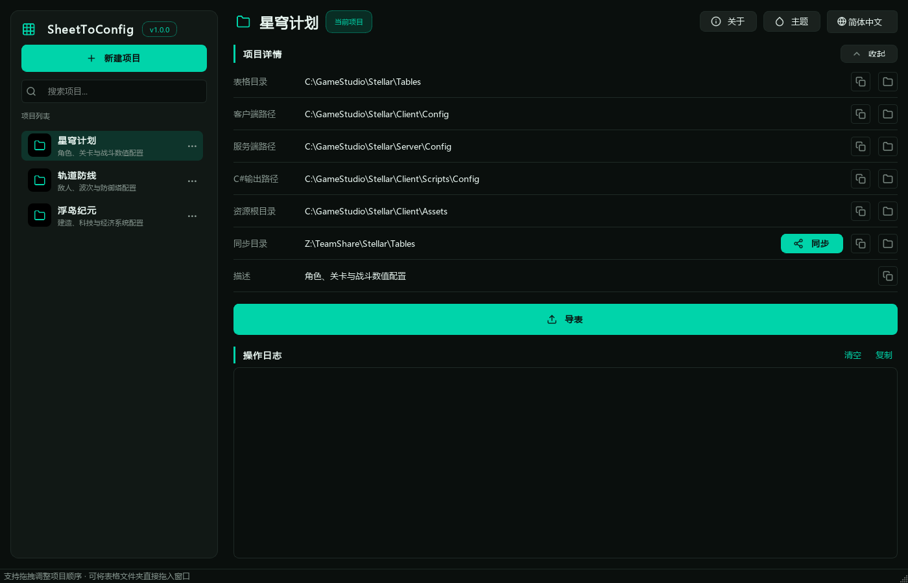
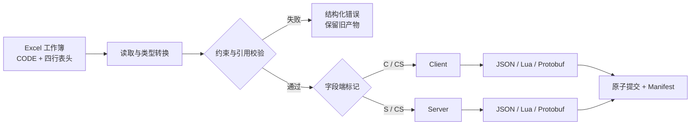

<p align="center">
  <a href="./README.en.md">English</a> |
  <strong>简体中文</strong> |
  <a href="./README.ja.md">日本語</a> |
  <a href="./README.ko.md">한국어</a> |
  <a href="./README.es.md">Español</a> |
  <a href="./README.zh-TW.md">繁體中文</a>
</p>

<h1 align="center">SheetToConfig</h1>

<p align="center"><a href="https://github.com/liushafeiniao/SheetToConfig">github.com/liushafeiniao/SheetToConfig</a></p>

<p align="center">
  <strong>面向游戏团队的 Excel 配置表管理、校验与多格式导出工具</strong>
</p>

<p align="center">
  通过桌面应用 SheetToConfig 统一管理多个项目，将配置可靠地导出为 JSON、Lua 和 Protobuf，并按字段粒度拆分客户端与服务端数据。
</p>

<p align="center">
  
  
  
  
  <a href="LICENSE"></a>
</p>

<p align="center">
  <a href="#快速开始">快速开始</a> ·
  <a href="#核心能力">核心能力</a> ·
  <a href="#excel-表格规范">表格规范</a> ·
  <a href="#protobuf">Protobuf</a> ·
  <a href="#开发与验证">开发与验证</a>
</p>

<p align="center">
  
</p>

<p align="center"><sub>界面中的项目名称和路径均为演示数据。</sub></p>

## 目录

应用内「关于 → 使用说明」与本 README 的分节一一对应，可按需查阅：

- [快速开始](#快速开始)：安装、源码启动与[第一次导出](#第一次导出)（对应应用内「快速上手」）
- [核心能力](#核心能力) · [工作原理](#工作原理)
- [Excel 表格规范](#excel-表格规范)：[CODE 工作表](#code-工作表)（导出清单，对应「CODE 表」）、[数据工作表](#数据工作表)（四行表头与主键，对应「数据表」）、[类型与约束](#类型与约束)
- [跨表引用：`find_id` / `find`](#跨表引用find_id--find)：校验值是否存在于其他工作簿（对应「跨表引用」）
- [输出与一致性](#输出与一致性)：暂存 + 原子提交、`excel2json-manifest.json` 清单（对应「导出安全机制」）
- [Protobuf](#protobuf)：`.proto` / `.pb` 生成、字段号稳定与 reserved（对应「导出安全机制与 Protobuf」）
- [项目配置与本地数据](#项目配置与本地数据)：必填/可选路径、资源根目录与 C# 输出（对应「资源校验与 C# 生成」）、同步目录
- [开发与验证](#开发与验证) · [兼容性与边界](#兼容性与边界) · [参与开发](#参与开发) · [版本与许可证](#版本与许可证)

## 快速开始

SheetToConfig 以 Windows 为主要支持平台，并在 Apple Silicon 与 Intel macOS 上持续测试。正式安装包从 [GitHub Releases](https://github.com/liushafeiniao/SheetToConfig/releases) 下载；macOS DMG 只有在完成 Apple 签名和公证后才会进入稳定 Release。

Windows 源码启动：

```powershell
py -3.12 -m venv .venv
.\.venv\Scripts\python.exe -m pip install -r requirements.txt
.\.venv\Scripts\python.exe SheetToConfig.py
```

安装依赖后，也可以双击 `run.bat`。`launch.bat` 会优先启动 `dist/SheetToConfig.exe`，不存在时再尝试从源码启动。

macOS 源码启动：

```bash
python3.12 -m venv .venv
source .venv/bin/activate
python -m pip install -r requirements.txt
./run.sh
```

### 第一次导出

1. 点击「新建项目」，设置表格目录、客户端输出目录和服务端输出目录。
2. 在表格目录中放入至少一个包含 `CODE` 工作表的 `.xlsx` 文件。
3. 选中项目并点击「导表」，先勾选「仅校验」检查全部问题；确认无误后执行正式导出。
4. 在操作日志中确认结果，再到对应输出目录查看产物。

首次导出会在表格目录中自动创建 `TypeDefinition.xlsx`，其中包含内置类型和约束示例。C# 输出目录与团队同步目录都是可选项。

## 核心能力

| 能力 | 说明 |
| --- | --- |
| 多项目管理 | 集中维护表格、客户端、服务端、C# 与共享目录；支持搜索、拖放路径和项目排序 |
| 多格式导出 | 同一套 Excel 配置可生成 JSON、Lua、`.proto` 与 `.pb`，并可选生成 C# 类型 |
| 客户端 / 服务端分流 | 用 `C`、`S`、`CS`、`X` 标记控制字段去向，避免把服务端数据误发到客户端 |
| 数据校验 | 校验类型、主键、唯一性、字段约束与跨表引用；错误可定位到文件、工作表、行、列和字段 |
| 安全写入 | 整批配置先在暂存目录完成转换和校验，通过后再原子提交；失败时保留旧产物 |
| 热更新清单 | 为客户端和服务端分别生成确定性的 `excel2json-manifest.json`，记录 SHA-256、大小和来源 |
| 团队工作流 | 一键将表格复制到同步目录；项目配置、主题与窗口皮肤保存在本地，不污染仓库 |

## 工作原理



导出器先读取每个工作簿的 `CODE` 配置，再解析数据表的四行表头。只有整批工作簿都通过转换、约束和引用检查后，产物与清单才会一起写入正式目录。

## Excel 表格规范

### `CODE` 工作表

每个待导出的工作簿都必须包含 `CODE` 工作表：

| Sheet | File | Platform |
| --- | --- | --- |
| Item | ItemConfig.json | cs |
| Skill | SkillData.lua | c |
| Quest | QuestConfig.pb | cs |

- `Sheet`：同一工作簿中的数据工作表名称。
- `File`：输出文件名；扩展名决定格式，只支持 `.json`、`.lua`、`.pb`，不能省略或猜测。
- `Platform`：`c` 仅客户端、`s` 仅服务端、`cs` 两端都导出。

### 数据工作表

数据表使用四行表头，第五行起是数据：

```text
ID    Name      Rewards                    Rate
int   string    intList+len(1,5)           float+range(0,1)
CS    CS        C                          S
编号  名称      奖励列表                    服务端概率
1     初级药水  1001#1002                  0.25
```

四行依次表示字段名、字段类型、导出端和字段说明。字段端标记支持：

| 标记 | 行为 |
| --- | --- |
| `C` | 仅导出到客户端 |
| `S` | 仅导出到服务端 |
| `CS` | 客户端和服务端都导出 |
| `X` | 不导出 |

第一列会作为主键处理，必须是非空的标量值且不能重复。错误不会被静默跳过，而是作为结构化诊断返回。

### 类型与约束

内置类型覆盖 `int`、`float`、`string`、`bool`、`bytes`、一至三维列表、字典、路径和跨表 ID 引用。复杂类型也可以在 `TypeDefinition.xlsx` 中通过组合表达式扩展。

枚举仍在三列 TypeDefinition 中定义，不增加新 Schema。`enum(string,white,green,blue)` 与 `enum(int,1,2,3)` 会先严格转换基础类型，再校验允许值；导出值保持原字符串或整数，不做名称到数字映射。

约束直接追加在类型后面，例如：

```text
intList+len(1,5)
float+range(0,1)
string+required()+unique()
string+regex(^item_[0-9]+$)
intList+equalLen(Weights)
```

支持的约束包括 `len`、`len2`、`len3`、`equalLen`、`equalLen2`、`coexist`、`leastOne`、`required` / `notEmpty`、`range`、`regex` 和 `unique`。

## 跨表引用：`find_id` / `find`

公开语法只有以下两个同义函数：

```text
find_id(file_prefix, display_label, field)
find(file_prefix, display_label, field)
```

- `file_prefix` 按文件名前缀定位目标 `.xlsx` 工作簿。
- `display_label` 只用于显示，不用于选择工作表。
- `field` 匹配目标字段；从第 5 行开始读取数据。
- 空值按目标字段真实类型处理；缺表、缺字段或缺 ID 会校验失败。
- 列表引用按分隔符展平后验证；失败时整批取消并保留旧产物。
- `find` 是 `find_id` 的同义简写，其他名称不是公开能力。

## 输出与一致性

每个启用的输出端都会得到一份 `excel2json-manifest.json`：

```json
{
  "manifestVersion": 1,
  "platform": "client",
  "contentVersion": "sha256:...",
  "files": [
    {
      "path": "ItemConfig.json",
      "format": "json",
      "sha256": "...",
      "size": 2048,
      "source": {
        "workbook": "Item.xlsx",
        "sheet": "Item"
      }
    }
  ]
}
```

清单按路径稳定排序，`contentVersion` 只由运行时产物的身份与内容计算，可用于比较客户端 / 服务端版本及生成热更新差异。指定文件导出属于增量导出，需要输出目录中已有有效清单；清单缺失或损坏时会停止写入。

导出采用整批暂存与原子提交。任一工作簿失败、输出路径冲突或提交异常时，不会留下半套新配置；无法完成提交时会尝试恢复旧文件并报告错误。

## Protobuf

在 `CODE` 工作表中把 `File` 写成 `.pb` 文件名，即可生成同名 `.proto` 与 `.pb`：

```text
QuestConfig.proto
QuestConfig.pb
```

- 普通标量、`bytes` 以及 `intList` / `intList2` 等列表类型可以直接从 Excel 推导。
- 可选的 `PROTO` 工作表用于设置 package、C# namespace 或描述更复杂的 message、enum、map、oneof 与 reserved 声明。
- 自动生成器会复用已有 schema manifest，尽量保持字段号稳定；删除的字段会写入 `reserved`。
- 客户端与服务端共享同一份字段超集 `.proto`，各自的 `.pb` 只包含该端允许的数据。
- 配置 C# 输出目录后，可调用 `protoc` 生成 C# 文件。

桌面界面默认禁止破坏性协议变更。只有显式勾选「允许重建 Protobuf 协议」并通过二次确认后，才会允许不兼容重建；发布过的协议仍应检查 `.proto` diff。

## 项目配置与本地数据

| 配置 | 必填 | 用途 |
| --- | --- | --- |
| 表格目录 | 是 | 存放 `.xlsx` 与 `TypeDefinition.xlsx` |
| 客户端路径 | 是 | 客户端配置与 manifest 输出目录 |
| 服务端路径 | 是 | 服务端配置与 manifest 输出目录 |
| C# 输出路径 | 否 | `protoc` 生成的 C# 类型目录 |
| 资源根目录 | 否 | 校验 `path()` 结果未越界且文件真实存在；留空时只转换路径并提示 |
| 同步目录 | 否 | 「同步」操作的目标目录 |

源码位于父项目的 `GitHub` 子目录时，本地状态默认写入同级 `LocalData`；独立运行源码时默认写入源码目录；打包后的 EXE 默认写入可执行文件目录。可以用环境变量覆盖：

```powershell
$env:SHEETTOCONFIG_DATA_DIR = "D:\SheetToConfigData"
python SheetToConfig.py
```

`projects.json`、`theme_config.json` 等本地状态已被 `.gitignore` 排除。仓库不应提交真实项目路径、凭据或团队共享目录信息。

## 开发与验证

### 运行测试

```powershell
$env:PYTHONUTF8 = "1"
python -m unittest discover -s tests -v
```

`PYTHONUTF8=1` 可避免中文 Windows 的 GBK 控制台无法输出 Unicode 状态符。GitHub Actions 会在 Windows、Apple Silicon macOS 和 Intel macOS 的 Python 3.12 环境中运行同一套测试。测试覆盖应用数据路径、类型与约束校验、JSON / Lua / Protobuf 导出、schema 演进、运行时清单以及原子回滚。

### 构建 Windows EXE

```powershell
python -m pip install -r requirements-dev.txt
python build.py
```

构建成功后，单文件程序位于 `dist/SheetToConfig.exe`。`build.py` 使用独立暂存目录构建，只有 PyInstaller 成功后才替换旧 EXE。

### 构建 macOS 应用

```bash
python3.12 -m pip install -r requirements-dev.txt
./build.sh
python scripts/package_macos.py --unsigned
```

构建必须在对应架构的 macOS 上执行，输出为 `dist/SheetToConfig.app` 和 DMG。未签名 DMG 只用于内部验证；稳定 Release 通过 GitHub Actions 完成 Developer ID 签名和 Apple 公证。完整发布与密钥配置见 [`RELEASING.md`](RELEASING.md)。

如需生成 C# 配置类，还必须安装 `protoc` 并加入 `PATH`，或设置 `PROTOC` 环境变量。

<details>
<summary><strong>项目结构</strong></summary>

```text
SheetToConfig.py             主窗口与交互
app_paths.py                本地数据目录解析
dialogs.py                  项目、主题、导出与关于对话框
styles.py                   主题驱动的 QSS 样式
theme_config.py             主题预设与持久化
icons.py                    随主题着色的图标工厂
widgets.py                  自定义控件
utils/
  project_manager.py        项目数据与排序持久化
  export_handler.py         导出调度
  import_handler.py         团队共享同步
  exporter/
    converter.py            批量转换与校验编排
    constraints.py          字段约束
    reference_validator.py  跨表引用校验
    protobuf_schema.py      Protobuf schema 解析与演进
    artifact_manifest.py    运行时产物清单
    atomic_writer.py        原子提交与回滚
    exporters/              JSON / Lua / Protobuf 输出器
tests/                      自动化测试
```

</details>

## 兼容性与边界

- Windows 是主要支持平台；Apple Silicon 与 Intel macOS 也进入 CI 和正式打包链路。
- Linux 仅保留源码兼容性，不提供 AppImage、Flatpak 或其他正式安装包。
- README 与桌面界面均支持简体中文、English、日本語、한국어、Español 和繁體中文。
- 输入以 `.xlsx` 为正式支持格式；临时文件和非工作簿内容不会参与导出。
- 生成 C# 代码依赖外部 `protoc`，JSON、Lua、`.proto` 和 `.pb` 不依赖系统级编译器。
- 增量导出依赖已有且有效的 manifest；首次使用应先执行一次完整导出。
- Protobuf 自动演进不能替代协议评审，发布后的破坏性变更仍需由团队控制。

## 参与开发

提交问题时，请附上可复现的最小工作簿结构、期望结果、实际日志和运行环境；请勿上传包含业务数据、真实路径或凭据的文件。

提交代码前，请先运行完整测试。涉及导出格式、manifest 或 Protobuf schema 的改动，应同时补充成功路径、错误路径和回滚场景测试。

## 版本与许可证

- 当前版本：[`version.py`](version.py) 中的 `1.0.0`
- 变更记录：[`CHANGELOG.md`](CHANGELOG.md)
- 开源许可证：[`MIT`](LICENSE)
