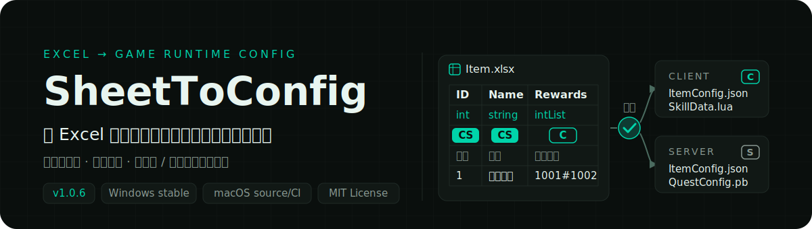
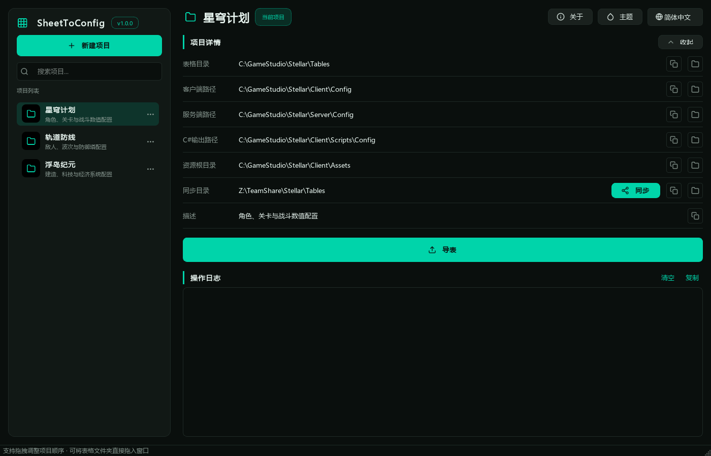
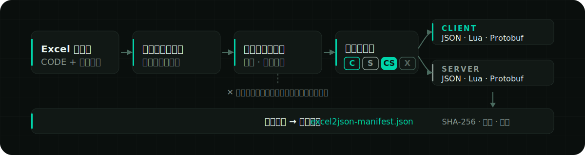
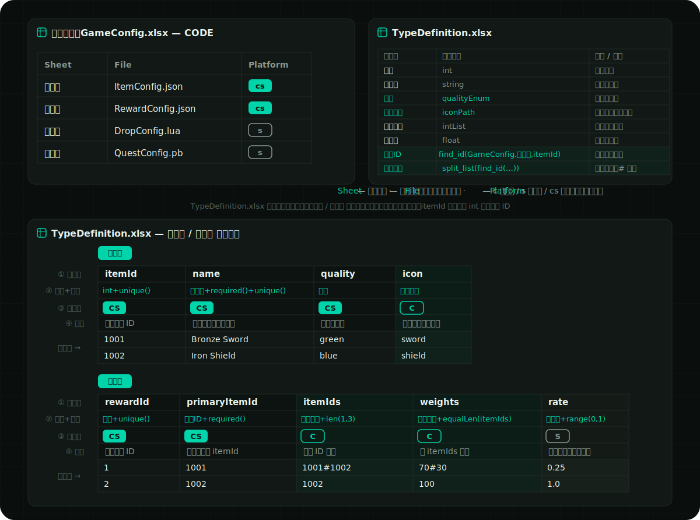
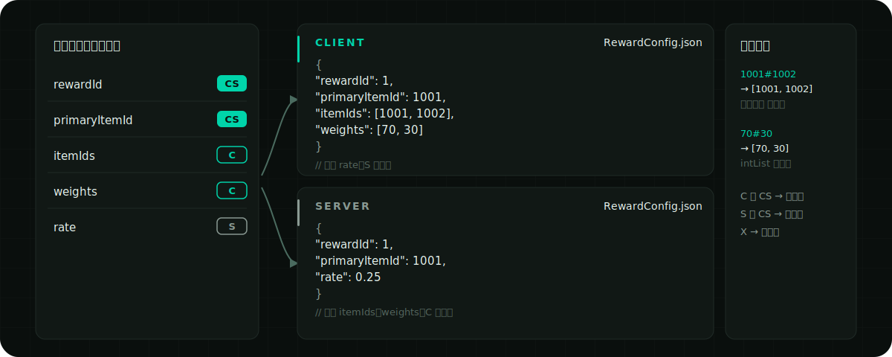

<p align="right">
  <a href="docs/locales/README.en.md">English</a> ·
  <strong>简体中文</strong> ·
  <a href="docs/locales/README.ja.md">日本語</a> ·
  <a href="docs/locales/README.ko.md">한국어</a> ·
  <a href="docs/locales/README.es.md">Español</a> ·
  <a href="docs/locales/README.zh-TW.md">繁體中文</a>
</p>

<p align="center">
  
</p>

<p align="center">
  <a href="https://github.com/liushafeiniao/SheetToConfig/actions/workflows/tests.yml"></a>
  <a href="https://github.com/liushafeiniao/SheetToConfig/releases"></a>
  
  <a href="LICENSE"></a>
</p>

<p align="center">
  <a href="https://github.com/liushafeiniao/SheetToConfig/releases"><strong>下载 / Releases</strong></a> ·
  <a href="#快速开始"><strong>快速开始</strong></a> ·
  <a href="#excel-表格规范">查看表格规范</a>
</p>

<p align="center">
  
</p>

<p align="center"><sub>界面中的项目名称和路径均为演示数据。</sub></p>

| 一个可信数据源 | 三种运行时格式 | 两端精细分流 |
| :---: | :---: | :---: |
| `CODE` + 四行表头 | `JSON` · `Lua` · `Protobuf` | `C` · `S` · `CS` · `X` |

## 快速开始

SheetToConfig 以 Windows 为主要支持平台，并在 Apple Silicon 与 Intel macOS 上持续测试。稳定版 [GitHub Releases](https://github.com/liushafeiniao/SheetToConfig/releases) 仅提供 Windows x64 EXE 和校验文件；当前没有 macOS 稳定安装包。

Windows 源码启动：

```powershell
py -3.12 -m venv .venv
.\.venv\Scripts\python.exe -m pip install -r requirements.txt
.\.venv\Scripts\python.exe -m sheet_to_config.app
```

安装依赖后，也可以双击 `scripts/run.bat` 从源码启动；已下载或构建的 `SheetToConfig.exe` 可直接双击运行。

macOS 源码启动：

```bash
python3.12 -m venv .venv
source .venv/bin/activate
python -m pip install -r requirements.txt
./scripts/run.sh
```

未签名 macOS 构建仅供维护者手动进行内部预览，不会作为公开 Release 发布；如需在 macOS 上使用，请按上述步骤从源码运行。

### 第一次导出

1. 点击「新建项目」，设置表格目录、客户端输出目录和服务端输出目录。
2. 在表格目录中放入至少一个包含 `CODE` 工作表的 `.xlsx` 文件。
3. 选中项目并点击「导表」，先勾选「仅校验」检查全部问题；确认无误后执行正式导出。
4. 在操作日志中确认结果，再到对应输出目录查看产物。

首次导出会在表格目录中自动创建 `TypeDefinition.xlsx`，其中包含内置类型和约束示例。C# 输出目录与团队同步目录都是可选项。

## 核心能力

| 能力 | 说明 |
| --- | --- |
| 多项目管理 | 集中维护表格、客户端、服务端、C# 与共享目录；支持搜索、拖放路径和项目排序 |
| 多格式导出 | 同一套 Excel 配置可生成 JSON、Lua、`.proto` 与 `.pb`，并可选生成 C# 类型 |
| 客户端 / 服务端分流 | 用 `C`、`S`、`CS`、`X` 标记控制字段去向，避免把服务端数据误发到客户端 |
| 数据校验 | 校验类型、主键、唯一性、字段约束与跨表引用；错误可定位到文件、工作表、行、列和字段 |
| 安全写入 | 整批配置先在暂存目录完成转换和校验，通过后再原子提交；失败时保留旧产物 |
| 热更新清单 | 为客户端和服务端分别生成确定性的 `excel2json-manifest.json`，记录 SHA-256、大小和来源 |
| 团队工作流 | 一键将表格复制到同步目录；项目配置、主题与窗口皮肤保存在本地，不污染仓库 |

## 工作原理

<p align="center">
  
</p>

导出器先读取每个工作簿的 `CODE` 配置，再解析数据表的四行表头。只有整批工作簿都通过转换、约束和引用检查后，产物与清单才会一起写入正式目录。

## Excel 表格规范

约定只有两条：每个工作簿用一张 `CODE` 工作表声明「哪些表导出成什么文件、发到哪一端」，每张数据表用四行表头声明字段。掌握下面的 `CODE` 工作表就能写出第一张可导出的表；数据表、类型约束与跨表引用的完整规则折叠在后，需要时再展开。

### `CODE` 工作表

每个待导出的工作簿都必须包含 `CODE` 工作表（名称不区分大小写），每行声明一张数据表的输出方式：

| Sheet | File | Platform |
| --- | --- | --- |
| Item | ItemConfig.json | cs |
| Skill | SkillData.lua | c |
| Quest | QuestConfig.pb | cs |

- `Sheet`：同一工作簿中的数据工作表名称。
- `File`：输出文件名，扩展名决定格式，只支持 `.json`、`.lua`、`.pb`。省略扩展名目前会按 JSON 兼容导出并给出警告（该兼容将在后续版本移除）；`.proto` 不能单独作为导出格式。
- `Platform`：`c` 仅客户端、`s` 仅服务端、`cs` 两端都导出；不区分大小写，留空时跟随当前导出模式。

解析按列位置进行，表头行可写可不写；首行第一格是 `Sheet` 等表头文字时会自动跳过。

### 一份完整示例

下图用于快速认识一套完整表格的结构。仓库提供一份完整的 [`TypeDefinition.xlsx`](examples/cross_table/tables/TypeDefinition.xlsx)，其中集中放置 `CODE`、`Guide`、`Examples`、`物品表`、`奖励表` 五个分表，覆盖客户端/服务端字段分流、`unique`、`len`、`equalLen`、`range`、直接跨表引用和引用列表。

`TypeDefinition.xlsx` 会被导出器整体跳过，因此其中的 `物品表`、`奖励表` 是可复制的教学示例，不会直接生成配置。需要实际运行时，把这两个分表复制到普通业务工作簿（如 `GameConfig.xlsx`），再在该工作簿的 `CODE` 分表中声明输出即可。

也可以生成一份独立副本（输出目录必须不存在或为空；`--force` 也只会替换这一份 `TypeDefinition.xlsx`）：

```powershell
python scripts/create_examples.py --output-dir my-example
```

<p align="center">
  
</p>

<details>
<summary><strong>这份示例导出后长什么样</strong> — 同一张表在客户端与服务端的不同产物</summary>

<p align="center">
  
</p>

`C` 与 `CS` 字段进入客户端产物，`S` 与 `CS` 字段进入服务端产物，`X` 不导出；列表类型的分隔符串（如 `1001#1002`、`70#30`）在 JSON 中转换为数组。

</details>

<details>
<summary><strong>数据工作表：四行表头与字段端标记</strong> — 字段名 / 类型 / 导出端 / 说明，第一列即主键</summary>

数据表使用四行表头，第五行起是数据：

```text
itemId  name      itemIds                    rate
int     string    intList+len(1,5)           float+range(0,1)
CS    CS        C                          S
编号  名称      奖励列表                    服务端概率
1     初级药水  1001#1002                  0.25
```

四行依次表示字段名、字段类型、导出端和字段说明。导出端标记不区分大小写：

| 标记 | 行为 |
| --- | --- |
| `C` | 仅导出到客户端 |
| `S` | 仅导出到服务端 |
| `CS` | 客户端和服务端都导出（留空时的默认值） |
| `X` | 不导出 |

第一列会作为主键处理，必须是非空的标量值且不能重复。错误不会被静默跳过，而是作为结构化诊断返回，可定位到文件、工作表、行、列和字段。

</details>

<details>
<summary><strong>类型、枚举与约束</strong> — 内置类型清单、TypeDefinition 扩展与 11 种字段约束</summary>

内置类型覆盖 `int`、`float`、`string`、`bool`、`bytes`、`text_key`、一至三维列表、字典、路径 `path()` 和跨表 ID 引用。首次导出自动生成的 `TypeDefinition.xlsx` 包含五张表：`CODE` 是实际类型清单，`Guide` 说明约束、分隔符、引用参数与输出边界，`Examples` 提供表达式示例，另外两张本地化命名的教学分表则提供可复制到业务工作簿的完整数据表示例。

`CODE` 使用四列 `Name / Convert / Description / Cell example`；前两列参与转换，后两列用于说明。旧项目的两列、三列文件仍可读取。枚举不增加新 Schema：`enum(string,white,green,blue)` 与 `enum(int,1,2,3)` 会先严格转换基础类型，再校验允许值；导出值保持原字符串或整数。

缺少文件时，`TypeDefinition.xlsx` 会按当前界面语言首次生成；已有文件不会因切换语言而被改写。教学数据表第 1 行始终使用英文 camelCase 代码字段（如 `itemId`、`primaryItemId`），第 2 行使用当前语言的类型名，第 4 行使用当前语言说明；`required()`、`unique()`、`range()` 等约束关键字保持固定。作为跨表引用源的 `itemId` 保留标准 `int`，引用它的字段则使用本地化类型名（中文为 `物品ID`），以维持纯标量 ID 输出。

跨表引用采用两层写法：先在 `TypeDefinition.xlsx / CODE` 注册命名类型，例如中文模板已有的 `物品ID = find_id(GameConfig,物品表,itemId)`，再在业务数据表第 2 行写 `物品ID+required()`；不要重复创建“物品引用”等近义类型，也不要把 `find_id(...)` 直接写进业务表类型行。这里第一个参数是目标工作簿前缀，第二个参数只是报错时的显示标签，第三个参数才是被引用字段。

约束直接追加在类型后面，例如：

```text
intList+len(1,5)
float+range(0,1)
string+required()+unique()
string+regex(^item_[0-9]+$)
intList+equalLen(weights)
```

支持的约束包括 `len`、`len2`、`len3`、`equalLen`、`equalLen2`、`coexist`、`leastOne`、`required` / `notEmpty`、`range`、`regex` 和 `unique`。

</details>

<details>
<summary><strong>跨表引用：<code>find_id</code> / <code>find</code></strong> — 按文件名前缀引用其他工作簿的 ID，导出时真实校验</summary>

一张表的 ID 列可以引用另一张表的主键，导出时会逐条校验目标真实存在。公开语法只有以下两个同义函数：

```text
find_id(file_prefix, display_label, field)
find(file_prefix, display_label, field)
```

- `file_prefix` 按文件名前缀定位目标 `.xlsx` 工作簿。
- `display_label` 只用于显示，不用于选择工作表。
- `field` 匹配目标字段；从第 5 行开始读取数据。
- 生成 Protobuf 时，`find_id` 按引用目标的最终标量类型确定字段类型；缺表、缺字段或缺 ID 会校验失败。
- 列表引用按分隔符展平后验证；失败时整批取消并保留旧产物。
- `find` 是 `find_id` 的同义简写，其他名称不是公开能力。

</details>

<details>
<summary><strong>输出、Manifest 与原子提交</strong> — 确定性清单格式、增量导出条件与失败回滚保证</summary>

每个启用的输出端都会得到一份 `excel2json-manifest.json`：

```json
{
  "manifestVersion": 1,
  "platform": "client",
  "contentVersion": "sha256:...",
  "files": [
    {
      "path": "ItemConfig.json",
      "format": "json",
      "sha256": "...",
      "size": 2048,
      "source": {
        "workbook": "Item.xlsx",
        "sheet": "Item"
      }
    }
  ]
}
```

清单按路径稳定排序，`contentVersion` 只由运行时产物的身份与内容计算，可用于比较客户端 / 服务端版本及生成热更新差异。指定文件导出属于增量导出，需要输出目录中已有有效清单；清单缺失或损坏时会停止写入。

导出采用整批暂存与原子提交。任一工作簿失败、输出路径冲突或提交异常时，不会留下半套新配置；无法完成提交时会尝试恢复旧文件并报告错误。

</details>

<details>
<summary><strong>Protobuf 导出</strong> — <code>.pb</code> 即生成同名 <code>.proto</code>，超集协议与 schema 重建</summary>

在 `CODE` 工作表中把 `File` 写成 `.pb` 文件名，即可生成同名 `.proto` 与 `.pb`：

```text
QuestConfig.proto
QuestConfig.pb
```

- 普通标量、`bytes` 以及 `intList` / `intList2` 等列表类型可以直接从 Excel 推导。
- 可选的 `PROTO` 工作表用于设置 package、C# namespace 或描述更复杂的 message、enum、map、oneof 与 reserved 声明。
- 自动生成器会复用已有 schema manifest，尽量保持字段号稳定；删除的字段会写入 `reserved`。
- 客户端与服务端共享同一份字段超集 `.proto`，各自的 `.pb` 只包含该端允许的数据。
- 配置 C# 输出目录后，可调用 `protoc` 生成 C# 文件。

桌面端导出与「仅校验」会自动接受当前 Excel schema，并据此重建 Protobuf 协议；这不会绕过主键、类型或其他数据校验，非受管或损坏的 `.proto` 仍会被拒绝。发布过的协议仍应检查 `.proto` diff。底层 Python API 的 `allow_breaking_proto_change` 默认仍为 `False`，保持严格的兼容性检查。

</details>

<details>
<summary><strong>项目配置与本地数据</strong> — 六项目录配置、本地状态位置与 <code>SHEETTOCONFIG_DATA_DIR</code></summary>

| 配置 | 必填 | 用途 |
| --- | --- | --- |
| 表格目录 | 是 | 存放 `.xlsx` 与 `TypeDefinition.xlsx` |
| 客户端路径 | 是 | 客户端配置与 manifest 输出目录 |
| 服务端路径 | 是 | 服务端配置与 manifest 输出目录 |
| C# 输出路径 | 否 | `protoc` 生成的 C# 类型目录 |
| 资源根目录 | 否 | 配置后校验已填写的 `path()` 是否未越界且文件真实存在；留空时完全跳过 `path()` 存在性检查，不回退也不提示警告 |
| 同步目录 | 否 | 「同步」操作的目标目录 |

源码位于父项目的 `GitHub` 子目录且同级存在 `LocalData` 时，本地状态写入该目录；其他源码环境使用系统用户配置目录；Windows EXE 默认写入可执行文件目录。可以用环境变量覆盖：

```powershell
$env:SHEETTOCONFIG_DATA_DIR = "D:\SheetToConfigData"
python -m sheet_to_config.app
```

`projects.json`、`theme_config.json` 等本地状态已被 `.gitignore` 排除。仓库不应提交真实项目路径、凭据或团队共享目录信息。

</details>

<details>
<summary><strong>开发与验证</strong> — 测试命令、Windows / macOS 构建与项目结构</summary>

### 运行测试

```powershell
$env:PYTHONUTF8 = "1"
python -m unittest discover -s tests -v
```

`PYTHONUTF8=1` 可避免中文 Windows 的 GBK 控制台无法输出 Unicode 状态符。GitHub Actions 会在 Windows、Apple Silicon macOS 和 Intel macOS 的 Python 3.12 环境中运行同一套测试。测试覆盖应用数据路径、类型与约束校验、JSON / Lua / Protobuf 导出、schema 演进、运行时清单以及原子回滚。

### 构建 Windows EXE

```powershell
python -m pip install -r requirements-dev.txt
python scripts/build.py
```

构建成功后，单文件程序位于 `dist/SheetToConfig.exe`。`scripts/build.py` 使用独立暂存目录构建，只有 PyInstaller 成功后才替换旧 EXE。

### 构建 macOS 应用

```bash
python3.12 -m pip install -r requirements-dev.txt
./scripts/build.sh
python scripts/package_macos.py --unsigned
```

构建应在目标 macOS 架构上执行，输出为 `dist/SheetToConfig.app` 和 DMG。macOS 仍在 CI 测试，但未签名 DMG 只作为维护者手动的内部预览；当前没有 macOS 稳定 Release。完整发布边界见 [`docs/RELEASING.md`](docs/RELEASING.md)。

如需生成 C# 配置类，还必须安装 `protoc` 并加入 `PATH`，或设置 `PROTOC` 环境变量。

### 项目结构

```text
SheetToConfig.py              根目录启动器（兼容入口）
sheet_to_config/app.py        主窗口与交互
sheet_to_config/app_paths.py  本地数据目录解析
sheet_to_config/dialogs.py    项目、主题、导出与关于对话框
sheet_to_config/styles.py     主题驱动的 QSS 样式
sheet_to_config/theme_config.py 主题预设与持久化
sheet_to_config/icons.py      随主题着色的图标工厂
sheet_to_config/widgets.py    自定义控件
sheet_to_config/utils/
  project_manager.py          项目数据与排序持久化
  export_handler.py           导出调度
  import_handler.py           团队共享同步
  exporter/
    converter.py              批量转换与校验编排
    batch_transaction.py      整批事务与增量导出
    type_registry.py          类型注册与转换
    template.py               TypeDefinition.xlsx 模板
    constraints.py            字段约束
    reference_validator.py    跨表引用校验
    protobuf_schema.py        Protobuf schema 解析与演进
    artifact_manifest.py      运行时产物清单
    atomic_writer.py          原子提交与回滚
    exporters/                JSON / Lua / Protobuf 输出器
tests/                        自动化测试
```

</details>

## 兼容性与边界

- Windows 是主要支持平台；Apple Silicon 与 Intel macOS 进入 CI，未签名打包仅供维护者内部验证。
- Linux 当前不受正式支持，也未进入 CI；源码运行可能可用，但不提供 AppImage、Flatpak 或其他正式安装包。
- README 与桌面界面均支持简体中文、English、日本語、한국어、Español 和繁體中文。
- 输入以 `.xlsx` 为正式支持格式；临时文件和非工作簿内容不会参与导出。
- 生成 C# 代码依赖外部 `protoc`，JSON、Lua、`.proto` 和 `.pb` 不依赖系统级编译器。
- 增量导出依赖已有且有效的 manifest；首次使用应先执行一次完整导出。
- Protobuf 自动演进不能替代协议评审，发布后的破坏性变更仍需由团队控制。

## 参与开发

提交问题时，请附上可复现的最小工作簿结构、期望结果、实际日志和运行环境；请勿上传包含业务数据、真实路径或凭据的文件。

提交代码前，请先运行完整测试。涉及导出格式、manifest 或 Protobuf schema 的改动，应同时补充成功路径、错误路径和回滚场景测试。

## 版本与许可证

- 当前版本：[`sheet_to_config/version.py`](sheet_to_config/version.py) 中的 `1.0.2`
- 变更记录：[`CHANGELOG.md`](CHANGELOG.md)
- 开源许可证：[`MIT`](LICENSE)
