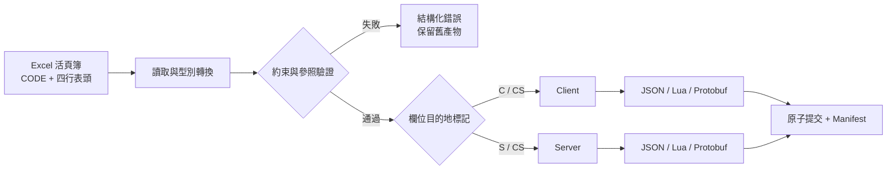

<p align="center">
  <a href="./README.en.md">English</a> |
  <a href="./README.md">简体中文</a> |
  <a href="./README.ja.md">日本語</a> |
  <a href="./README.ko.md">한국어</a> |
  <a href="./README.es.md">Español</a> |
  <strong>繁體中文</strong>
</p>

<h1 align="center">SheetToConfig</h1>

<p align="center"><a href="https://github.com/liushafeiniao/SheetToConfig">github.com/liushafeiniao/SheetToConfig</a></p>

<p align="center"><strong>面向遊戲團隊的 Excel 設定表管理、驗證與多格式匯出工具</strong></p>

<p align="center">透過桌面應用程式 SheetToConfig 統一管理多個專案，將設定可靠地匯出為 JSON、Lua 和 Protobuf，並依欄位粒度分離用戶端與伺服器資料。</p>

<p align="center">
  
  
  
  
  <a href="LICENSE"></a>
</p>

<p align="center">
  <a href="#快速開始">快速開始</a> ·
  <a href="#核心能力">核心能力</a> ·
  <a href="#excel-活頁簿格式">Excel 格式</a> ·
  <a href="#protobuf">Protobuf</a> ·
  <a href="#開發與驗證">開發</a>
</p>

<p align="center"></p>
<p align="center"><sub>畫面中的專案名稱與路徑均為虛構的示範資料。</sub></p>

## 快速開始

SheetToConfig 以 Windows 為主要支援平台，並在 Apple Silicon 與 Intel macOS 上持續測試。macOS 安裝相依套件後可執行 `./run.sh` 啟動原始碼版本。穩定版 DMG 僅會在完成 Developer ID 簽署與 Apple 公證後發布。

實驗性 DMG 可從滾動的 [macos-preview](https://github.com/liushafeiniao/SheetToConfig/releases/tag/macos-preview) GitHub Prerelease 取得：Apple M 系列請選 `arm64`，Intel Mac 請選 `x64`。這些 DMG 未簽署、未公證，也未經 Apple 驗證；僅在信任儲存庫及對應原始碼提交時使用。公司或學校管理的 Mac 可能會阻擋它們。首次啟動失敗後，請使用 Apple 支援的「系統設定 → 隱私權與安全性 → 仍要打開」。若連結尚未建立，表示目前沒有公開預覽包，請依照上述步驟從原始碼執行。

```powershell
py -3.12 -m venv .venv
.\.venv\Scripts\python.exe -m pip install -r requirements.txt
.\.venv\Scripts\python.exe SheetToConfig.py
```

安裝相依套件後，也可以執行 `run.bat`。`launch.bat` 會在 `dist/SheetToConfig.exe` 存在時優先啟動，否則改用原始碼版本。

### 第一次匯出

1. 建立新專案（`新建项目`），設定表格、用戶端輸出與伺服器輸出資料夾。
2. 將至少一個包含 `CODE` 工作表的 `.xlsx` 檔案放入表格資料夾。
3. 選取專案並按下匯出（`导表`），先使用僅驗證（`仅校验`）檢查所有問題。
4. 驗證成功後執行正式匯出，確認操作日誌與輸出資料夾。

第一次匯出會在表格資料夾自動建立包含內建型別與約束範例的 `TypeDefinition.xlsx`。C# 輸出資料夾與團隊共享資料夾都是選用項目。

## 核心能力

| 能力 | 說明 |
| --- | --- |
| 多專案管理 | 集中管理表格、用戶端、伺服器、C# 與共享資料夾，支援搜尋、拖放路徑與排序 |
| 多格式匯出 | 從同一份 Excel 產生 JSON、Lua、`.proto`、`.pb`，並可選擇產生 C# 型別 |
| 用戶端 / 伺服器分流 | 使用 `C`、`S`、`CS`、`X` 控制每個欄位的輸出目的地 |
| 資料驗證 | 驗證型別、主鍵、唯一性、欄位約束與跨表參照，回傳包含檔案、工作表、列、欄與欄位的診斷 |
| 安全寫入 | 整批設定先在暫存目錄轉換與驗證，通過後再原子提交；失敗時保留舊產物 |
| 熱更新清單 | 為用戶端與伺服器產生確定性的 `excel2json-manifest.json`，記錄 SHA-256、大小與來源 |
| 團隊流程 | 一鍵將表格同步到共享資料夾；專案設定與主題保存在本機，不污染儲存庫 |

## 工作原理



匯出器會讀取每個活頁簿的 `CODE` 設定，再解析資料工作表的四行表頭。只有整批活頁簿通過轉換、約束與參照驗證後，產物與清單才會寫入正式目錄。

## Excel 活頁簿格式

### `CODE` 工作表

每個要匯出的活頁簿都必須包含 `CODE` 工作表：

| Sheet | File | Platform |
| --- | --- | --- |
| Item | ItemConfig.json | cs |
| Skill | SkillData.lua | c |
| Quest | QuestConfig.pb | cs |

- `Sheet`：同一活頁簿中的資料工作表名稱。
- `File`：輸出檔名。副檔名必須是 `.json`、`.lua` 或 `.pb`，不會猜測格式。
- `Platform`：`c` 僅輸出到用戶端、`s` 僅輸出到伺服器、`cs` 兩端都輸出。

### 資料工作表

使用四行表頭，第五行開始是資料：

```text
ID           Name        Rewards                    Rate
int          string      intList+len(1,5)           float+range(0,1)
CS           CS          C                          S
識別碼       名稱        獎勵清單                    伺服器機率
1            Potion      1001#1002                  0.25
```

四行依序表示欄位名稱、欄位型別、輸出目的地與欄位說明。`C` 是用戶端、`S` 是伺服器、`CS` 是兩端、`X` 是不輸出。第一欄會作為主鍵，必須是非空純量且不可重複。

### 型別與約束

內建型別涵蓋 `int`、`float`、`string`、`bool`、`bytes`、一至三維清單、字典、路徑與跨表 ID 參照，也可以在 `TypeDefinition.xlsx` 以組合運算式擴充。

Enum 仍使用既有三欄 TypeDefinition 格式。`enum(string,white,green,blue)` 與 `enum(int,1,2,3)` 會先嚴格轉換基礎型別，再驗證允許值。

```text
intList+len(1,5)
float+range(0,1)
string+required()+unique()
string+regex(^item_[0-9]+$)
intList+equalLen(Weights)
```

支援的約束包括 `len`、`len2`、`len3`、`equalLen`、`equalLen2`、`coexist`、`leastOne`、`required` / `notEmpty`、`range`、`regex` 與 `unique`。

## 跨活頁簿引用：`find_id` / `find`

公開語法只有以下兩個同義函式：

```text
find_id(file_prefix, display_label, field)
find(file_prefix, display_label, field)
```

- `file_prefix` 依檔名前綴定位目標 `.xlsx` 活頁簿。
- `display_label` 僅供顯示，不會用來選擇工作表。
- `field` 必須符合目標欄位名，從第 5 列開始讀取資料。
- 空值依目標欄位真實型別處理；缺少活頁簿、欄位或 ID 會驗證失敗。
- 清單引用會依分隔符展平後驗證；失敗時取消整批並保留舊產物。
- `find` 是 `find_id` 的同義簡寫，其他名稱不是公開功能。

## 輸出一致性

每個啟用的輸出目的地都會取得一份 `excel2json-manifest.json`，依路徑穩定排序並記錄 SHA-256、大小、來源活頁簿與工作表。指定檔案匯出屬於增量匯出，需要有效的既有清單。

匯出會先在暫存目錄完成整批轉換，再進行原子提交。若發生工作簿錯誤、輸出衝突或提交失敗，不會留下不完整的新設定，並會嘗試還原舊檔案。

## Protobuf

在 `CODE` 的 `File` 填入 `.pb` 檔名，即可產生同名的 `.proto` 與 `.pb`。

- 純量、`bytes`、`intList` / `intList2` 等清單型別可直接由 Excel 推導。
- 選用的 `PROTO` 工作表可設定 package、C# namespace、message、enum、map、oneof 與 reserved。
- 產生器會重用既有 schema manifest，盡可能保持欄位編號；刪除的欄位會寫入 `reserved`。
- 用戶端與伺服器共用欄位超集 `.proto`，各自的 `.pb` 只包含該端允許的資料。
- 產生 C# 需要 `protoc`。

桌面介面預設拒絕破壞性協議變更。只有明確啟用並確認「允許重建 Protobuf 協議（`允许重建 Protobuf 协议`）」後，才允許不相容重建。已發布的協議仍應檢查 `.proto` 差異。

## 專案設定與本機資料

| 設定 | 必填 | 用途 |
| --- | --- | --- |
| 表格目錄 | 是 | 存放 `.xlsx` 與 `TypeDefinition.xlsx` |
| 用戶端路徑 | 是 | 用戶端設定與 manifest |
| 伺服器路徑 | 是 | 伺服器設定與 manifest |
| C# 輸出路徑 | 否 | `protoc` 產生的 C# 型別 |
| 資源根目錄 | 否 | 驗證 `path()` 結果不越界且檔案存在 |
| 同步目錄 | 否 | 「傳共享」的目標資料夾 |

當原始碼位於父專案的 `GitHub` 子目錄時，本機狀態預設寫入同層的 `LocalData`。可以用環境變數覆寫：

```powershell
$env:SHEETTOCONFIG_DATA_DIR = "D:\SheetToConfigData"
python SheetToConfig.py
```

`projects.json`、`theme_config.json` 等本機狀態已由 `.gitignore` 排除。不要提交真實專案路徑、憑證或團隊共享位置。

## 開發與驗證

```powershell
$env:PYTHONUTF8 = "1"
python -m unittest discover -s tests -v
```

部分中文 Windows 的 GBK 主控台無法輸出 Unicode 狀態符號時，請設定 `PYTHONUTF8=1`。GitHub Actions 會在 Windows、Apple Silicon macOS 與 Intel macOS 執行同一套測試。

建置 Windows EXE：

```powershell
python -m pip install -r requirements-dev.txt
python build.py
```

成功後會產生 `dist/SheetToConfig.exe`。C# 產生需要將 `protoc` 加入 `PATH`，或設定 `PROTOC` 環境變數。

macOS 可執行 `./build.sh` 產生 `.app`，再以 `python scripts/package_macos.py --unsigned` 建立 DMG。維護者也可透過公開 GitHub Actions macOS runner 建置，不必擁有 Mac；但雲端建置不能取代真實裝置驗收。未簽署 DMG 可作為公開實驗性 `macos-preview` 預覽發布，但不能描述為穩定版、官方版、已簽署或已公證的發布物。穩定版 DMG 必須完成 Developer ID 簽署與 Apple 公證。

## 相容性與限制

- Windows 是主要平台；Apple Silicon 與 Intel macOS 也納入 CI 和正式打包。Linux 不提供正式安裝套件。
- README 與桌面介面均支援簡體中文、English、日本語、한국어、Español 與繁體中文。
- 支援的輸入格式是 `.xlsx`，增量匯出需要有效的既有 manifest。
- Protobuf 自動演進不能取代協議審查。

## 參與開發

提交 Issue 時，請附上最小可重現的活頁簿結構、預期結果、實際日誌與執行環境。請勿上傳業務資料、真實路徑或憑證。

涉及輸出格式、manifest 或 Protobuf schema 的修改，應補充成功、錯誤與回滾測試。

## 版本與授權

- 目前版本：[`version.py`](version.py) 中的 `1.0.0`
- 變更記錄：[`CHANGELOG.md`](CHANGELOG.md)
- 授權：[`MIT`](LICENSE)
