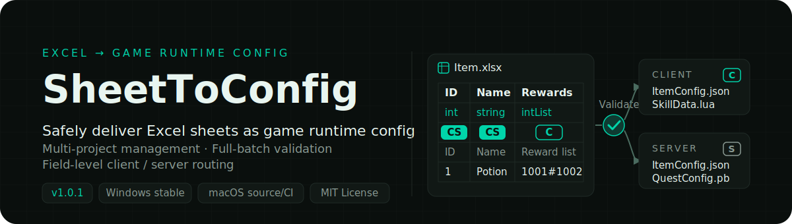
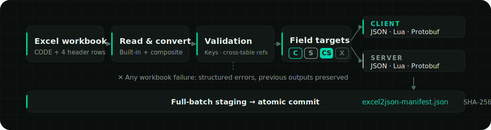
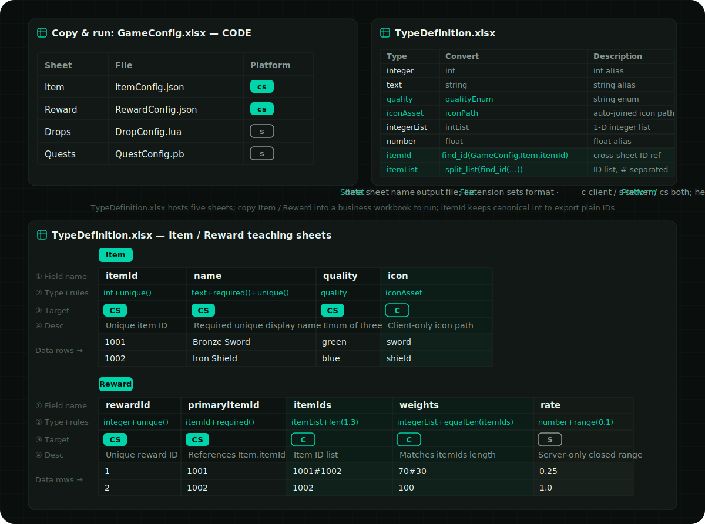
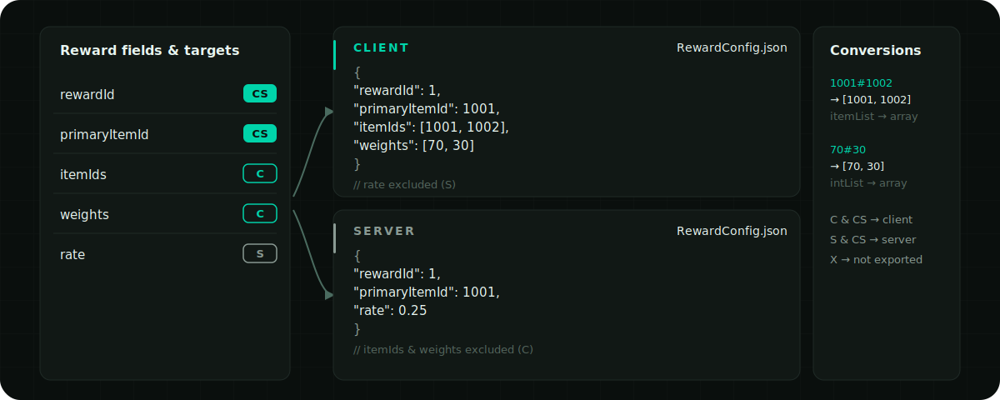

<p align="right">
  <strong>English</strong> ·
  <a href="../../README.md">简体中文</a> ·
  <a href="./README.ja.md">日本語</a> ·
  <a href="./README.ko.md">한국어</a> ·
  <a href="./README.es.md">Español</a> ·
  <a href="./README.zh-TW.md">繁體中文</a>
</p>

<p align="center">
  
</p>

<p align="center">
  <a href="https://github.com/liushafeiniao/SheetToConfig/actions/workflows/tests.yml"></a>
  <a href="https://github.com/liushafeiniao/SheetToConfig/releases"></a>
  
  <a href="../../LICENSE"></a>
</p>

<p align="center">
  <a href="https://github.com/liushafeiniao/SheetToConfig/releases"><strong>Download / Releases</strong></a> ·
  <a href="#quick-start"><strong>Quick Start</strong></a> ·
  <a href="#excel-workbook-format">View the workbook format</a>
</p>

<p align="center">
  
</p>

<p align="center"><sub>All project names and paths shown in the UI are demonstration data.</sub></p>

| One source of truth | Three runtime formats | Precise client / server routing |
| :---: | :---: | :---: |
| `CODE` + four header rows | `JSON` · `Lua` · `Protobuf` | `C` · `S` · `CS` · `X` |

## Quick Start

Windows is the primary supported platform, with continuous testing on Apple Silicon and Intel macOS. Stable [GitHub Releases](https://github.com/liushafeiniao/SheetToConfig/releases) provide only the Windows x64 EXE and checksum files; there is currently no stable macOS installer.

Run from source on Windows:

```powershell
py -3.12 -m venv .venv
.\.venv\Scripts\python.exe -m pip install -r requirements.txt
.\.venv\Scripts\python.exe -m sheet_to_config.app
```

After installing the dependencies, you can also double-click `scripts/run.bat` to launch from source; a downloaded or built `SheetToConfig.exe` runs directly on double-click.

Run from source on macOS:

```bash
python3.12 -m venv .venv
source .venv/bin/activate
python -m pip install -r requirements.txt
./scripts/run.sh
```

Unsigned macOS builds are maintainer-only manual internal previews and are never published as public Releases; to use SheetToConfig on macOS, run from source with the steps above.

### Your first export

1. Click "New Project" and set the workbook directory, client output directory, and server output directory.
2. Place at least one `.xlsx` file containing a `CODE` worksheet into the workbook directory.
3. Select the project and click "Export"; first enable "Validate only" to check every issue, then run the real export once everything is clean.
4. Confirm the result in the operation log, then inspect the artifacts in the corresponding output directories.

The first export automatically creates `TypeDefinition.xlsx` in the workbook directory, containing built-in types and constraint examples. The C# output directory and team sync directory are both optional.

## Core Capabilities

| Capability | What it provides |
| --- | --- |
| Multi-project management | Centrally manage workbook, client, server, C#, and shared directories; supports search, drag-and-drop paths, and project ordering |
| Multi-format export | Generate JSON, Lua, `.proto`, and `.pb` from the same Excel configuration, with optional C# type generation |
| Client / server routing | Use `C`, `S`, `CS`, and `X` markers to control where each field goes, keeping server data from being sent to the client by mistake |
| Data validation | Validate types, primary keys, uniqueness, field constraints, and cross-table references; errors locate the file, worksheet, row, column, and field |
| Safe writes | The whole batch is converted and validated in a staging directory and committed atomically only after passing; failures preserve previous artifacts |
| Hot-update manifests | Generate a deterministic `excel2json-manifest.json` for client and server, recording SHA-256, size, and source |
| Team workflow | One-click copy of sheets to the sync directory; project settings, themes, and window skins are stored locally and never pollute the repository |

## How It Works

<p align="center">
  
</p>

The exporter first reads the `CODE` configuration of each workbook, then parses the four header rows of every data sheet. Artifacts and manifests are written to the live directories only after the entire batch of workbooks passes conversion, constraint, and reference checks.

## Excel Workbook Format

There are only two conventions: every workbook declares "which sheets export to which files, and to which targets" in a `CODE` worksheet, and every data sheet declares its fields with four header rows. Learn the `CODE` worksheet below and you can write your first exportable sheet; the full rules for data sheets, type constraints, and cross-table references are collapsed further down — expand them when needed.

### The `CODE` worksheet

Every workbook to be exported must contain a `CODE` worksheet (the name is case-insensitive); each row declares how one data sheet is exported:

| Sheet | File | Platform |
| --- | --- | --- |
| Item | ItemConfig.json | cs |
| Skill | SkillData.lua | c |
| Quest | QuestConfig.pb | cs |

- `Sheet`: the name of the data worksheet in the same workbook.
- `File`: the output filename; the extension determines the format, and only `.json`, `.lua`, and `.pb` are supported. Omitting the extension currently exports as JSON for compatibility and emits a warning (this compatibility will be removed in a future version); `.proto` cannot be used as a standalone export format.
- `Platform`: `c` exports to the client only, `s` to the server only, `cs` to both; case-insensitive, and when left empty it follows the current export mode.

Parsing is positional by column, and the header row is optional; when the first cell of the first row contains header text such as `Sheet`, that row is skipped automatically.

### A complete example

The figure below gives a quick tour of a complete workbook set. The repository ships a full [`TypeDefinition.xlsx`](../../examples/cross_table/tables/TypeDefinition.xlsx) that bundles five sheets — `CODE`, `Guide`, `Examples`, `Item`, and `Reward` — covering client/server field routing, `unique`, `len`, `equalLen`, `range`, direct cross-table references, and reference lists.

The exporter skips `TypeDefinition.xlsx` as a whole, so the `Item` and `Reward` sheets in it are copyable teaching examples and never generate configuration directly. To actually run them, copy these two sheets into a normal business workbook (such as `GameConfig.xlsx`) and declare the outputs in that workbook's `CODE` sheet.

You can also generate a standalone copy (the output directory must not exist or must be empty; `--force` replaces only this one `TypeDefinition.xlsx`):

```powershell
python scripts/create_examples.py --output-dir my-example
```

<p align="center">
  
</p>

<details>
<summary><strong>What this example looks like after export</strong> — the same sheet's different artifacts for client and server</summary>

<p align="center">
  
</p>

`C` and `CS` fields go into the client artifact, `S` and `CS` fields go into the server artifact, and `X` is not exported; separator strings of list types (such as `1001#1002` and `70#30`) are converted to arrays in JSON.

</details>

<details>
<summary><strong>Data worksheets: four header rows and field target markers</strong> — field name / type / export target / description; the first column is the primary key</summary>

Data sheets use four header rows; data starts on row five:

```text
itemId       name        itemIds                    rate
int          string      intList+len(1,5)           float+range(0,1)
CS           CS          C                          S
Identifier   Name        Reward list                Server-side rate
1            Potion      1001#1002                  0.25
```

The four rows are, in order, field name, field type, export target, and field description. Export target markers are case-insensitive:

| Marker | Behavior |
| --- | --- |
| `C` | Export to the client only |
| `S` | Export to the server only |
| `CS` | Export to both client and server (the default when left empty) |
| `X` | Not exported |

The first column is treated as the primary key and must be a non-empty, unique scalar value. Errors are never silently skipped; they are returned as structured diagnostics that locate the file, worksheet, row, column, and field.

</details>

<details>
<summary><strong>Types, enums, and constraints</strong> — built-in type list, TypeDefinition extensions, and 11 field constraints</summary>

Built-in types cover `int`, `float`, `string`, `bool`, `bytes`, `text_key`, one- to three-dimensional lists, dictionaries, `path()` paths, and cross-workbook ID references. A generated `TypeDefinition.xlsx` contains `CODE` for actual definitions, `Guide` for constraints and boundaries, `Examples` for expressions, and copyable `Item` and `Reward` data-sheet examples.

`CODE` has four columns: `Name / Convert / Description / Cell example`; only the first two affect conversion, and legacy two- or three-column files remain readable. The English template registers `itemId = find_id(GameConfig,Item,itemId)` in `CODE`; use `itemId+required()` in data-sheet row 2 rather than creating a near-duplicate “reference” type or writing `find_id(...)` there directly. The second `find_id` argument is a display label, not a worksheet selector.

When missing, `TypeDefinition.xlsx` is created once in the current UI language; changing the UI language never rewrites an existing file. Teaching sheets always use English camelCase field names in row 1, localized type names in row 2, and localized explanations in row 4. Constraint keywords such as `required()`, `unique()`, and `range()` stay fixed. The referenced `itemId` source keeps canonical `int`, while fields that reference it use the localized `itemId` type, preserving scalar-ID output compatibility.

Constraints are appended directly after the type, for example:

```text
intList+len(1,5)
float+range(0,1)
string+required()+unique()
string+regex(^item_[0-9]+$)
intList+equalLen(weights)
```

Supported constraints include `len`, `len2`, `len3`, `equalLen`, `equalLen2`, `coexist`, `leastOne`, `required` / `notEmpty`, `range`, `regex`, and `unique`.

</details>

<details>
<summary><strong>Cross-table references: <code>find_id</code> / <code>find</code></strong> — reference IDs in other workbooks by filename prefix, validated for real at export time</summary>

A sheet's ID column can reference another sheet's primary key, and every entry is checked against the real target at export time. The public syntax is limited to these two synonymous functions:

```text
find_id(file_prefix, display_label, field)
find(file_prefix, display_label, field)
```

- `file_prefix` locates the target `.xlsx` workbook by filename prefix.
- `display_label` is for display only and is never used to select a worksheet.
- `field` matches the target field; data is read from row 5 onward.
- For Protobuf, `find_id` uses the referenced target's final scalar type for the field type; a missing sheet, field, or ID fails validation.
- List references are flattened by their separator before validation; on failure the whole batch is cancelled and previous artifacts are preserved.
- `find` is a synonymous shorthand for `find_id`; other names are not public capabilities.

</details>

<details>
<summary><strong>Output, manifests, and atomic commit</strong> — deterministic manifest format, incremental export conditions, and failure rollback guarantees</summary>

Every enabled output target receives an `excel2json-manifest.json`:

```json
{
  "manifestVersion": 1,
  "platform": "client",
  "contentVersion": "sha256:...",
  "files": [
    {
      "path": "ItemConfig.json",
      "format": "json",
      "sha256": "...",
      "size": 2048,
      "source": {
        "workbook": "Item.xlsx",
        "sheet": "Item"
      }
    }
  ]
}
```

Manifest entries are sorted stably by path, and `contentVersion` is computed only from the identity and content of runtime artifacts; it can be used to compare client / server versions and to generate hot-update diffs. Exporting selected files is an incremental export and requires an existing valid manifest in the output directory; if the manifest is missing or corrupt, the write stops.

Exports use full-batch staging and atomic commit. If any workbook fails, output paths conflict, or the commit errors, no half-written set of new configuration is left behind; when a commit cannot complete, SheetToConfig tries to restore the old files and reports the error.

</details>

<details>
<summary><strong>Protobuf export</strong> — <code>.pb</code> generates a same-named <code>.proto</code>; superset schema and schema rebuilds</summary>

Set `File` to a `.pb` filename in the `CODE` worksheet to generate a same-named `.proto` and `.pb`:

```text
QuestConfig.proto
QuestConfig.pb
```

- Plain scalars, `bytes`, and list types such as `intList` / `intList2` can be inferred directly from Excel.
- An optional `PROTO` worksheet sets the package and C# namespace, or describes more complex message, enum, map, oneof, and reserved declarations.
- The generator reuses the existing schema manifest to keep field numbers as stable as possible; deleted fields are written to `reserved`.
- Client and server share one field-superset `.proto`; each `.pb` contains only the data allowed for that target.
- With a C# output directory configured, `protoc` can be invoked to generate C# files.

Desktop exports and Validate only automatically accept the current Excel schema and rebuild the Protobuf protocol from it. This does not bypass primary-key, type, or other data validation; unmanaged or damaged `.proto` files are still rejected. Review the `.proto` diff for published protocols. The underlying Python API keeps `allow_breaking_proto_change` at its default of `False`, so it remains strictly compatible by default.

</details>

<details>
<summary><strong>Project settings and local data</strong> — the six directory settings, local state locations, and <code>SHEETTOCONFIG_DATA_DIR</code></summary>

| Setting | Required | Purpose |
| --- | --- | --- |
| Workbook directory | Yes | Stores `.xlsx` workbooks and `TypeDefinition.xlsx` |
| Client path | Yes | Client configuration and manifest output directory |
| Server path | Yes | Server configuration and manifest output directory |
| C# output path | No | Directory for C# types generated by `protoc` |
| Asset root | No | When configured, validates that filled-in `path()` values stay in bounds and the files really exist; when empty, all `path()` existence checks are skipped, with no fallback or warning |
| Shared directory | No | Target directory of the "Sync" action |

When the source code lives in the parent project's `GitHub` subdirectory and a sibling `LocalData` directory exists, local state is written there; other source checkouts use the system per-user configuration directory; the Windows EXE writes to the executable's directory by default. Override it with an environment variable:

```powershell
$env:SHEETTOCONFIG_DATA_DIR = "D:\SheetToConfigData"
python -m sheet_to_config.app
```

Local state such as `projects.json` and `theme_config.json` is excluded by `.gitignore`. The repository should never commit real project paths, credentials, or team share information.

</details>

<details>
<summary><strong>Development and verification</strong> — test commands, Windows / macOS builds, and project structure</summary>

### Run the tests

```powershell
$env:PYTHONUTF8 = "1"
python -m unittest discover -s tests -v
```

`PYTHONUTF8=1` prevents the GBK console on Chinese Windows from failing to print Unicode status symbols. GitHub Actions runs the same suite in Python 3.12 environments on Windows, Apple Silicon macOS, and Intel macOS. Tests cover application data paths, type and constraint validation, JSON / Lua / Protobuf export, schema evolution, runtime manifests, and atomic rollback.

### Build the Windows EXE

```powershell
python -m pip install -r requirements-dev.txt
python scripts/build.py
```

After a successful build, the single-file program is at `dist/SheetToConfig.exe`. `scripts/build.py` builds in an isolated staging directory and replaces the old EXE only after PyInstaller succeeds.

### Build the macOS app

```bash
python3.12 -m pip install -r requirements-dev.txt
./scripts/build.sh
python scripts/package_macos.py --unsigned
```

Builds should run on the target macOS architecture; the outputs are `dist/SheetToConfig.app` and a DMG. macOS is still tested in CI, but unsigned DMGs are maintainer-only manual internal previews; there is currently no stable macOS Release. See [`RELEASING.md`](../RELEASING.md) for the full release boundaries.

To generate C# configuration classes, `protoc` must also be installed and on `PATH`, or the `PROTOC` environment variable must be set.

### Project structure

```text
SheetToConfig.py              Root launcher (compatibility entry point)
sheet_to_config/app.py        Main window and interactions
sheet_to_config/app_paths.py  Local data directory resolution
sheet_to_config/dialogs.py    Project, theme, export, and about dialogs
sheet_to_config/styles.py     Theme-driven QSS styles
sheet_to_config/theme_config.py Theme presets and persistence
sheet_to_config/icons.py      Theme-aware icon factory
sheet_to_config/widgets.py    Custom widgets
sheet_to_config/utils/
  project_manager.py          Project data and ordering persistence
  export_handler.py           Export orchestration
  import_handler.py           Team share synchronization
  exporter/
    converter.py              Batch conversion and validation orchestration
    batch_transaction.py      Full-batch transactions and incremental export
    type_registry.py          Type registration and conversion
    template.py               TypeDefinition.xlsx template
    constraints.py            Field constraints
    reference_validator.py    Cross-table reference validation
    protobuf_schema.py        Protobuf schema parsing and evolution
    artifact_manifest.py      Runtime artifact manifests
    atomic_writer.py          Atomic commit and rollback
    exporters/                JSON / Lua / Protobuf writers
tests/                        Automated tests
```

</details>

## Compatibility and Limits

- Windows is the primary supported platform; Apple Silicon and Intel macOS are in CI, and unsigned packaging is for maintainer-internal verification only.
- Linux is not officially supported or CI-tested; running from source may work, but no AppImage, Flatpak, or other official installer is provided.
- Both the README and the desktop UI support Simplified Chinese, English, Japanese, Korean, Spanish, and Traditional Chinese.
- `.xlsx` is the officially supported input format; temporary files and non-workbook content do not participate in export.
- Generating C# code depends on an external `protoc`; JSON, Lua, `.proto`, and `.pb` do not depend on a system-level compiler.
- Incremental export depends on an existing valid manifest; run one full export first.
- Automatic Protobuf evolution cannot replace protocol review; breaking changes after release must still be controlled by the team.

## Contributing

When reporting an issue, attach a minimal reproducible workbook structure, the expected result, the actual log, and your runtime environment; do not upload files containing business data, real paths, or credentials.

Run the full test suite before submitting code. Changes touching export formats, manifests, or Protobuf schemas should add success-path, error-path, and rollback scenario tests.

## Version and License

- Current version: `1.0.3` in [`sheet_to_config/version.py`](../../sheet_to_config/version.py)
- Changelog: [`CHANGELOG.md`](../../CHANGELOG.md)
- License: [`MIT`](../../LICENSE)
