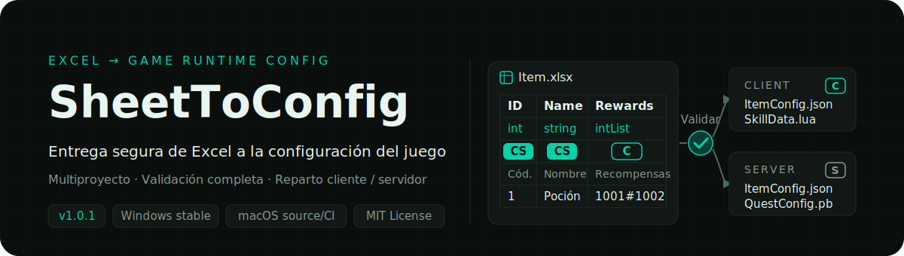
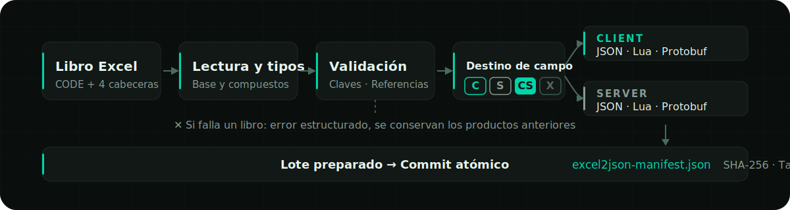
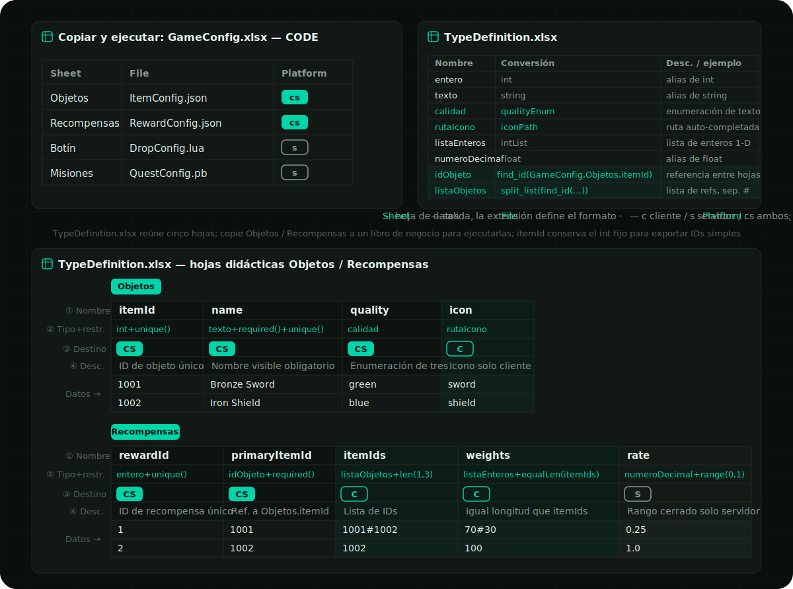
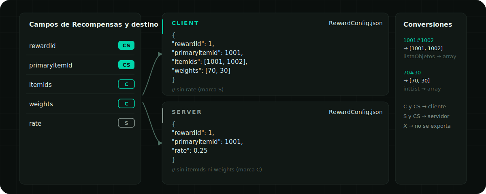

<p align="right">
  <a href="./README.en.md">English</a> ·
  <a href="../../README.md">简体中文</a> ·
  <a href="./README.ja.md">日本語</a> ·
  <a href="./README.ko.md">한국어</a> ·
  <strong>Español</strong> ·
  <a href="./README.zh-TW.md">繁體中文</a>
</p>

<p align="center">
  
</p>

<p align="center">
  <a href="https://github.com/liushafeiniao/SheetToConfig/actions/workflows/tests.yml"></a>
  <a href="https://github.com/liushafeiniao/SheetToConfig/releases"></a>
  
  <a href="../../LICENSE"></a>
</p>

<p align="center">
  <a href="https://github.com/liushafeiniao/SheetToConfig/releases"><strong>Descargar / Releases</strong></a> ·
  <a href="#inicio-rápido"><strong>Inicio rápido</strong></a> ·
  <a href="#especificación-de-hojas-de-excel">Ver la especificación de hojas</a>
</p>

<p align="center">
  
</p>

<p align="center"><sub>Los nombres de proyecto y las rutas de la interfaz son datos de demostración.</sub></p>

| Una fuente fiable | Tres formatos de ejecución | Reparto preciso entre ambos extremos |
| :---: | :---: | :---: |
| `CODE` + cuatro filas de encabezado | `JSON` · `Lua` · `Protobuf` | `C` · `S` · `CS` · `X` |

## Inicio rápido

SheetToConfig tiene Windows como plataforma principal de soporte y se prueba continuamente en macOS Apple Silicon e Intel. Las versiones estables de [GitHub Releases](https://github.com/liushafeiniao/SheetToConfig/releases) solo incluyen el EXE Windows x64 y su archivo de comprobación; actualmente no hay paquete estable para macOS.

Inicio desde el código fuente en Windows:

```powershell
py -3.12 -m venv .venv
.\.venv\Scripts\python.exe -m pip install -r requirements.txt
.\.venv\Scripts\python.exe -m sheet_to_config.app
```

Después de instalar las dependencias también puedes hacer doble clic en `scripts/run.bat` para iniciar desde el código fuente; el `SheetToConfig.exe` descargado o compilado se ejecuta directamente con doble clic.

Inicio desde el código fuente en macOS:

```bash
python3.12 -m venv .venv
source .venv/bin/activate
python -m pip install -r requirements.txt
./scripts/run.sh
```

Las compilaciones de macOS sin firma son solo vistas previas internas que los mantenedores ejecutan manualmente y no se publican como Release pública; para usar la aplicación en macOS, ejecútala desde el código fuente con los pasos anteriores.

### Primera exportación

1. Haz clic en «Nuevo proyecto» y configura la carpeta de tablas, la ruta del cliente y la ruta del servidor.
2. Coloca en la carpeta de tablas al menos un archivo `.xlsx` que contenga una hoja `CODE`.
3. Selecciona el proyecto y haz clic en «Exportar»; marca primero «Solo validar; no escribir archivos» para revisar todos los problemas y, cuando todo esté correcto, ejecuta la exportación real.
4. Confirma el resultado en el registro de operaciones y revisa los productos en las carpetas de salida correspondientes.

La primera exportación crea automáticamente `TypeDefinition.xlsx` en la carpeta de tablas, con los tipos integrados y ejemplos de restricciones. La ruta de salida C# y la carpeta compartida son opcionales.

## Capacidades principales

| Capacidad | Descripción |
| --- | --- |
| Gestión de varios proyectos | Mantiene de forma centralizada las carpetas de tablas, cliente, servidor, C# y compartida; con búsqueda, rutas por arrastrar y soltar y ordenación de proyectos |
| Exportación multiformato | El mismo conjunto de configuración Excel genera JSON, Lua, `.proto` y `.pb`, y opcionalmente tipos C# |
| Reparto cliente / servidor | Los marcadores `C`, `S`, `CS` y `X` controlan el destino de cada campo y evitan enviar datos de servidor al cliente por error |
| Validación de datos | Valida tipos, claves primarias, unicidad, restricciones de campo y referencias entre tablas; los errores se localizan por archivo, hoja, fila, columna y campo |
| Escritura segura | Todo el lote se convierte y valida primero en un directorio temporal y solo después se confirma de forma atómica; si algo falla, se conservan los productos anteriores |
| Manifiesto de actualización en caliente | Genera un `excel2json-manifest.json` determinista para cliente y servidor, con SHA-256, tamaño y origen |
| Flujo de trabajo en equipo | Copia las tablas a la carpeta compartida con un clic; la configuración de proyectos, el tema y la apariencia de la ventana se guardan en local y no contaminan el repositorio |

## Cómo funciona

<p align="center">
  
</p>

El exportador lee primero la configuración `CODE` de cada libro y después analiza las cuatro filas de encabezado de las hojas de datos. Solo cuando todo el lote supera la conversión, las restricciones y las comprobaciones de referencias se escriben juntos los productos y los manifiestos en los directorios finales.

## Especificación de hojas de Excel

Solo hay dos convenciones: cada libro declara con una hoja `CODE` «qué hojas se exportan a qué archivo y a qué destino», y cada hoja de datos declara sus campos con cuatro filas de encabezado. Con la hoja `CODE` de abajo ya puedes escribir tu primera hoja exportable; las reglas completas de hojas de datos, tipos, restricciones y referencias entre tablas están plegadas más abajo para cuando las necesites.

### Hoja `CODE`

Cada libro que se vaya a exportar debe contener una hoja `CODE` (el nombre no distingue mayúsculas), y cada fila declara cómo se exporta una hoja de datos:

| Sheet | File | Platform |
| --- | --- | --- |
| Item | ItemConfig.json | cs |
| Skill | SkillData.lua | c |
| Quest | QuestConfig.pb | cs |

- `Sheet`: nombre de la hoja de datos dentro del mismo libro.
- `File`: nombre del archivo de salida; la extensión determina el formato y solo se admiten `.json`, `.lua` y `.pb`. Omitir la extensión exporta actualmente como JSON por compatibilidad y muestra una advertencia (esa compatibilidad se eliminará en una versión futura); `.proto` no puede usarse por sí solo como formato de exportación.
- `Platform`: `c` solo cliente, `s` solo servidor, `cs` ambos destinos; no distingue mayúsculas y, si se deja vacío, sigue el modo de exportación actual.

El análisis se hace por posición de columna y la fila de encabezado es opcional; si la primera celda de la primera fila contiene texto de encabezado como `Sheet`, se omite automáticamente.

### Un ejemplo completo

La siguiente imagen sirve para reconocer rápidamente la estructura de un conjunto completo de hojas. El repositorio incluye un [`TypeDefinition.xlsx`](../../examples/cross_table/tables/TypeDefinition.xlsx) completo que reúne cinco hojas —`CODE`, `Guide`, `Examples`, `Objetos` y `Recompensas`— y cubre el reparto de campos entre cliente y servidor, `unique`, `len`, `equalLen`, `range`, referencias directas entre hojas y listas de referencias.

El exportador omite `TypeDefinition.xlsx` por completo, por lo que `Objetos` y `Recompensas` son ejemplos didácticos copiables que no generan configuración por sí solos. Para ejecutarlos de verdad, copia ambas hojas a un libro de negocio normal (como `GameConfig.xlsx`) y declara la salida en la hoja `CODE` de ese libro.

También puedes generar una copia independiente (el directorio de salida debe no existir o estar vacío; `--force` solo reemplaza esta copia de `TypeDefinition.xlsx`):

```powershell
python scripts/create_examples.py --output-dir my-example
```

<p align="center">
  
</p>

<details>
<summary><strong>Cómo queda este ejemplo al exportarlo</strong> — productos distintos de la misma hoja en cliente y servidor</summary>

<p align="center">
  
</p>

Los campos `C` y `CS` van al producto de cliente, los campos `S` y `CS` van al de servidor y `X` no se exporta; las cadenas con separador de las listas (como `1001#1002` o `70#30`) se convierten en arrays en JSON.

</details>

<details>
<summary><strong>Hojas de datos: cuatro filas de encabezado y marcadores de destino</strong> — nombre / tipo / destino / descripción; la primera columna es la clave primaria</summary>

Las hojas de datos usan cuatro filas de encabezado y los datos empiezan en la quinta:

```text
itemId  name      itemIds                    rate
int     string    intList+len(1,5)           float+range(0,1)
CS    CS        C                          S
Cód.  Nombre    Lista de recompensas       Probabilidad de servidor
1     Poción    1001#1002                  0.25
```

Las cuatro filas indican, en orden, el nombre del campo, el tipo, el destino de exportación y la descripción. Los marcadores de destino no distinguen mayúsculas:

| Marcador | Comportamiento |
| --- | --- |
| `C` | Solo se exporta al cliente |
| `S` | Solo se exporta al servidor |
| `CS` | Se exporta a cliente y servidor (valor por defecto si está vacío) |
| `X` | No se exporta |

La primera columna se trata como clave primaria: debe ser un valor escalar no vacío y no puede repetirse. Los errores no se omiten en silencio, sino que se devuelven como diagnósticos estructurados localizables por archivo, hoja, fila, columna y campo.

</details>

<details>
<summary><strong>Tipos, enums y restricciones</strong> — catálogo de tipos integrados, ampliación con TypeDefinition y 11 restricciones de campo</summary>

Los tipos integrados cubren `int`, `float`, `string`, `bool`, `bytes`, `text_key`, listas de una a tres dimensiones, diccionarios, rutas `path()` y referencias de ID entre libros. El `TypeDefinition.xlsx` generado contiene `CODE` para las definiciones reales, `Guide` para restricciones y límites, `Examples` para expresiones y las hojas de datos copiables `Objetos` y `Recompensas`.

`CODE` tiene cuatro columnas: `Name / Convert / Description / Cell example`; solo las dos primeras afectan a la conversión y los archivos antiguos de dos o tres columnas siguen siendo compatibles. La plantilla española ya registra `idObjeto = find_id(GameConfig,Objetos,itemId)`; use `idObjeto+required()` en la fila 2 y no cree un tipo de referencia casi duplicado ni escriba allí `find_id(...)` directamente. El segundo argumento de `find_id` es una etiqueta visible, no un selector de hoja.

Si falta, `TypeDefinition.xlsx` se crea una sola vez con el idioma actual de la interfaz; cambiar el idioma no modifica un archivo existente. Las hojas didácticas usan campos ingleses camelCase en la fila 1, tipos del idioma actual en la fila 2 y descripciones localizadas en la fila 4. Las restricciones como `required()`, `unique()` y `range()` permanecen fijas. La fuente referenciada `itemId` conserva el `int` canónico para mantener la salida como ID escalar.

Las restricciones se añaden directamente después del tipo, por ejemplo:

```text
intList+len(1,5)
float+range(0,1)
string+required()+unique()
string+regex(^item_[0-9]+$)
intList+equalLen(weights)
```

Las restricciones admitidas son `len`, `len2`, `len3`, `equalLen`, `equalLen2`, `coexist`, `leastOne`, `required` / `notEmpty`, `range`, `regex` y `unique`.

</details>

<details>
<summary><strong>Referencias entre tablas: <code>find_id</code> / <code>find</code></strong> — referencia IDs de otros libros por prefijo de nombre de archivo, con validación real al exportar</summary>

La columna de ID de una hoja puede referenciar la clave primaria de otra hoja, y al exportar se comprueba una a una que el destino exista de verdad. La sintaxis pública se limita a estas dos funciones equivalentes:

```text
find_id(file_prefix, display_label, field)
find(file_prefix, display_label, field)
```

- `file_prefix` localiza el libro `.xlsx` de destino por prefijo de nombre de archivo.
- `display_label` solo se usa para mostrar; no se usa para elegir la hoja.
- `field` es el campo de destino con el que se compara; los datos se leen desde la fila 5.
- Para Protobuf, `find_id` usa el tipo escalar final del destino referenciado como tipo de campo; un libro, campo o ID ausente hace fallar la validación.
- Las referencias de lista se expanden por su separador antes de validarse; si fallan, se cancela todo el lote y se conservan los productos anteriores.
- `find` es el alias idéntico de `find_id`; ningún otro nombre es una capacidad pública.

</details>

<details>
<summary><strong>Salidas, manifest y commit atómico</strong> — formato de manifiesto determinista, condiciones de la exportación incremental y garantía de rollback ante fallos</summary>

Cada destino de salida habilitado recibe un `excel2json-manifest.json`:

```json
{
  "manifestVersion": 1,
  "platform": "client",
  "contentVersion": "sha256:...",
  "files": [
    {
      "path": "ItemConfig.json",
      "format": "json",
      "sha256": "...",
      "size": 2048,
      "source": {
        "workbook": "Item.xlsx",
        "sheet": "Item"
      }
    }
  ]
}
```

El manifiesto se ordena de forma estable por ruta y `contentVersion` se calcula solo a partir de la identidad y el contenido de los productos de ejecución, por lo que sirve para comparar versiones de cliente y servidor y generar diferencias de actualización en caliente. La exportación de archivos seleccionados es una exportación incremental y requiere un manifiesto válido ya existente en el directorio de salida; si el manifiesto falta o está dañado, se detiene la escritura.

La exportación prepara todo el lote y lo confirma de forma atómica. Si falla cualquier libro, hay un conflicto de rutas de salida o el commit produce una excepción, no queda media configuración nueva escrita; cuando el commit no puede completarse, se intenta restaurar los archivos anteriores y se informa del error.

</details>

<details>
<summary><strong>Exportación Protobuf</strong> — <code>.pb</code> genera el <code>.proto</code> homónimo, protocolo superconjunto y reconstrucción de schema</summary>

Escribiendo un nombre de archivo `.pb` en la columna `File` de la hoja `CODE` se generan el `.proto` y el `.pb` homónimos:

```text
QuestConfig.proto
QuestConfig.pb
```

- Los escalares normales, `bytes` y listas como `intList` / `intList2` se pueden inferir directamente desde Excel.
- La hoja opcional `PROTO` permite definir el package, el namespace de C# o declaraciones más complejas de message, enum, map, oneof y reserved.
- El generador automático reutiliza el schema manifest existente para mantener los números de campo estables siempre que sea posible; los campos eliminados se escriben como `reserved`.
- Cliente y servidor comparten el mismo `.proto` superconjunto de campos, y cada `.pb` contiene solo los datos permitidos para su destino.
- Con una ruta de salida C# configurada, se puede invocar `protoc` para generar archivos C#.

Las exportaciones de escritorio y «Solo validar» aceptan automáticamente el schema actual de Excel y reconstruyen a partir de él el protocolo Protobuf. Esto no omite la validación de claves primarias, tipos ni otros datos; los archivos `.proto` no administrados o dañados se siguen rechazando. Revisa el diff de `.proto` de los protocolos ya publicados. La API de Python subyacente conserva `allow_breaking_proto_change` con su valor predeterminado `False`, por lo que sigue siendo estricta de forma predeterminada.

</details>

<details>
<summary><strong>Configuración del proyecto y datos locales</strong> — seis rutas de configuración, ubicación del estado local y <code>SHEETTOCONFIG_DATA_DIR</code></summary>

| Configuración | Obligatoria | Uso |
| --- | --- | --- |
| Carpeta de tablas | Sí | Almacena los `.xlsx` y `TypeDefinition.xlsx` |
| Ruta del cliente | Sí | Directorio de salida de la configuración y el manifest del cliente |
| Ruta del servidor | Sí | Directorio de salida de la configuración y el manifest del servidor |
| Ruta de salida C# | No | Directorio de los tipos C# generados por `protoc` |
| Raíz de recursos | No | Cuando se configura, valida que los valores `path()` rellenados no salgan de la raíz y que los archivos existan; si está vacía, se omiten todas las comprobaciones de existencia de `path()`, sin respaldo ni advertencia |
| Carpeta compartida | No | Directorio de destino de la acción «Sincronizar» |

Cuando el código fuente está en el subdirectorio `GitHub` del proyecto padre y existe un `LocalData` al mismo nivel, el estado local se escribe en ese directorio; en otros entornos de código fuente se usa el directorio de configuración del usuario del sistema; el EXE de Windows escribe por defecto en el directorio del ejecutable. Se puede sobrescribir con una variable de entorno:

```powershell
$env:SHEETTOCONFIG_DATA_DIR = "D:\SheetToConfigData"
python -m sheet_to_config.app
```

El estado local como `projects.json` y `theme_config.json` ya está excluido por `.gitignore`. El repositorio no debe contener rutas de proyecto reales, credenciales ni información de carpetas compartidas del equipo.

</details>

<details>
<summary><strong>Desarrollo y verificación</strong> — comandos de prueba, compilación en Windows / macOS y estructura del proyecto</summary>

### Ejecutar las pruebas

```powershell
$env:PYTHONUTF8 = "1"
python -m unittest discover -s tests -v
```

`PYTHONUTF8=1` evita que la consola GBK del Windows en chino no pueda mostrar los símbolos de estado Unicode. GitHub Actions ejecuta la misma suite de pruebas en entornos Python 3.12 sobre Windows, macOS Apple Silicon y macOS Intel. Las pruebas cubren las rutas de datos de la aplicación, la validación de tipos y restricciones, la exportación JSON / Lua / Protobuf, la evolución del esquema, el manifiesto de ejecución y el rollback atómico.

### Compilar el EXE de Windows

```powershell
python -m pip install -r requirements-dev.txt
python scripts/build.py
```

Tras una compilación correcta, el programa de un solo archivo queda en `dist/SheetToConfig.exe`. `scripts/build.py` compila en un directorio temporal independiente y solo sustituye el EXE anterior si PyInstaller termina con éxito.

### Compilar la aplicación de macOS

```bash
python3.12 -m pip install -r requirements-dev.txt
./scripts/build.sh
python scripts/package_macos.py --unsigned
```

La compilación debe ejecutarse en la arquitectura macOS de destino y produce `dist/SheetToConfig.app` y un DMG. macOS sigue probándose en CI, pero el DMG sin firma es solo una vista previa interna manual para los mantenedores; actualmente no hay Release estable para macOS. Los límites completos de publicación están en [`docs/RELEASING.md`](../RELEASING.md).

Para generar clases de configuración C# también hay que instalar `protoc` y añadirlo al `PATH`, o definir la variable de entorno `PROTOC`.

### Estructura del proyecto

```text
SheetToConfig.py              Lanzador en la raíz (punto de entrada de compatibilidad)
sheet_to_config/app.py        Ventana principal e interacción
sheet_to_config/app_paths.py  Resolución del directorio de datos locales
sheet_to_config/dialogs.py    Diálogos de proyecto, tema, exportación y acerca de
sheet_to_config/styles.py     Estilos QSS controlados por el tema
sheet_to_config/theme_config.py Preajustes de tema y persistencia
sheet_to_config/icons.py      Fábrica de iconos coloreados según el tema
sheet_to_config/widgets.py    Controles personalizados
sheet_to_config/utils/
  project_manager.py          Datos de proyectos y persistencia de la ordenación
  export_handler.py           Orquestación de la exportación
  import_handler.py           Sincronización con la carpeta compartida del equipo
  exporter/
    converter.py              Orquestación de la conversión y validación por lotes
    batch_transaction.py      Transacción de todo el lote y exportación incremental
    type_registry.py          Registro y conversión de tipos
    template.py               Plantilla de TypeDefinition.xlsx
    constraints.py            Restricciones de campo
    reference_validator.py    Validación de referencias entre tablas
    protobuf_schema.py        Análisis y evolución del esquema Protobuf
    artifact_manifest.py      Manifiesto de los productos de ejecución
    atomic_writer.py          Commit atómico y rollback
    exporters/                Exportadores JSON / Lua / Protobuf
tests/                        Pruebas automatizadas
```

</details>

## Compatibilidad y límites

- Windows es la plataforma principal de soporte; macOS Apple Silicon e Intel están en CI y el empaquetado sin firma es solo para verificación interna de los mantenedores.
- Linux no tiene soporte oficial ni pruebas en CI; puede funcionar desde el código fuente, pero no se ofrecen AppImage, Flatpak ni otros paquetes oficiales.
- Tanto el README como la interfaz de escritorio están disponibles en 简体中文, English, 日本語, 한국어, Español y 繁體中文.
- La entrada oficialmente admitida es `.xlsx`; los archivos temporales y el contenido que no sea un libro no participan en la exportación.
- Generar código C# depende del `protoc` externo; JSON, Lua, `.proto` y `.pb` no dependen de ningún compilador del sistema.
- La exportación incremental depende de un manifest existente y válido; la primera vez hay que ejecutar una exportación completa.
- La evolución automática de Protobuf no sustituye la revisión del protocolo; los cambios incompatibles tras una publicación deben seguir controlados por el equipo.

## Contribuir

Al abrir un issue, adjunta la estructura mínima reproducible del libro, el resultado esperado, el registro real y el entorno de ejecución; no subas archivos con datos de negocio, rutas reales ni credenciales.

Antes de enviar código, ejecuta primero la suite de pruebas completa. Los cambios que afecten a formatos de exportación, al manifest o al esquema Protobuf deben incluir también pruebas de los caminos de éxito, de error y de rollback.

## Versión y licencia

- Versión actual: `1.0.2` en [`sheet_to_config/version.py`](../../sheet_to_config/version.py)
- Historial de cambios: [`CHANGELOG.md`](../../CHANGELOG.md)
- Licencia de código abierto: [`MIT`](../../LICENSE)
