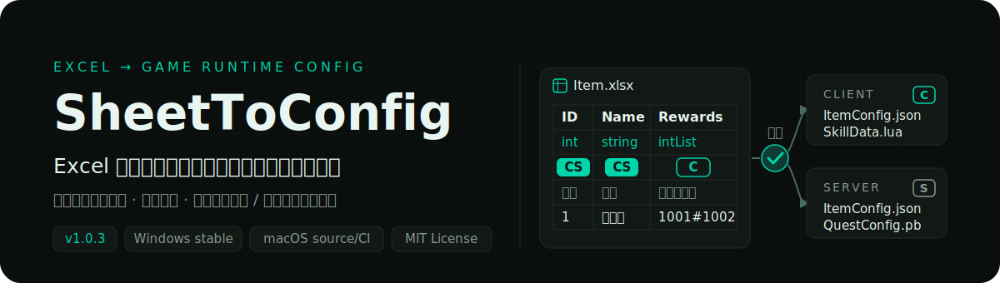
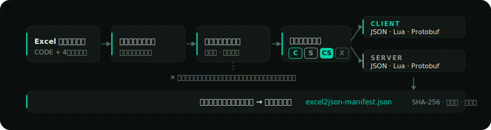
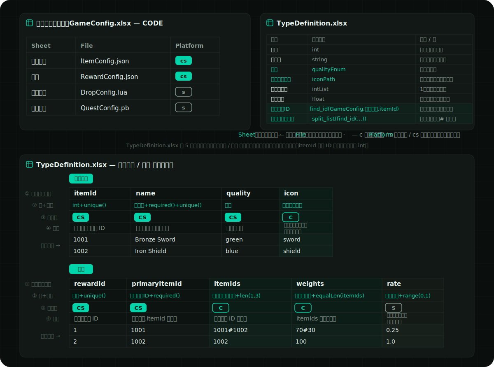
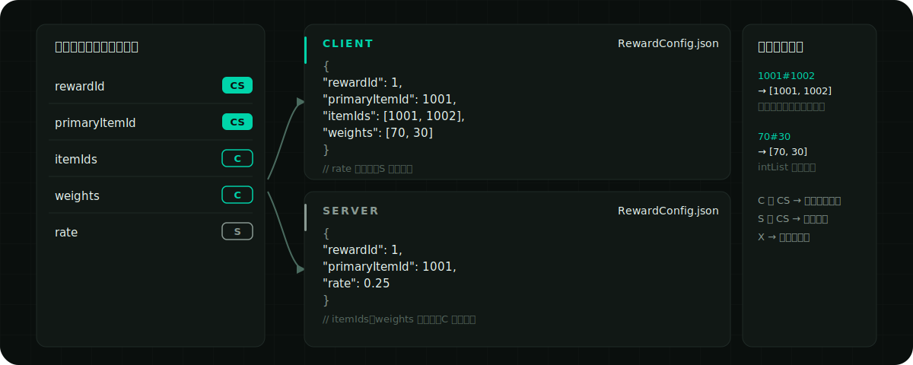

<p align="right">
  <a href="./README.en.md">English</a> ·
  <a href="../../README.md">简体中文</a> ·
  <strong>日本語</strong> ·
  <a href="./README.ko.md">한국어</a> ·
  <a href="./README.es.md">Español</a> ·
  <a href="./README.zh-TW.md">繁體中文</a>
</p>

<p align="center">
  
</p>

<p align="center">
  <a href="https://github.com/liushafeiniao/SheetToConfig/actions/workflows/tests.yml"></a>
  <a href="https://github.com/liushafeiniao/SheetToConfig/releases"></a>
  
  <a href="../../LICENSE"></a>
</p>

<p align="center">
  <a href="https://github.com/liushafeiniao/SheetToConfig/releases"><strong>ダウンロード / Releases</strong></a> ·
  <a href="#クイックスタート"><strong>クイックスタート</strong></a> ·
  <a href="#excel-シート仕様">シート仕様を見る</a>
</p>

<p align="center">
  
</p>

<p align="center"><sub>画面内のプロジェクト名とパスはすべてデモデータです。</sub></p>

| 信頼できる単一のデータソース | 3 つのランタイム形式 | 両端への精密な振り分け |
| :---: | :---: | :---: |
| `CODE` + 4 行ヘッダー | `JSON` · `Lua` · `Protobuf` | `C` · `S` · `CS` · `X` |

## クイックスタート

SheetToConfig は Windows を主要サポートプラットフォームとし、Apple Silicon と Intel macOS でも継続的にテストしています。安定版の [GitHub Releases](https://github.com/liushafeiniao/SheetToConfig/releases) には Windows x64 EXE とチェックサムファイルのみが含まれ、現在 macOS の安定インストーラーはありません。

Windows でソースから起動：

```powershell
py -3.12 -m venv .venv
.\.venv\Scripts\python.exe -m pip install -r requirements.txt
.\.venv\Scripts\python.exe -m sheet_to_config.app
```

依存関係のインストール後は、`scripts/run.bat` をダブルクリックしてソースから起動することもできます。ダウンロードまたはビルド済みの `SheetToConfig.exe` はダブルクリックで直接実行できます。

macOS でソースから起動：

```bash
python3.12 -m venv .venv
source .venv/bin/activate
python -m pip install -r requirements.txt
./scripts/run.sh
```

未署名の macOS ビルドはメンテナーが手動で行う内部プレビュー専用で、公開 Release としては配布されません。macOS で使用する場合は、上記の手順でソースから実行してください。

### 初めてのエクスポート

1. 「新規プロジェクト」をクリックし、表フォルダー、クライアント出力先、サーバー出力先を設定します。
2. 表フォルダーに `CODE` ワークシートを含む `.xlsx` ファイルを 1 つ以上置きます。
3. プロジェクトを選択して「エクスポート」をクリックし、まず「検証のみ」ですべての問題を確認します。問題がなければ正式なエクスポートを実行します。
4. 操作ログで結果を確認し、各出力先ディレクトリで成果物を確認します。

初回のエクスポートでは、組み込み型と制約の例を含む `TypeDefinition.xlsx` が表フォルダーに自動作成されます。C# 出力先と共有フォルダーは任意です。

## 主な機能

| 機能 | 説明 |
| --- | --- |
| 複数プロジェクト管理 | 表・クライアント・サーバー・C#・共有フォルダーを一元管理。検索、パスのドラッグ＆ドロップ、プロジェクトの並べ替えに対応 |
| 複数形式エクスポート | 同じ Excel 設定から JSON、Lua、`.proto`、`.pb` を生成し、必要に応じて C# 型も生成 |
| クライアント / サーバー振り分け | `C`、`S`、`CS`、`X` マーカーでフィールドの出力先を制御し、サーバーデータを誤ってクライアントへ送ることを防止 |
| データ検証 | 型、主キー、一意性、フィールド制約、シート間参照を検証。エラーはファイル・ワークシート・行・列・フィールドまで特定可能 |
| 安全な書き込み | バッチ全体の設定をステージングディレクトリで変換・検証し、合格後に原子コミット。失敗時は旧成果物を保持 |
| ホットアップデート用マニフェスト | クライアントとサーバーそれぞれに決定的な `excel2json-manifest.json` を生成し、SHA-256・サイズ・ソースを記録 |
| チームワークフロー | ワンクリックで表を共有フォルダーへコピー。プロジェクト設定、テーマ、ウィンドウスキンはローカルに保存され、リポジトリを汚染しません |

## 仕組み

<p align="center">
  
</p>

エクスポーターはまず各ワークブックの `CODE` 設定を読み込み、次にデータシートの 4 行ヘッダーを解析します。バッチ内のすべてのワークブックが変換・制約・参照チェックに合格して初めて、成果物とマニフェストが正式ディレクトリに一緒に書き込まれます。

## Excel シート仕様

約束事は 2 つだけです。各ワークブックは 1 枚の `CODE` ワークシートで「どのシートをどのファイルに出力し、どちらの端へ送るか」を宣言し、各データシートは 4 行ヘッダーでフィールドを宣言します。以下の `CODE` ワークシートを理解すれば、最初のエクスポート可能なシートが書けます。データシート、型制約、シート間参照の完全なルールは後ろに折りたたんであるので、必要なときに開いてください。

### `CODE` ワークシート

エクスポートするすべてのワークブックに `CODE` ワークシート（名前は大文字小文字を区別しない）が必要で、各行が 1 枚のデータシートの出力方法を宣言します：

| Sheet | File | Platform |
| --- | --- | --- |
| Item | ItemConfig.json | cs |
| Skill | SkillData.lua | c |
| Quest | QuestConfig.pb | cs |

- `Sheet`：同じワークブック内のデータワークシート名。
- `File`：出力ファイル名。拡張子が形式を決定し、`.json`、`.lua`、`.pb` のみ対応します。拡張子を省略した場合は現在、JSON として互換エクスポートされ警告が表示されます（この互換動作は今後のバージョンで削除予定）。`.proto` は単独のエクスポート形式にはできません。
- `Platform`：`c` はクライアントのみ、`s` はサーバーのみ、`cs` は両端へ出力。大文字小文字は区別せず、空欄の場合は現在のエクスポートモードに従います。

解析は列位置で行われ、ヘッダー行は書いても書かなくても構いません。先頭行の最初のセルが `Sheet` などのヘッダー文字列の場合は自動的にスキップされます。

### 完全なサンプル

下図は一式そろった表の構造を素早く把握するためのものです。リポジトリには完全な [`TypeDefinition.xlsx`](../../examples/cross_table/tables/TypeDefinition.xlsx) があり、`CODE`、`Guide`、`Examples`、`アイテム`、`報酬` の 5 シートを集約し、クライアント / サーバーのフィールド振り分け、`unique`、`len`、`equalLen`、`range`、直接のシート間参照と参照リストをカバーしています。

`TypeDefinition.xlsx` はエクスポーターに丸ごとスキップされるため、中の `アイテム`、`報酬` はコピー可能な学習用サンプルであり、直接設定は生成されません。実際に実行する場合は、この 2 シートを `GameConfig.xlsx` など通常の業務ワークブックにコピーし、そのワークブックの `CODE` シートで出力を宣言してください。学習用シートの 1 行目は英語 camelCase のコードフィールド、2 行目は日本語の型名、4 行目は日本語の説明です。

独立したコピーを生成することもできます（出力ディレクトリは未作成または空である必要があります。`--force` もこの `TypeDefinition.xlsx` 1 つだけを置き換えます）：

```powershell
python scripts/create_examples.py --output-dir my-example
```

<p align="center">
  
</p>

<details>
<summary><strong>このサンプルをエクスポートするとどうなるか</strong> — 同じ表がクライアントとサーバーで異なる成果物になる様子</summary>

<p align="center">
  
</p>

`C` と `CS` フィールドはクライアント成果物に、`S` と `CS` フィールドはサーバー成果物に出力され、`X` は出力されません。リスト型の区切り文字列（`1001#1002`、`70#30` など）は JSON では配列に変換されます。

</details>

<details>
<summary><strong>データワークシート：4 行ヘッダーとフィールド端マーカー</strong> — フィールド名 / 型 / 出力先 / 説明、1 列目が主キー</summary>

データシートは 4 行ヘッダーを使い、5 行目からがデータです：

```text
itemId  name      itemIds                    rate
int     string    intList+len(1,5)           float+range(0,1)
CS    CS        C                          S
番号  名前      報酬リスト                  サーバー確率
1     回復薬    1001#1002                  0.25
```

4 行はそれぞれフィールド名、フィールド型、出力先、フィールド説明を表します。出力先マーカーは大文字小文字を区別しません：

| マーカー | 動作 |
| --- | --- |
| `C` | クライアントのみに出力 |
| `S` | サーバーのみに出力 |
| `CS` | クライアントとサーバーの両方に出力（空欄時のデフォルト） |
| `X` | 出力しない |

1 列目は主キーとして処理され、空でないスカラー値で、重複は許されません。エラーは黙ってスキップされず、ファイル・ワークシート・行・列・フィールドを特定できる構造化診断として返されます。

</details>

<details>
<summary><strong>型・列挙・制約</strong> — 組み込み型一覧、TypeDefinition による拡張と 11 種のフィールド制約</summary>

組み込み型は `int`、`float`、`string`、`bool`、`bytes`、`text_key`、1〜3 次元リスト、辞書、`path()`、ワークブック間 ID 参照をカバーします。生成される `TypeDefinition.xlsx` には、実定義の `CODE`、制約と境界を説明する `Guide`、式を示す `Examples`、コピー可能なデータ表例の `アイテム` と `報酬` があります。

`CODE` は `Name / Convert / Description / Cell example` の 4 列で、変換に使うのは先頭 2 列です。旧 2 列・3 列ファイルも読み込めます。日本語テンプレートには `アイテムID = find_id(GameConfig,アイテム,itemId)` が登録済みです。データシート 2 行目では `アイテムID+required()` を使い、近い意味の参照型を重複登録したり `find_id(...)` を直接書いたりしないでください。`find_id` の第 2 引数は表示ラベルであり、シート選択ではありません。

ファイルがない場合、`TypeDefinition.xlsx` は現在の UI 言語で一度だけ生成されます。UI 言語を変更しても既存ファイルは書き換えません。学習用シートの 1 行目は英語 camelCase、2 行目は現在の言語の型名、4 行目は現在の言語の説明です。`required()`、`unique()`、`range()` などの制約キーワードは固定です。参照元の `itemId` はスカラー ID 出力の互換性を保つため標準 `int` のままです。

制約は型の後ろに直接追加します。例：

```text
intList+len(1,5)
float+range(0,1)
string+required()+unique()
string+regex(^item_[0-9]+$)
intList+equalLen(weights)
```

サポートされる制約は `len`、`len2`、`len3`、`equalLen`、`equalLen2`、`coexist`、`leastOne`、`required` / `notEmpty`、`range`、`regex`、`unique` です。

</details>

<details>
<summary><strong>シート間参照：<code>find_id</code> / <code>find</code></strong> — ファイル名プレフィックスで他ワークブックの ID を参照し、エクスポート時に実在を検証</summary>

あるシートの ID 列は別シートの主キーを参照でき、エクスポート時に対象の実在が 1 件ずつ検証されます。公開構文は次の 2 つの同義関数のみです：

```text
find_id(file_prefix, display_label, field)
find(file_prefix, display_label, field)
```

- `file_prefix` はファイル名プレフィックスで対象の `.xlsx` ワークブックを特定します。
- `display_label` は表示専用で、ワークシートの選択には使われません。
- `field` は対象フィールドと照合します。データは 5 行目から読み込みます。
- Protobuf では、`find_id` は参照先の最終的なスカラー型に基づいてフィールド型を決定します。表・フィールド・ID が見つからない場合は検証に失敗します。
- リスト参照は区切り文字で展開してから検証します。失敗時はバッチ全体をキャンセルし、旧成果物を保持します。
- `find` は `find_id` の同義短縮形で、それ以外の名前は公開機能ではありません。

</details>

<details>
<summary><strong>出力・Manifest・原子コミット</strong> — 決定的なマニフェスト形式、増分エクスポートの条件と失敗時のロールバック保証</summary>

有効な出力端ごとに `excel2json-manifest.json` が 1 つ生成されます：

```json
{
  "manifestVersion": 1,
  "platform": "client",
  "contentVersion": "sha256:...",
  "files": [
    {
      "path": "ItemConfig.json",
      "format": "json",
      "sha256": "...",
      "size": 2048,
      "source": {
        "workbook": "Item.xlsx",
        "sheet": "Item"
      }
    }
  ]
}
```

マニフェストはパスで安定ソートされ、`contentVersion` はランタイム成果物の同一性と内容のみから計算されるため、クライアント / サーバーのバージョン比較やホットアップデート差分の生成に使えます。指定ファイルエクスポートは増分エクスポートであり、出力先ディレクトリに有効な既存マニフェストが必要です。マニフェストがないか破損している場合は書き込みを停止します。

エクスポートはバッチ全体のステージングと原子コミットで行われます。いずれかのワークブックの失敗、出力パスの衝突、コミット異常が発生しても、半分だけの新設定は残りません。コミットを完了できない場合は旧ファイルの復元を試み、エラーを報告します。

</details>

<details>
<summary><strong>Protobuf エクスポート</strong> — <code>.pb</code> で同名の <code>.proto</code> を生成、スーパーセットプロトコルと schema 再構築</summary>

`CODE` ワークシートの `File` に `.pb` ファイル名を書くと、同名の `.proto` と `.pb` が生成されます：

```text
QuestConfig.proto
QuestConfig.pb
```

- 通常のスカラー、`bytes`、`intList` / `intList2` などのリスト型は Excel から直接推論できます。
- 任意の `PROTO` ワークシートで package、C# namespace の設定や、より複雑な message、enum、map、oneof、reserved の宣言ができます。
- 自動ジェネレーターは既存の schema manifest を再利用してフィールド番号を可能な限り安定に保ち、削除されたフィールドは `reserved` に書き込みます。
- クライアントとサーバーは同じフィールドのスーパーセット `.proto` を共有し、各 `.pb` にはその端で許可されたデータのみが含まれます。
- C# 出力先を設定すると、`protoc` を呼び出して C# ファイルを生成できます。

デスクトップのエクスポートと「検証のみ」は、現在の Excel schema を自動的に受け入れ、それに基づいて Protobuf プロトコルを再構築します。これは主キー、型、その他のデータ検証を迂回するものではなく、管理対象外または破損した `.proto` は引き続き拒否されます。公開済みのプロトコルでは `.proto` の diff を確認してください。基盤となる Python API の `allow_breaking_proto_change` は既定で `False` のままで、既定では厳格な互換性検査を維持します。

</details>

<details>
<summary><strong>プロジェクト設定とローカルデータ</strong> — 6 つのディレクトリ設定、ローカル状態の保存場所と <code>SHEETTOCONFIG_DATA_DIR</code></summary>

| 設定 | 必須 | 用途 |
| --- | --- | --- |
| 表フォルダー | はい | `.xlsx` と `TypeDefinition.xlsx` を配置 |
| クライアント出力先 | はい | クライアント設定と manifest の出力ディレクトリ |
| サーバー出力先 | はい | サーバー設定と manifest の出力ディレクトリ |
| C# 出力先 | いいえ | `protoc` が生成する C# 型のディレクトリ |
| アセットルート | いいえ | 設定時は、入力済みの `path()` がルート外に出ず、ファイルが実在することを検証。空欄時はすべての `path()` 存在確認をスキップし、フォールバックも警告も行いません |
| 共有フォルダー | いいえ | 「同期」操作のコピー先ディレクトリ |

ソースが親プロジェクトの `GitHub` サブディレクトリにあり、同階層に `LocalData` が存在する場合、ローカル状態はそのディレクトリに書き込まれます。その他のソース環境ではシステムのユーザー設定ディレクトリを使用し、Windows EXE はデフォルトで実行ファイルのディレクトリに書き込みます。環境変数で上書きできます：

```powershell
$env:SHEETTOCONFIG_DATA_DIR = "D:\SheetToConfigData"
python -m sheet_to_config.app
```

`projects.json`、`theme_config.json` などのローカル状態は `.gitignore` で除外されています。実際のプロジェクトパス、認証情報、チーム共有ディレクトリの情報はリポジトリにコミットしないでください。

</details>

<details>
<summary><strong>開発と検証</strong> — テストコマンド、Windows / macOS ビルドとプロジェクト構成</summary>

### テストの実行

```powershell
$env:PYTHONUTF8 = "1"
python -m unittest discover -s tests -v
```

`PYTHONUTF8=1` を設定すると、中国語版 Windows の GBK コンソールで Unicode の状態記号を出力できない問題を回避できます。GitHub Actions は Windows、Apple Silicon macOS、Intel macOS の Python 3.12 環境で同じテストを実行します。テストはアプリデータパス、型と制約の検証、JSON / Lua / Protobuf エクスポート、schema 進化、ランタイムマニフェスト、原子ロールバックをカバーします。

### Windows EXE のビルド

```powershell
python -m pip install -r requirements-dev.txt
python scripts/build.py
```

ビルド成功後、単一ファイルのプログラムは `dist/SheetToConfig.exe` にあります。`scripts/build.py` は独立したステージングディレクトリでビルドし、PyInstaller が成功した場合のみ旧 EXE を置き換えます。

### macOS アプリのビルド

```bash
python3.12 -m pip install -r requirements-dev.txt
./scripts/build.sh
python scripts/package_macos.py --unsigned
```

ビルドは対象の macOS アーキテクチャ上で実行し、出力は `dist/SheetToConfig.app` と DMG です。macOS は CI でテストされていますが、未署名 DMG はメンテナー手動の内部プレビュー専用で、現在 macOS の安定 Release はありません。完全なリリース方針は [`docs/RELEASING.md`](../RELEASING.md) を参照してください。

C# 設定クラスを生成するには、`protoc` をインストールして `PATH` に追加するか、`PROTOC` 環境変数を設定する必要があります。

### プロジェクト構成

```text
SheetToConfig.py              ルートランチャー（互換エントリ）
sheet_to_config/app.py        メインウィンドウとインタラクション
sheet_to_config/app_paths.py  ローカルデータディレクトリの解決
sheet_to_config/dialogs.py    プロジェクト、テーマ、エクスポート、概要ダイアログ
sheet_to_config/styles.py     テーマ駆動の QSS スタイル
sheet_to_config/theme_config.py テーマプリセットと永続化
sheet_to_config/icons.py      テーマに合わせて着色するアイコンファクトリ
sheet_to_config/widgets.py    カスタムウィジェット
sheet_to_config/utils/
  project_manager.py          プロジェクトデータと並べ替えの永続化
  export_handler.py           エクスポートのスケジューリング
  import_handler.py           チーム共有の同期
  exporter/
    converter.py              バッチ変換と検証のオーケストレーション
    batch_transaction.py      バッチトランザクションと増分エクスポート
    type_registry.py          型の登録と変換
    template.py               TypeDefinition.xlsx テンプレート
    constraints.py            フィールド制約
    reference_validator.py    シート間参照の検証
    protobuf_schema.py        Protobuf schema の解析と進化
    artifact_manifest.py      ランタイム成果物マニフェスト
    atomic_writer.py          原子コミットとロールバック
    exporters/                JSON / Lua / Protobuf 出力器
tests/                        自動テスト
```

</details>

## 互換性と範囲

- Windows が主要サポートプラットフォームです。Apple Silicon と Intel macOS は CI に組み込まれ、未署名パッケージはメンテナーの内部検証専用です。
- Linux は正式サポートおよび CI テストの対象外です。ソースから動作する可能性はありますが、AppImage、Flatpak などの正式インストーラーは提供しません。
- README とデスクトップ UI は、简体中文、English、日本語、한국어、Español、繁體中文に対応しています。
- 入力は `.xlsx` が正式サポート形式です。一時ファイルやワークブック以外の内容はエクスポートに参加しません。
- C# コード生成は外部の `protoc` に依存します。JSON、Lua、`.proto`、`.pb` はシステムレベルのコンパイラに依存しません。
- 増分エクスポートは既存の有効な manifest に依存します。初めて使う場合は、まず 1 回完全エクスポートを実行してください。
- Protobuf の自動進化はプロトコルレビューの代わりにはなりません。公開後の破壊的変更はチームで管理する必要があります。

## 開発への参加

問題を報告する際は、再現可能な最小限のワークブック構成、期待する結果、実際のログ、実行環境を添付してください。業務データ、実際のパス、認証情報を含むファイルはアップロードしないでください。

コードを提出する前に、完全なテストを実行してください。エクスポート形式、manifest、Protobuf schema に関わる変更には、成功パス、エラーパス、ロールバックのシナリオテストも追加してください。

## バージョンとライセンス

- 現在のバージョン：[`sheet_to_config/version.py`](../../sheet_to_config/version.py) の `1.0.5`
- 変更履歴：[`CHANGELOG.md`](../../CHANGELOG.md)
- オープンソースライセンス：[`MIT`](../../LICENSE)
