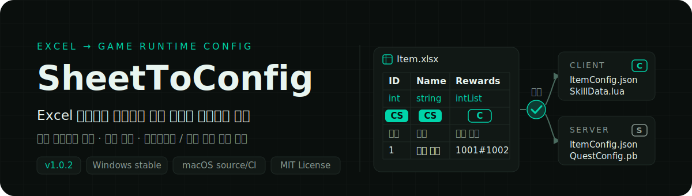
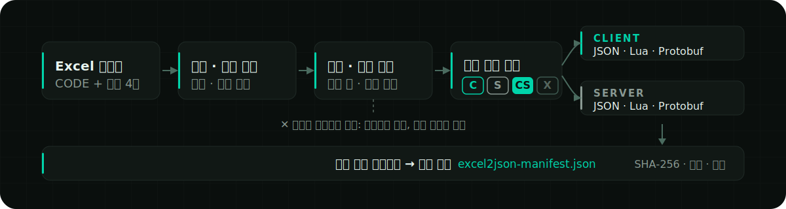
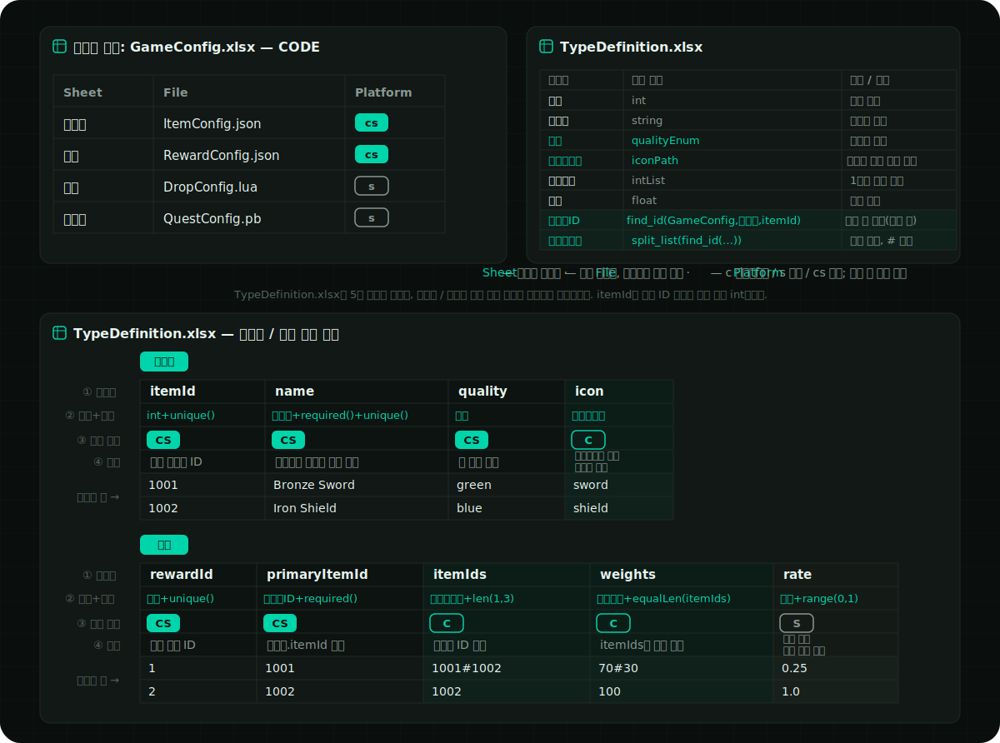
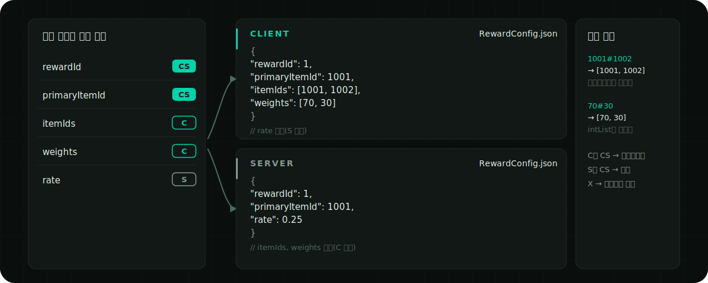

<p align="right">
  <a href="./README.en.md">English</a> ·
  <a href="../../README.md">简体中文</a> ·
  <a href="./README.ja.md">日本語</a> ·
  <strong>한국어</strong> ·
  <a href="./README.es.md">Español</a> ·
  <a href="./README.zh-TW.md">繁體中文</a>
</p>

<p align="center">
  
</p>

<p align="center">
  <a href="https://github.com/liushafeiniao/SheetToConfig/actions/workflows/tests.yml"></a>
  <a href="https://github.com/liushafeiniao/SheetToConfig/releases"></a>
  
  <a href="../../LICENSE"></a>
</p>

<p align="center">
  <a href="https://github.com/liushafeiniao/SheetToConfig/releases"><strong>다운로드 / Releases</strong></a> ·
  <a href="#빠른-시작"><strong>빠른 시작</strong></a> ·
  <a href="#excel-워크북-형식">워크북 형식 보기</a>
</p>

<p align="center">
  
</p>

<p align="center"><sub>화면의 프로젝트 이름과 경로는 모두 데모 데이터입니다.</sub></p>

| 하나의 신뢰할 수 있는 데이터 원본 | 세 가지 런타임 형식 | 양쪽 세밀한 분기 |
| :---: | :---: | :---: |
| `CODE` + 헤더 4행 | `JSON` · `Lua` · `Protobuf` | `C` · `S` · `CS` · `X` |

## 빠른 시작

SheetToConfig는 Windows를 주요 지원 플랫폼으로 하며, Apple Silicon과 Intel macOS에서도 지속적으로 테스트합니다. 안정 버전 [GitHub Releases](https://github.com/liushafeiniao/SheetToConfig/releases)에는 Windows x64 EXE와 체크섬 파일만 제공되며, 현재 macOS 안정 설치 패키지는 없습니다.

Windows 소스 실행:

```powershell
py -3.12 -m venv .venv
.\.venv\Scripts\python.exe -m pip install -r requirements.txt
.\.venv\Scripts\python.exe -m sheet_to_config.app
```

의존성을 설치한 뒤 `scripts/run.bat`을 두 번 클릭해 소스에서 실행할 수 있으며, 내려받거나 빌드한 `SheetToConfig.exe`는 바로 두 번 클릭해 실행할 수 있습니다.

macOS 소스 실행:

```bash
python3.12 -m venv .venv
source .venv/bin/activate
python -m pip install -r requirements.txt
./scripts/run.sh
```

서명되지 않은 macOS 빌드는 유지 관리자가 수동으로 수행하는 내부 미리 보기용일 뿐 공개 Release로 배포되지 않습니다. macOS에서 사용하려면 위 절차대로 소스에서 실행하세요.

### 첫 내보내기

1. 「새 프로젝트」를 클릭하고 표 디렉터리, 클라이언트 출력 디렉터리, 서버 출력 디렉터리를 설정합니다.
2. 표 디렉터리에 `CODE` 워크시트를 포함하는 `.xlsx` 파일을 하나 이상 넣습니다.
3. 프로젝트를 선택하고 「내보내기」를 클릭한 뒤, 먼저 「검증만 수행 (파일 없음)」을 선택해 모든 문제를 확인합니다. 문제가 없으면 정식 내보내기를 실행합니다.
4. 작업 로그에서 결과를 확인하고 해당 출력 디렉터리에서 산출물을 확인합니다.

첫 내보내기에서 표 디렉터리에 `TypeDefinition.xlsx`가 자동으로 생성되며, 내장 타입과 제약 예제가 들어 있습니다. C# 출력 디렉터리와 팀 동기화 디렉터리는 선택 사항입니다.

## 핵심 기능

| 기능 | 설명 |
| --- | --- |
| 다중 프로젝트 관리 | 표, 클라이언트, 서버, C#, 공유 디렉터리를 한곳에서 관리하고 검색, 경로 드래그 앤 드롭, 프로젝트 정렬을 지원 |
| 다중 형식 내보내기 | 같은 Excel 설정으로 JSON, Lua, `.proto`, `.pb`를 생성하고 선택적으로 C# 타입도 생성 |
| 클라이언트 / 서버 분기 | `C`, `S`, `CS`, `X` 표시로 필드의 출력 대상을 제어해 서버 데이터가 클라이언트로 잘못 나가는 것을 방지 |
| 데이터 검증 | 타입, 기본 키, 고유성, 필드 제약, 워크북 간 참조를 검증하고 오류를 파일·워크시트·행·열·필드까지 위치 지정 |
| 안전한 쓰기 | 전체 배치를 먼저 스테이징 디렉터리에서 변환·검증하고 통과한 뒤 원자적으로 커밋하며, 실패 시 기존 산출물 보존 |
| 핫업데이트 매니페스트 | 클라이언트와 서버 각각에 결정적인 `excel2json-manifest.json`을 생성해 SHA-256, 크기, 출처를 기록 |
| 팀 워크플로 | 한 번의 클릭으로 표를 동기화 디렉터리에 복사하고, 프로젝트 설정·테마·창 스킨은 로컬에 저장되어 저장소를 오염시키지 않음 |

## 작동 방식

<p align="center">
  
</p>

내보내기는 먼저 각 워크북의 `CODE` 설정을 읽고 데이터 시트의 4행 헤더를 파싱합니다. 모든 워크북이 변환·제약·참조 검사를 통과해야만 산출물과 매니페스트가 함께 공식 디렉터리에 기록됩니다.

## Excel 워크북 형식

규칙은 두 가지뿐입니다. 각 워크북은 `CODE` 워크시트 하나로 “어떤 시트를 어떤 파일로 내보내고 어느 쪽으로 보낼지”를 선언하고, 각 데이터 시트는 4행 헤더로 필드를 선언합니다. 아래 `CODE` 워크시트만 익히면 첫 번째 내보낼 수 있는 시트를 만들 수 있으며, 데이터 시트·타입 제약·워크북 간 참조의 전체 규칙은 접어 두었으니 필요할 때 펼쳐 보세요.

### `CODE` 워크시트

내보낼 모든 워크북에는 `CODE` 워크시트(이름은 대소문자 구분 없음)가 있어야 하며, 각 행이 데이터 시트 하나의 출력 방식을 선언합니다.

| Sheet | File | Platform |
| --- | --- | --- |
| Item | ItemConfig.json | cs |
| Skill | SkillData.lua | c |
| Quest | QuestConfig.pb | cs |

- `Sheet`: 같은 워크북 안의 데이터 워크시트 이름입니다.
- `File`: 출력 파일명으로, 확장자가 형식을 결정하며 `.json`, `.lua`, `.pb`만 지원합니다. 현재는 확장자를 생략하면 JSON으로 호환 내보내기하며 경고를 표시합니다(이 호환 동작은 이후 버전에서 제거될 예정). `.proto`는 단독 내보내기 형식으로 사용할 수 없습니다.
- `Platform`: `c`는 클라이언트만, `s`는 서버만, `cs`는 양쪽 모두 내보냅니다. 대소문자를 구분하지 않으며, 비워 두면 현재 내보내기 모드를 따릅니다.

파싱은 열 위치 기준으로 진행되며 헤더 행은 써도 되고 생략해도 됩니다. 첫 행의 첫 칸이 `Sheet` 같은 헤더 텍스트이면 자동으로 건너뜁니다.

### 완전한 예시

아래 그림은 완전한 표 세트의 구조를 빠르게 파악하기 위한 것입니다. 저장소에는 완전한 [`TypeDefinition.xlsx`](../../examples/cross_table/tables/TypeDefinition.xlsx)가 포함되어 있으며, `CODE`, `Guide`, `Examples`, `아이템`, `보상` 다섯 시트가 함께 들어 있어 클라이언트/서버 필드 분기, `unique`, `len`, `equalLen`, `range`, 직접 워크북 간 참조와 참조 목록을 모두 다룹니다.

`TypeDefinition.xlsx`는 내보내기에서 통째로 건너뛰므로, 그 안의 `아이템`, `보상` 시트는 복사 가능한 학습용 예시일 뿐 설정이 직접 생성되지는 않습니다. 실제로 실행하려면 이 두 시트를 `GameConfig.xlsx` 같은 일반 업무 워크북으로 복사한 뒤, 해당 워크북의 `CODE` 시트에서 출력을 선언하세요. 1행은 영문 camelCase 코드 필드, 2행은 한국어 타입 이름, 4행은 한국어 설명을 사용합니다.

별도 사본을 생성할 수도 있습니다(출력 디렉터리가 존재하지 않거나 비어 있어야 하며, `--force`도 이 `TypeDefinition.xlsx` 하나만 교체합니다):

```powershell
python scripts/create_examples.py --output-dir my-example
```

<p align="center">
  
</p>

<details>
<summary><strong>이 예시를 내보내면 어떤 모습일까</strong> — 같은 표가 클라이언트와 서버에서 만들어 내는 서로 다른 산출물</summary>

<p align="center">
  
</p>

`C`와 `CS` 필드는 클라이언트 산출물로, `S`와 `CS` 필드는 서버 산출물로 들어가며 `X`는 내보내지 않습니다. 목록 타입의 구분자 문자열(예: `1001#1002`, `70#30`)은 JSON에서 배열로 변환됩니다.

</details>

<details>
<summary><strong>데이터 워크시트: 4행 헤더와 대상 표시</strong> — 필드명 / 타입 / 내보내기 대상 / 설명, 첫 번째 열이 기본 키</summary>

데이터 시트는 4행 헤더를 사용하고 5행부터 데이터입니다.

```text
itemId  name      itemIds                    rate
int     string    intList+len(1,5)           float+range(0,1)
CS    CS        C                          S
번호  이름      보상 목록                  서버 확률
1     하급 물약 1001#1002                  0.25
```

4행은 차례로 필드명, 필드 타입, 내보내기 대상, 필드 설명을 나타냅니다. 내보내기 대상 표시는 대소문자를 구분하지 않습니다.

| 표시 | 동작 |
| --- | --- |
| `C` | 클라이언트에만 내보냄 |
| `S` | 서버에만 내보냄 |
| `CS` | 클라이언트와 서버 모두 내보냄(비워 두었을 때의 기본값) |
| `X` | 내보내지 않음 |

첫 번째 열은 기본 키로 처리되며, 비어 있지 않은 스칼라 값이어야 하고 중복될 수 없습니다. 오류는 조용히 건너뛰지 않고 구조화된 진단으로 반환되어 파일, 워크시트, 행, 열, 필드까지 위치를 알 수 있습니다.

</details>

<details>
<summary><strong>타입, Enum과 제약</strong> — 내장 타입 목록, TypeDefinition 확장과 11가지 필드 제약</summary>

내장 타입은 `int`, `float`, `string`, `bool`, `bytes`, `text_key`, 1~3차원 목록, 딕셔너리, `path()`, 워크북 간 ID 참조를 포함합니다. 생성되는 `TypeDefinition.xlsx`에는 실제 정의용 `CODE`, 제약과 경계 설명용 `Guide`, 표현식 예시용 `Examples`, 복사 가능한 데이터 시트 예시인 `아이템`과 `보상`이 있습니다.

`CODE`는 `Name / Convert / Description / Cell example` 4열이며 변환에는 앞의 두 열만 사용합니다. 기존 2열·3열 파일도 읽을 수 있습니다. 한국어 템플릿에는 `아이템ID = find_id(GameConfig,아이템,itemId)`가 등록되어 있습니다. 데이터 시트 2행에는 `아이템ID+required()`를 사용하고, 비슷한 참조 타입을 중복 등록하거나 `find_id(...)`를 직접 쓰지 마세요. `find_id`의 두 번째 인자는 표시용 라벨이며 시트 선택자가 아닙니다.

파일이 없으면 `TypeDefinition.xlsx`는 현재 UI 언어로 한 번만 생성됩니다. UI 언어를 바꿔도 기존 파일은 다시 쓰지 않습니다. 학습용 시트의 1행은 영문 camelCase, 2행은 현재 언어의 타입 이름, 4행은 현재 언어의 설명을 사용합니다. `required()`, `unique()`, `range()` 같은 제약 키워드는 고정입니다. 참조 원본 `itemId`는 스칼라 ID 출력 호환성을 위해 표준 `int`를 유지합니다.

제약은 타입 뒤에 바로 덧붘입니다. 예:

```text
intList+len(1,5)
float+range(0,1)
string+required()+unique()
string+regex(^item_[0-9]+$)
intList+equalLen(weights)
```

지원하는 제약은 `len`, `len2`, `len3`, `equalLen`, `equalLen2`, `coexist`, `leastOne`, `required` / `notEmpty`, `range`, `regex`, `unique`입니다.

</details>

<details>
<summary><strong>워크북 간 참조: <code>find_id</code> / <code>find</code></strong> — 파일명 접두사로 다른 워크북의 ID를 참조하고 내보낼 때 실제로 검증</summary>

한 시트의 ID 열은 다른 시트의 기본 키를 참조할 수 있으며, 내보낼 때 대상이 실제로 존재하는지 항목별로 검증합니다. 공개 문법은 다음 두 동의 함수뿐입니다.

```text
find_id(file_prefix, display_label, field)
find(file_prefix, display_label, field)
```

- `file_prefix`는 파일명 접두사로 대상 `.xlsx` 워크북을 찾습니다.
- `display_label`은 표시에만 사용되며 워크시트 선택에는 사용되지 않습니다.
- `field`는 대상 필드와 일치해야 하며 데이터는 5행부터 읽습니다.
- Protobuf에서 `find_id`는 참조 대상의 최종 스칼라 타입을 기준으로 필드 타입을 결정합니다. 표·필드·ID가 없으면 검증에 실패합니다.
- 목록 참조는 구분자로 펼친 뒤 검증하며, 실패하면 배치 전체를 취소하고 기존 산출물을 보존합니다.
- `find`는 `find_id`의 동의 약칭이며 다른 이름은 공개 기능이 아닙니다.

</details>

<details>
<summary><strong>출력, Manifest와 원자 커밋</strong> — 결정적인 매니페스트 형식, 증분 내보내기 조건과 실패 롤백 보장</summary>

활성화된 각 출력 대상에는 `excel2json-manifest.json`이 생성됩니다.

```json
{
  "manifestVersion": 1,
  "platform": "client",
  "contentVersion": "sha256:...",
  "files": [
    {
      "path": "ItemConfig.json",
      "format": "json",
      "sha256": "...",
      "size": 2048,
      "source": {
        "workbook": "Item.xlsx",
        "sheet": "Item"
      }
    }
  ]
}
```

매니페스트는 경로 기준으로 안정 정렬되며, `contentVersion`은 런타임 산출물의 신원과 내용만으로 계산되므로 클라이언트 / 서버 버전 비교와 핫업데이트 차이 생성에 사용할 수 있습니다. 지정 파일 내보내기는 증분 내보내기에 해당하며 출력 디렉터리에 유효한 기존 매니페스트가 있어야 합니다. 매니페스트가 없거나 손상되면 쓰기를 중단합니다.

내보내기는 전체 배치 스테이징과 원자 커밋을 사용합니다. 어떤 워크북이든 실패하거나 출력 경로가 충돌하거나 커밋에 예외가 발생하면 절반만 적용된 새 설정을 남기지 않으며, 커밋을 완료할 수 없으면 이전 파일 복원을 시도하고 오류를 보고합니다.

</details>

<details>
<summary><strong>Protobuf 내보내기</strong> — <code>.pb</code>는 같은 이름의 <code>.proto</code>를 생성, 상위 집합 프로토콜과 schema 재구성</summary>

`CODE` 워크시트의 `File`을 `.pb` 파일명으로 쓰면 같은 이름의 `.proto`와 `.pb`가 생성됩니다.

```text
QuestConfig.proto
QuestConfig.pb
```

- 일반 스칼라, `bytes`, `intList` / `intList2` 등의 목록 타입은 Excel에서 바로 추론할 수 있습니다.
- 선택적 `PROTO` 워크시트로 package, C# namespace를 설정하거나 더 복잡한 message, enum, map, oneof, reserved 선언을 기술할 수 있습니다.
- 자동 생성기는 기존 schema manifest를 재사용해 필드 번호를 최대한 안정적으로 유지하고, 삭제된 필드는 `reserved`로 기록합니다.
- 클라이언트와 서버는 같은 필드 상위 집합 `.proto`를 공유하며, 각 `.pb`에는 해당 대상에서 허용된 데이터만 포함됩니다.
- C# 출력 디렉터리를 설정하면 `protoc`를 호출해 C# 파일을 생성할 수 있습니다.

데스크톱 내보내기와 「검증만」은 현재 Excel schema를 자동으로 받아들이고 이를 바탕으로 Protobuf 프로토콜을 재구성합니다. 이 동작은 기본 키, 타입 또는 다른 데이터 검증을 우회하지 않으며, 관리되지 않거나 손상된 `.proto`는 계속 거부됩니다. 이미 배포된 프로토콜은 `.proto` diff를 검토하세요. 기반 Python API의 `allow_breaking_proto_change` 기본값은 계속 `False`이므로 기본적으로 엄격한 호환성 검사를 유지합니다.

</details>

<details>
<summary><strong>프로젝트 설정과 로컬 데이터</strong> — 6개 디렉터리 설정, 로컬 상태 위치와 <code>SHEETTOCONFIG_DATA_DIR</code></summary>

| 설정 | 필수 | 용도 |
| --- | --- | --- |
| 표 디렉터리 | 예 | `.xlsx`와 `TypeDefinition.xlsx` 저장 |
| 클라이언트 경로 | 예 | 클라이언트 설정과 manifest 출력 디렉터리 |
| 서버 경로 | 예 | 서버 설정과 manifest 출력 디렉터리 |
| C# 출력 경로 | 아니요 | `protoc`가 생성하는 C# 타입 디렉터리 |
| 리소스 루트 | 아니요 | 설정하면 입력된 `path()` 값이 범위를 벗어나지 않고 파일이 실제로 존재하는지 검증; 비워 두면 모든 `path()` 존재성 검사를 건너뛰며 대체 경로나 경고가 없습니다 |
| 공유 디렉터리 | 아니요 | 「동기화」 작업의 대상 디렉터리 |

소스 코드가 상위 프로젝트의 `GitHub` 하위 디렉터리에 있고 같은 수준에 `LocalData`가 있으면 로컬 상태는 해당 디렉터리에 기록됩니다. 그 외 소스 환경에서는 시스템 사용자 설정 디렉터리를 사용하고, Windows EXE는 기본적으로 실행 파일 디렉터리에 기록합니다. 환경 변수로 변경할 수 있습니다.

```powershell
$env:SHEETTOCONFIG_DATA_DIR = "D:\SheetToConfigData"
python -m sheet_to_config.app
```

`projects.json`, `theme_config.json` 등의 로컬 상태는 `.gitignore`로 제외되어 있습니다. 저장소에 실제 프로젝트 경로, 자격 증명, 팀 공유 디렉터리 정보를 커밋하지 마세요.

</details>

<details>
<summary><strong>개발과 검증</strong> — 테스트 명령, Windows / macOS 빌드와 프로젝트 구조</summary>

### 테스트 실행

```powershell
$env:PYTHONUTF8 = "1"
python -m unittest discover -s tests -v
```

`PYTHONUTF8=1`을 설정하면 중국어 Windows의 GBK 콘솔이 Unicode 상태 문자를 출력하지 못하는 문제를 피할 수 있습니다. GitHub Actions는 Windows, Apple Silicon macOS, Intel macOS의 Python 3.12 환경에서 같은 테스트를 실행합니다. 테스트는 앱 데이터 경로, 타입·제약 검증, JSON / Lua / Protobuf 내보내기, 스키마 진화, 런타임 매니페스트, 원자 롤백을 다룹니다.

### Windows EXE 빌드

```powershell
python -m pip install -r requirements-dev.txt
python scripts/build.py
```

빌드에 성공하면 단일 파일 프로그램이 `dist/SheetToConfig.exe`에 생성됩니다. `scripts/build.py`는 별도의 스테이징 디렉터리에서 빌드하고 PyInstaller가 성공한 후에만 기존 EXE를 교체합니다.

### macOS 앱 빌드

```bash
python3.12 -m pip install -r requirements-dev.txt
./scripts/build.sh
python scripts/package_macos.py --unsigned
```

빌드는 대상 macOS 아키텍처에서 수행해야 하며 출력은 `dist/SheetToConfig.app`과 DMG입니다. macOS는 계속 CI에서 테스트되지만 서명되지 않은 DMG는 유지 관리자가 수동으로 사용하는 내부 미리 보기일 뿐이며, 현재 안정 macOS Release는 없습니다. 전체 배포 범위는 [`docs/RELEASING.md`](../RELEASING.md)를 참조하세요.

C# 설정 클래스를 생성하려면 `protoc`를 설치해 `PATH`에 추가하거나 `PROTOC` 환경 변수를 설정해야 합니다.

### 프로젝트 구조

```text
SheetToConfig.py              루트 실행기(호환 진입점)
sheet_to_config/app.py        메인 창과 상호 작용
sheet_to_config/app_paths.py  로컬 데이터 디렉터리 결정
sheet_to_config/dialogs.py    프로젝트, 테마, 내보내기, 정보 대화 상자
sheet_to_config/styles.py     테마 기반 QSS 스타일
sheet_to_config/theme_config.py 테마 프리셋과 저장
sheet_to_config/icons.py      테마에 따라 채색되는 아이콘 팩토리
sheet_to_config/widgets.py    사용자 지정 위젯
sheet_to_config/utils/
  project_manager.py          프로젝트 데이터와 정렬 저장
  export_handler.py           내보내기 스케줄링
  import_handler.py           팀 공유 동기화
  exporter/
    converter.py              배치 변환과 검증 조율
    batch_transaction.py      배치 트랜잭션과 증분 내보내기
    type_registry.py          타입 등록과 변환
    template.py               TypeDefinition.xlsx 템플릿
    constraints.py            필드 제약
    reference_validator.py    워크북 간 참조 검증
    protobuf_schema.py        Protobuf 스키마 파싱과 진화
    artifact_manifest.py      런타임 산출물 매니페스트
    atomic_writer.py          원자 커밋과 롤백
    exporters/                JSON / Lua / Protobuf 출력기
tests/                        자동화 테스트
```

</details>

## 호환성과 범위

- Windows가 주요 지원 플랫폼이며, Apple Silicon과 Intel macOS는 CI에 포함되고 서명되지 않은 패키징은 유지 관리자 내부 검증용입니다.
- Linux는 공식 지원 또는 CI 테스트 대상이 아닙니다. 소스 실행은 가능할 수 있지만 AppImage, Flatpak 등의 공식 설치 패키지는 제공하지 않습니다.
- README와 데스크톱 UI는 중국어 간체, English, 日本語, 한국어, Español, 중국어 번체를 지원합니다.
- 입력은 `.xlsx`가 공식 지원 형식이며 임시 파일과 워크북이 아닌 내용은 내보내기에 포함되지 않습니다.
- C# 코드 생성은 외부 `protoc`에 의존하며 JSON, Lua, `.proto`, `.pb`는 시스템 수준 컴파일러가 필요 없습니다.
- 증분 내보내기는 기존의 유효한 manifest가 필요하므로 처음 사용할 때는 전체 내보내기를 한 번 실행하세요.
- Protobuf 자동 진화는 프로토콜 리뷰를 대신할 수 없으며, 배포 후 파괴적 변경은 팀이 관리해야 합니다.

## 기여하기

Issue를 제출할 때는 재현 가능한 최소 워크북 구조, 기대 결과, 실제 로그, 실행 환경을 함께 첨부하세요. 업무 데이터, 실제 경로, 자격 증명이 포함된 파일은 올리지 마세요.

코드를 제출하기 전에 전체 테스트를 실행하세요. 내보내기 형식, manifest, Protobuf schema를 변경하는 경우 성공 경로, 오류 경로, 롤백 시나리오 테스트를 함께 추가해야 합니다.

## 버전과 라이선스

- 현재 버전: [`sheet_to_config/version.py`](../../sheet_to_config/version.py)의 `1.0.2`
- 변경 기록: [`CHANGELOG.md`](../../CHANGELOG.md)
- 오픈 소스 라이선스: [`MIT`](../../LICENSE)
