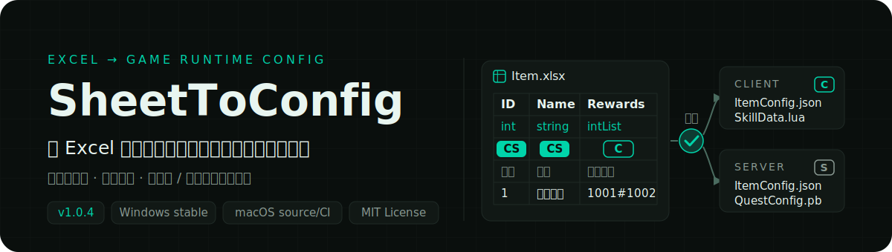
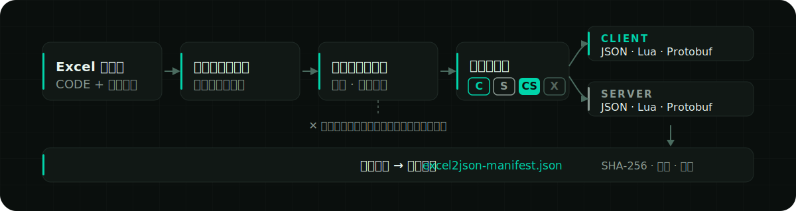

<p align="right">
  <a href="./README.en.md">English</a> ·
  <a href="../../README.md">简体中文</a> ·
  <a href="./README.ja.md">日本語</a> ·
  <a href="./README.ko.md">한국어</a> ·
  <a href="./README.es.md">Español</a> ·
  <strong>繁體中文</strong>
</p>

<p align="center">
  
</p>

<p align="center">
  <a href="https://github.com/liushafeiniao/SheetToConfig/actions/workflows/tests.yml"></a>
  <a href="https://github.com/liushafeiniao/SheetToConfig/releases"></a>
  
  <a href="../../LICENSE"></a>
</p>

<p align="center">
  <a href="https://github.com/liushafeiniao/SheetToConfig/releases"><strong>下載 / Releases</strong></a> ·
  <a href="#快速開始"><strong>快速開始</strong></a> ·
  <a href="#excel-表格規範">查看表格規範</a>
</p>

<p align="center">
  
</p>

<p align="center"><sub>介面中的專案名稱與路徑均為示範資料。</sub></p>

| 一個可信資料來源 | 三種執行階段格式 | 兩端精細分流 |
| :---: | :---: | :---: |
| `CODE` + 四行表頭 | `JSON` · `Lua` · `Protobuf` | `C` · `S` · `CS` · `X` |

## 快速開始

SheetToConfig 以 Windows 為主要支援平台，並在 Apple Silicon 與 Intel macOS 上持續測試。穩定版 [GitHub Releases](https://github.com/liushafeiniao/SheetToConfig/releases) 僅提供 Windows x64 EXE 與校驗檔；目前沒有 macOS 穩定安裝套件。

Windows 原始碼啟動：

```powershell
py -3.12 -m venv .venv
.\.venv\Scripts\python.exe -m pip install -r requirements.txt
.\.venv\Scripts\python.exe -m sheet_to_config.app
```

安裝相依套件後，也可以雙擊 `scripts/run.bat` 從原始碼啟動；已下載或建置的 `SheetToConfig.exe` 可直接雙擊執行。

macOS 原始碼啟動：

```bash
python3.12 -m venv .venv
source .venv/bin/activate
python -m pip install -r requirements.txt
./scripts/run.sh
```

未簽署 macOS 建置僅供維護者手動進行內部預覽，不會作為公開 Release 發佈；如需在 macOS 上使用，請按上述步驟從原始碼執行。

### 第一次匯出

1. 點擊「新增專案」，設定表格資料夾、用戶端輸出目錄與伺服器輸出目錄。
2. 在表格資料夾中放入至少一個包含 `CODE` 工作表的 `.xlsx` 檔案。
3. 選取專案並點擊「匯出」，先勾選「僅驗證，不寫入檔案」檢查全部問題；確認無誤後執行正式匯出。
4. 在操作日誌中確認結果，再到對應輸出目錄查看產物。

首次匯出會在表格資料夾中自動建立 `TypeDefinition.xlsx`，其中包含內建型別與約束範例。C# 輸出目錄與團隊同步目錄都是選用項目。

## 核心能力

| 能力 | 說明 |
| --- | --- |
| 多專案管理 | 集中維護表格、用戶端、伺服器、C# 與共享目錄；支援搜尋、拖放路徑與專案排序 |
| 多格式匯出 | 同一套 Excel 設定可產生 JSON、Lua、`.proto` 與 `.pb`，並可選產生 C# 型別 |
| 用戶端 / 伺服器分流 | 用 `C`、`S`、`CS`、`X` 標記控制欄位去向，避免把伺服器資料誤發到用戶端 |
| 資料驗證 | 驗證型別、主鍵、唯一性、欄位約束與跨表引用；錯誤可定位到檔案、工作表、列、欄與欄位 |
| 安全寫入 | 整批設定先在暫存目錄完成轉換與驗證，通過後再原子提交；失敗時保留舊產物 |
| 熱更新清單 | 為用戶端與伺服器分別產生確定性的 `excel2json-manifest.json`，記錄 SHA-256、大小與來源 |
| 團隊工作流程 | 一鍵將表格複製到同步目錄；專案設定、主題與視窗外觀保存在本機，不污染儲存庫 |

## 工作原理

<p align="center">
  
</p>

匯出器先讀取每個活頁簿的 `CODE` 設定，再解析資料表的四行表頭。只有整批活頁簿都通過轉換、約束與引用檢查後，產物與清單才會一起寫入正式目錄。

## Excel 表格規範

約定只有兩條：每個活頁簿用一張 `CODE` 工作表宣告「哪些表匯出成什麼檔案、發到哪一端」，每張資料表用四行表頭宣告欄位。掌握下面的 `CODE` 工作表就能寫出第一張可匯出的表；資料表、型別約束與跨表引用的完整規則摺疊在後，需要時再展開。

### `CODE` 工作表

每個待匯出的活頁簿都必須包含 `CODE` 工作表（名稱不區分大小寫），每行宣告一張資料表的輸出方式：

| Sheet | File | Platform |
| --- | --- | --- |
| Item | ItemConfig.json | cs |
| Skill | SkillData.lua | c |
| Quest | QuestConfig.pb | cs |

- `Sheet`：同一活頁簿中的資料工作表名稱。
- `File`：輸出檔名，副檔名決定格式，只支援 `.json`、`.lua`、`.pb`。省略副檔名目前會按 JSON 相容匯出並給出警告（該相容將在後續版本移除）；`.proto` 不能單獨作為匯出格式。
- `Platform`：`c` 僅用戶端、`s` 僅伺服器、`cs` 兩端都匯出；不區分大小寫，留空時跟隨目前匯出模式。

解析按欄位置進行，表頭列可寫可不寫；首列第一格是 `Sheet` 等表頭文字時會自動跳過。

<details>
<summary><strong>資料工作表：四行表頭與欄位端標記</strong> — 欄位名 / 型別 / 匯出端 / 說明，第一欄即主鍵</summary>

資料表使用四行表頭，第五列起是資料：

```text
ID    Name      Rewards                    Rate
int   string    intList+len(1,5)           float+range(0,1)
CS    CS        C                          S
編號  名稱      獎勵清單                    伺服器機率
1     初級藥水  1001#1002                  0.25
```

四行依序表示欄位名、欄位型別、匯出端與欄位說明。匯出端標記不區分大小寫：

| 標記 | 行為 |
| --- | --- |
| `C` | 僅匯出到用戶端 |
| `S` | 僅匯出到伺服器 |
| `CS` | 用戶端與伺服器都匯出（留空時的預設值） |
| `X` | 不匯出 |

第一欄會作為主鍵處理，必須是非空的純量值且不能重複。錯誤不會被靜默略過，而是作為結構化診斷回傳，可定位到檔案、工作表、列、欄與欄位。

</details>

<details>
<summary><strong>型別、列舉與約束</strong> — 內建型別清單、TypeDefinition 擴充與 11 種欄位約束</summary>

內建型別涵蓋 `int`、`float`、`string`、`bool`、`bytes`、`text_key`、一至三維清單、字典、路徑 `path()` 與跨表 ID 引用；首次匯出自動產生的 `TypeDefinition.xlsx` 中包含完整清單與範例。複雜型別也可以在 TypeDefinition 中透過組合運算式擴充。

列舉在三欄 TypeDefinition 中定義，不增加新 Schema。`enum(string,white,green,blue)` 與 `enum(int,1,2,3)` 會先嚴格轉換基礎型別，再驗證允許值；匯出值保持原字串或整數，不做名稱到數字映射。

約束直接附加在型別後面，例如：

```text
intList+len(1,5)
float+range(0,1)
string+required()+unique()
string+regex(^item_[0-9]+$)
intList+equalLen(Weights)
```

支援的約束包括 `len`、`len2`、`len3`、`equalLen`、`equalLen2`、`coexist`、`leastOne`、`required` / `notEmpty`、`range`、`regex` 與 `unique`。

</details>

<details>
<summary><strong>跨表引用：<code>find_id</code> / <code>find</code></strong> — 依檔名前綴引用其他活頁簿的 ID，匯出時真實驗證</summary>

一張表的 ID 欄可以引用另一張表的主鍵，匯出時會逐筆驗證目標真實存在。公開語法只有以下兩個同義函式：

```text
find_id(file_prefix, display_label, field)
find(file_prefix, display_label, field)
```

- `file_prefix` 依檔名前綴定位目標 `.xlsx` 活頁簿。
- `display_label` 只用於顯示，不用於選擇工作表。
- `field` 比對目標欄位；從第 5 列開始讀取資料。
- 空值按目標欄位真實型別處理；缺表、缺欄位或缺 ID 會驗證失敗。
- 清單引用按分隔符展平後驗證；失敗時整批取消並保留舊產物。
- `find` 是 `find_id` 的同義簡寫，其他名稱不是公開能力。

</details>

<details>
<summary><strong>輸出、Manifest 與原子提交</strong> — 確定性清單格式、增量匯出條件與失敗回滾保證</summary>

每個啟用的輸出端都會得到一份 `excel2json-manifest.json`：

```json
{
  "manifestVersion": 1,
  "platform": "client",
  "contentVersion": "sha256:...",
  "files": [
    {
      "path": "ItemConfig.json",
      "format": "json",
      "sha256": "...",
      "size": 2048,
      "source": {
        "workbook": "Item.xlsx",
        "sheet": "Item"
      }
    }
  ]
}
```

清單按路徑穩定排序，`contentVersion` 只由執行階段產物的身分與內容計算，可用於比較用戶端 / 伺服器版本及產生熱更新差異。指定檔案匯出屬於增量匯出，需要輸出目錄中已有有效清單；清單缺失或損毀時會停止寫入。

匯出採用整批暫存與原子提交。任一活頁簿失敗、輸出路徑衝突或提交異常時，不會留下半套新設定；無法完成提交時會嘗試還原舊檔案並回報錯誤。

</details>

<details>
<summary><strong>Protobuf 匯出</strong> — <code>.pb</code> 即產生同名 <code>.proto</code>，超集協議與破壞性變更開關</summary>

在 `CODE` 工作表中把 `File` 寫成 `.pb` 檔名，即可產生同名 `.proto` 與 `.pb`：

```text
QuestConfig.proto
QuestConfig.pb
```

- 一般純量、`bytes` 以及 `intList` / `intList2` 等清單型別可以直接從 Excel 推導。
- 選用的 `PROTO` 工作表用於設定 package、C# namespace 或描述更複雜的 message、enum、map、oneof 與 reserved 宣告。
- 自動產生器會重用既有 schema manifest，盡量保持欄位編號穩定；刪除的欄位會寫入 `reserved`。
- 用戶端與伺服器共享同一份欄位超集 `.proto`，各自的 `.pb` 只包含該端允許的資料。
- 設定 C# 輸出目錄後，可呼叫 `protoc` 產生 C# 檔案。

桌面介面預設禁止破壞性協議變更：偵測到不相容的 schema 變化會直接報錯。只有明確勾選「允許破壞相容性的 Protobuf 結構變更」後才會允許不相容重建，勾選即生效；發佈過的協議仍應檢查 `.proto` diff。

</details>

<details>
<summary><strong>專案設定與本機資料</strong> — 六項目錄設定、本機狀態位置與 <code>SHEETTOCONFIG_DATA_DIR</code></summary>

| 設定 | 必填 | 用途 |
| --- | --- | --- |
| 表格資料夾 | 是 | 存放 `.xlsx` 與 `TypeDefinition.xlsx` |
| 用戶端路徑 | 是 | 用戶端設定與 manifest 輸出目錄 |
| 伺服器路徑 | 是 | 伺服器設定與 manifest 輸出目錄 |
| C# 輸出路徑 | 否 | `protoc` 產生的 C# 型別目錄 |
| 資源根目錄 | 否 | 驗證 `path()` 結果未越界且檔案真實存在；留空時回退到用戶端輸出目錄繼續驗證，並給出警告 |
| 同步目錄 | 否 | 「同步」操作的目標目錄 |

原始碼位於父專案的 `GitHub` 子目錄且同層存在 `LocalData` 時，本機狀態寫入該目錄；其他原始碼環境使用系統使用者設定目錄；Windows EXE 預設寫入執行檔所在目錄。可以用環境變數覆寫：

```powershell
$env:SHEETTOCONFIG_DATA_DIR = "D:\SheetToConfigData"
python -m sheet_to_config.app
```

`projects.json`、`theme_config.json` 等本機狀態已被 `.gitignore` 排除。儲存庫不應提交真實專案路徑、憑證或團隊共享目錄資訊。

</details>

<details>
<summary><strong>開發與驗證</strong> — 測試命令、Windows / macOS 建置與專案結構</summary>

### 執行測試

```powershell
$env:PYTHONUTF8 = "1"
python -m unittest discover -s tests -v
```

`PYTHONUTF8=1` 可避免中文 Windows 的 GBK 主控台無法輸出 Unicode 狀態符。GitHub Actions 會在 Windows、Apple Silicon macOS 與 Intel macOS 的 Python 3.12 環境中執行同一套測試。測試涵蓋應用程式資料路徑、型別與約束驗證、JSON / Lua / Protobuf 匯出、schema 演進、執行階段清單以及原子回滾。

### 建置 Windows EXE

```powershell
python -m pip install -r requirements-dev.txt
python scripts/build.py
```

建置成功後，單一執行檔位於 `dist/SheetToConfig.exe`。`scripts/build.py` 使用獨立暫存目錄建置，只有 PyInstaller 成功後才取代舊 EXE。

### 建置 macOS 應用程式

```bash
python3.12 -m pip install -r requirements-dev.txt
./scripts/build.sh
python scripts/package_macos.py --unsigned
```

建置應在目標 macOS 架構上執行，輸出為 `dist/SheetToConfig.app` 與 DMG。macOS 仍在 CI 測試，但未簽署 DMG 只作為維護者手動的內部預覽；目前沒有 macOS 穩定 Release。完整發佈邊界見 [`docs/RELEASING.md`](../RELEASING.md)。

如需產生 C# 設定類別，還必須安裝 `protoc` 並加入 `PATH`，或設定 `PROTOC` 環境變數。

### 專案結構

```text
SheetToConfig.py              根目錄啟動器（相容入口）
sheet_to_config/app.py        主視窗與互動
sheet_to_config/app_paths.py  本機資料目錄解析
sheet_to_config/dialogs.py    專案、主題、匯出與關於對話框
sheet_to_config/styles.py     主題驅動的 QSS 樣式
sheet_to_config/theme_config.py 主題預設與持久化
sheet_to_config/icons.py      隨主題著色的圖示工廠
sheet_to_config/widgets.py    自訂控制項
sheet_to_config/utils/
  project_manager.py          專案資料與排序持久化
  export_handler.py           匯出排程
  import_handler.py           團隊共享同步
  exporter/
    converter.py              批次轉換與驗證編排
    batch_transaction.py      整批交易與增量匯出
    type_registry.py          型別註冊與轉換
    template.py               TypeDefinition.xlsx 範本
    constraints.py            欄位約束
    reference_validator.py    跨表引用驗證
    protobuf_schema.py        Protobuf schema 解析與演進
    artifact_manifest.py      執行階段產物清單
    atomic_writer.py          原子提交與回滾
    exporters/                JSON / Lua / Protobuf 輸出器
tests/                        自動化測試
```

</details>

## 相容性與邊界

- Windows 是主要支援平台；Apple Silicon 與 Intel macOS 進入 CI，未簽署打包僅供維護者內部驗證。
- Linux 目前不受正式支援，也未進入 CI；原始碼執行可能可用，但不提供 AppImage、Flatpak 或其他正式安裝套件。
- README 與桌面介面均支援簡體中文、English、日本語、한국어、Español 與繁體中文。
- 輸入以 `.xlsx` 為正式支援格式；暫存檔與非活頁簿內容不會參與匯出。
- 產生 C# 程式碼依賴外部 `protoc`，JSON、Lua、`.proto` 與 `.pb` 不依賴系統級編譯器。
- 增量匯出依賴既有且有效的 manifest；首次使用應先執行一次完整匯出。
- Protobuf 自動演進不能取代協議評審，發佈後的破壞性變更仍需由團隊控管。

## 參與開發

提交問題時，請附上可重現的最小活頁簿結構、預期結果、實際日誌與執行環境；請勿上傳包含業務資料、真實路徑或憑證的檔案。

提交程式碼前，請先執行完整測試。涉及匯出格式、manifest 或 Protobuf schema 的修改，應同時補充成功路徑、錯誤路徑與回滾情境測試。

## 版本與授權

- 目前版本：[`sheet_to_config/version.py`](../../sheet_to_config/version.py) 中的 `1.0.0`
- 變更記錄：[`CHANGELOG.md`](../../CHANGELOG.md)
- 開源授權：[`MIT`](../../LICENSE)
